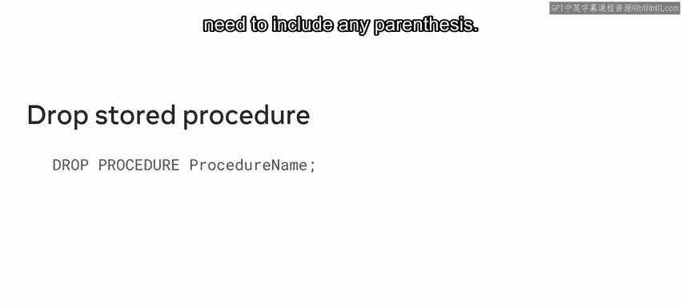
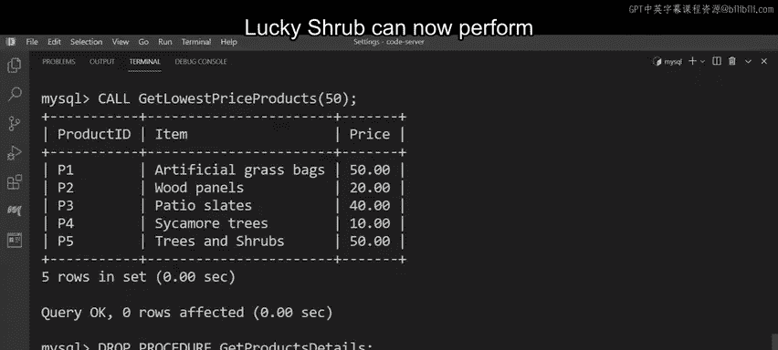

# 105：MySQL存储过程 📚

在本节课中，我们将要学习MySQL中的存储过程。存储过程是一种将特定SQL查询保存为代码块的方法，可以在需要时随时调用，从而避免重复编写相同的SQL语句。通过本教程，你将理解存储过程的概念，并学会如何创建和删除简单的存储过程。

## 什么是存储过程？ 🤔

上一节我们介绍了存储过程的基本概念，本节中我们来看看它的具体定义。

数据库工程师所说的“存储过程”，指的是一段可以存储在数据库中的代码或预编译查询。你可以使用 `CALL` 命令来调用或执行这段存储的代码。

使用存储过程有很多好处：
*   你的代码更加一致。
*   你的代码可以重复使用，无需反复编写相同的SQL语句。
*   你的代码也更容易使用和维护。

## 存储过程的语法 📝

理解了存储过程的概念后，本节中我们来探索其语法，以更好地理解它是如何工作的。

首先，要创建一个基本的存储过程，需要使用 `CREATE PROCEDURE` 命令。该命令后面必须跟上**过程名称**和一对**括号**，括号内包含参数列表。即使你的存储过程不包含任何参数，这对括号也是必需的。然后，根据需要编写过程逻辑。

例如，如果你的过程需要从表中选取所有数据，可以编写一个带有星号（`*`）的 `SELECT` 命令，后跟 `FROM` 关键字和目标表名。

当编写带有一个或多个参数的存储过程时，语法大致相同。关键区别在于，你必须在括号内包含所有必需的参数，然后再编写过程逻辑。

创建存储过程后，下一步就是调用它。要调用一个过程，可以使用 `CALL` 命令，后跟过程名称。请确保包含括号。

但是，当你不再需要一个存储过程时，如何从数据库中删除它呢？要删除存储过程，可以使用 `DROP PROCEDURE` 命令，后跟过程名称。在这种情况下，你不需要包含任何括号。

## 实践：创建与调用存储过程 🛠️

理论结合实践才能掌握知识。接下来，我们将通过一个具体案例来应用刚才学到的语法。

正如之前提到的，Ly Shrub 经常在其数据库中使用相同的查询。例如，他们经常需要查询数据库产品表中的产品列表，以便为客户查找商品或检查商店库存。然而，每次与产品表交互时，他们都需要重写相同的查询，这是一个耗时的过程。

现在，让我们运用关于存储过程的新知识来帮助他们创建一个可重用的查询。

Ly Shrub 需要创建一个存储过程，用于从其产品表中提取所有数据。该表存储了商店中所有产品的数据，分为三列：`product_id` 列、列出所有产品名称的 `item` 列，以及列出所有价格（四舍五入到两位小数）的 `price` 列。

以下是创建该存储过程的步骤：
1.  使用 `CREATE PROCEDURE` 命令，后跟过程名称。由于此过程的目的是返回所有产品的详细信息，我们可以将其命名为 `GetProductsDetails`，然后加上括号。
2.  此存储过程不需要任何参数，因此括号内可以留空。
3.  编写一个 `SELECT` 命令和星号（`*`）符号，指示MySQL提取所有数据。
4.  最后，编写 `FROM` 关键字并指定目标表 `products`。

执行此查询后，新的过程 `GetProductsDetails` 就创建好了。Ly Shrub 现在可以调用此查询来从表中提取数据，而无需每次都重写新的 `SELECT` 语句。

要演示如何调用存储过程，只需编写以下 `CALL` 命令：`CALL GetProductsDetails();`。执行该过程后，将提取包含所有产品数据的结果集。

## 实践：带参数的存储过程 🔧

上一节我们创建了一个简单的无参数存储过程，本节中我们来看看如何创建和使用带参数的存储过程。

Ly Shrub 还经常编写查询来识别数据库中价格最低的产品，以便将这些商品添加到促销活动中。我们可以为此查询创建一个带有一个或多个参数的存储过程。

以下是创建带参数存储过程的步骤：
1.  使用 `CREATE PROCEDURE` 命令，后跟过程名称。我们可以将其命名为 `GetLowestPriceProducts`。
2.  在括号内，需要声明参数。例如，声明一个名为 `lowest_price` 的整数类型参数。
3.  编写一个 `SELECT` 命令和星号（`*`）符号。
4.  编写 `FROM` 子句并指定目标表 `products`。
5.  在 `FROM` 子句后，包含一个小于或等于运算符（`<=`），后跟参数名 `lowest_price`。

在这个语句中，我们声明了一个整数数据类型的参数，必须将一个整数值传递到存储过程中。但请注意，此查询包含了参数，因此每次调用查询时，都需要指定存储过程必须处理的值。

例如，让我们通过键入 `CALL` 命令、存储过程名称 `GetLowestPriceProducts` 并在括号中放置值 `50`，来返回价格小于或等于50美元的产品数据。执行查询后，值 `50` 通过参数传递给存储过程，屏幕上会输出所有价格小于或等于50美元的产品列表。

## 删除存储过程 🗑️

学会了创建，自然也需要知道如何清理。本节中，我们将学习如何删除不再需要的存储过程。

最后，Ly Shrub 决定从他们的数据库中删除 `GetProductsDetails` 存储过程。要从数据库中删除存储过程，请键入 `DROP PROCEDURE` 命令和过程名称 `GetProductsDetails`。执行查询后，该存储过程就从数据库中删除了。

得益于存储过程的使用，Ly Shrub 现在可以更高效地在其数据库中执行查询。

## 总结 📋

本节课中我们一起学习了MySQL存储过程的核心知识。你现在应该能够展示对MySQL数据库中存储过程的理解，并且能够在MySQL中创建和删除简单的存储过程。

我们了解到，存储过程是一段可存储和重复调用的SQL代码块，它能提高代码的一致性、可重用性和可维护性。我们学习了使用 `CREATE PROCEDURE` 和 `CALL` 命令来创建和调用存储过程，也掌握了使用 `DROP PROCEDURE` 命令来删除存储过程。通过实践案例，我们进一步巩固了创建无参数和带参数存储过程的方法。