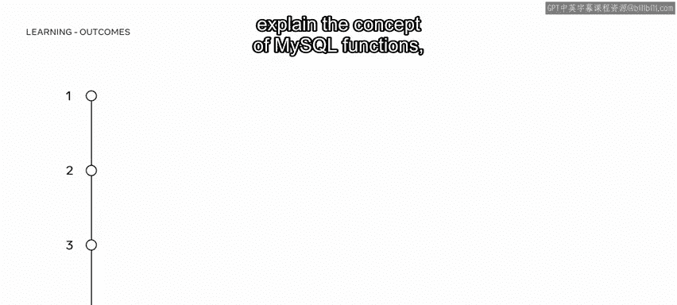
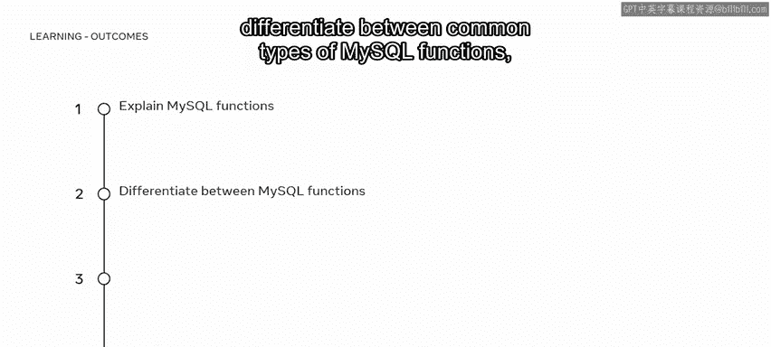
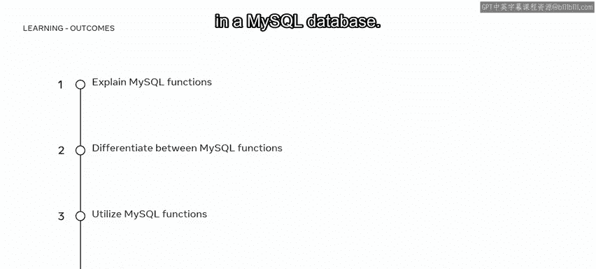
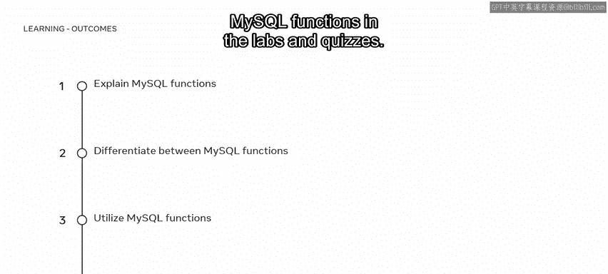
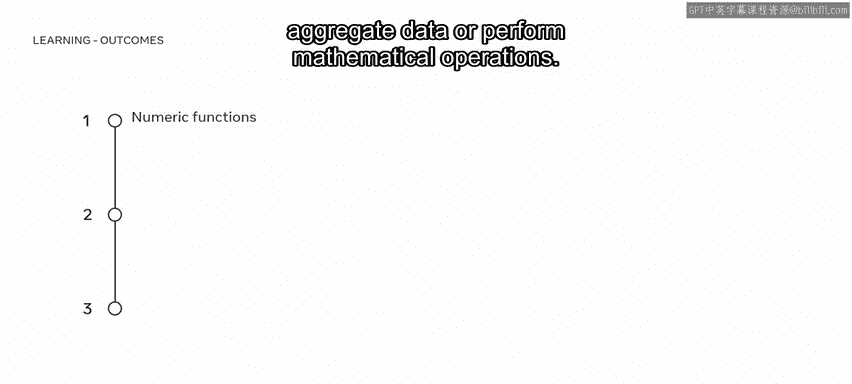
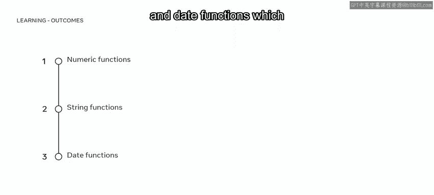
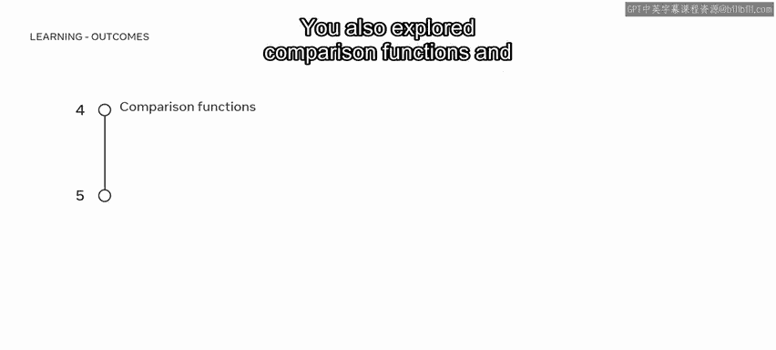
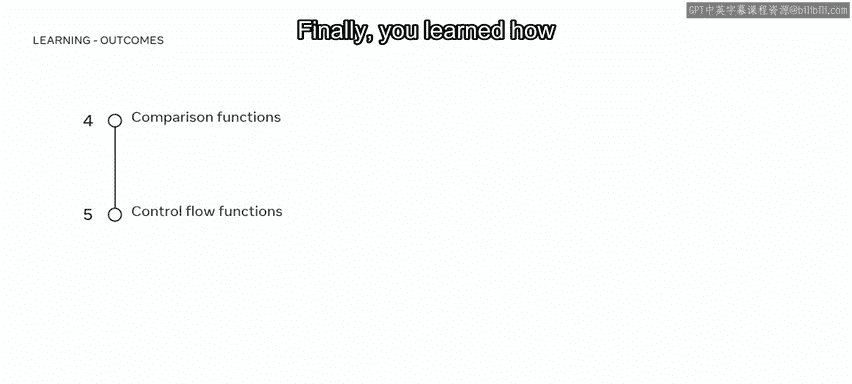
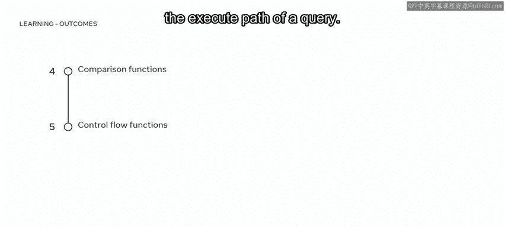
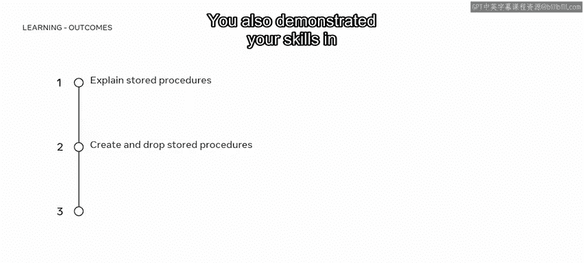

# 入门 106：函数与存储过程小结 🎯

在本节课中，我们将回顾并总结本模块的核心内容，即MySQL中的函数与存储过程。您将清晰地理解这两大概念的区别、用途以及基本使用方法。

恭喜您完成了本课程的第三个模块。现在，让我们花点时间回顾一下您在本模块课程中获得的关键技能。

## 第一课：MySQL函数 📊

在第一课中，您学习了MySQL中的函数。现在，您应该能够解释MySQL函数的概念，区分常见的MySQL函数类型，并在MySQL数据库中使用基本的MySQL函数。您还在实验和测验中展示了关于MySQL函数的知识和技能。

您所接触到的MySQL函数主要包括以下几种类型：

以下是本模块介绍的核心函数类别：

*   **数值函数**：用于聚合数据或执行数学运算。例如，`SUM()`、`AVG()`。
*   **字符串函数**：对数据库中的字符串值进行操作。例如，`CONCAT()`、`SUBSTRING()`。
*   **日期函数**：返回时间和日期信息。例如，`NOW()`、`DATE_ADD()`。

您还探索了比较函数，并了解了如何使用它们来比较数据库中的值。例如，`CASE WHEN ... THEN ... ELSE ... END`。

最后，您学习了控制流函数如何用于评估条件并确定查询的执行路径。例如，`IF()` 函数。

## 第二课：MySQL存储过程 ⚙️

上一节我们介绍了各种函数，本节中我们来看看MySQL的另一个强大功能——存储过程。

在第二课中，您探索了存储过程。现在，您应该能够解释MySQL数据库中存储过程的概念，并在MySQL中创建和删除简单的存储过程。

您同样在实验环境中展示了相关技能。

## 总结 📝

完成了本模块的学习后，您现在应该能够使用函数和MySQL存储过程。出色的工作。

本节课中，我们一起学习了MySQL中函数与存储过程的核心概念。函数是预定义的操作，用于处理数据并返回结果；而存储过程则是存储在数据库中的一组SQL语句，可以被重复调用。掌握这两者将极大提升您管理和操作数据库的效率与灵活性。