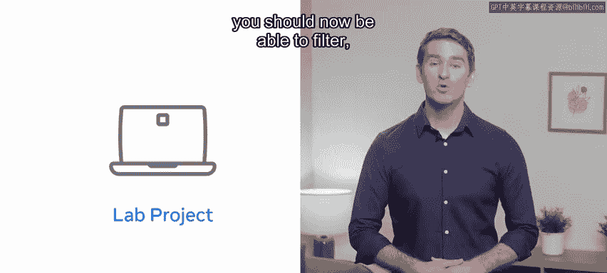
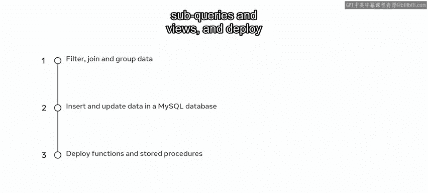
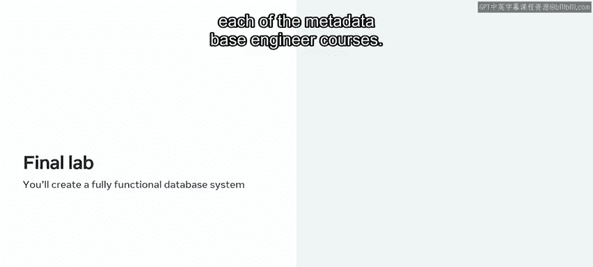
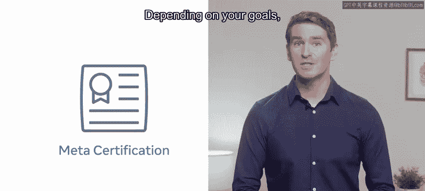

# 入门 108：31_课程总结

在本节课中，我们将对Meta数据库工程师课程的核心内容进行回顾与总结，梳理您已掌握的关键技能，并展望后续的学习路径。

您已经完成了这门Meta数据库工程课程。您付出了辛勤的努力，并在此过程中掌握了许多新技能。您在数据库学习的道路上取得了巨大进步。

现在，您应该能够理解数据库结构并使用MySQL进行管理。您能够在实验项目中展示部分学习成果以及您的实践数据库技能。

---

## 🎯 课程核心技能回顾

完成本课程后，您现在应该能够：

*   **筛选、连接与分组数据**：使用SQL语句对数据进行精确查询和聚合分析。
*   **插入与更新数据**：在数据库中操作数据，并应用**约束**、**子查询**和**视图**来确保操作的准确性与效率。
*   **部署函数与存储过程**：在MySQL数据库中创建和使用自定义函数与存储过程，实现复杂的业务逻辑封装。

---

## 📊 评估所衡量的关键能力

在分级评估中，关键技能衡量了您展示以下MySQL核心知识的能力：

*   数据筛选、连接与分组。
*   解释与**虚拟表**、**数据完整性**和**子查询**相关的数据库概念。
*   展示您在**函数**和**存储过程**方面的实践经验。

---

## 🚀 后续步骤与展望

这门Meta数据库工程课程为您介绍了几个关键领域的初步知识。您可能意识到仍有更多内容需要学习。

如果您觉得本课程有帮助并希望探索更多，何不注册下一门课程？在每一门Meta数据库工程课程中，您都将持续发展您的技能。在最终的实验项目中，您将运用所学的一切知识，创建您自己功能完整的数据库系统。

无论您是刚起步的技术专业人士、学生还是业务用户，本课程及其项目都能证明您对数据库系统价值和能力的理解。

实验项目通过实际应用来巩固您的能力。该实验还有另一个重要益处：这意味着您将拥有一个完全可以运行的数据库，可以将其纳入您的作品集中。

这有助于向潜在雇主展示您的技能。它不仅向雇主表明您具有自我驱动力和创新能力，也充分说明了您作为个人以及您新获得的知识。

一旦您完成了所有课程，您将获得Meta数据库工程认证。根据您的目标，此认证也可作为通往其他基于角色的Meta认证的进阶途径。您可以选择深入学习高级角色认证，或在获得此认证后学习其他基础课程。

Meta认证为您提供了全球认可且受行业认可的技术技能证明。

感谢您！很高兴能与您一同踏上这段探索之旅。祝您未来一切顺利！