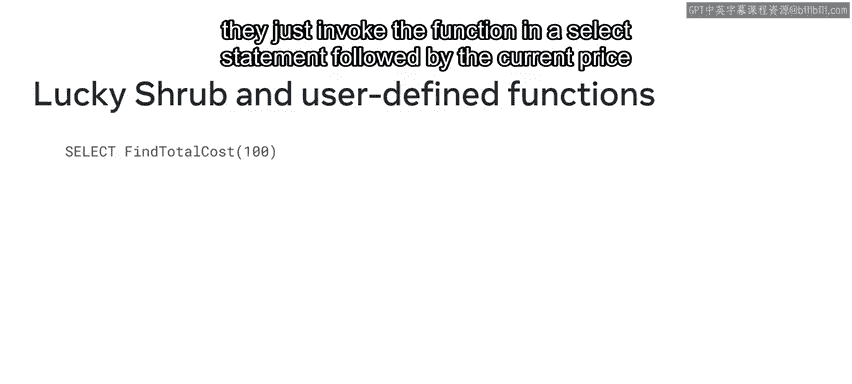
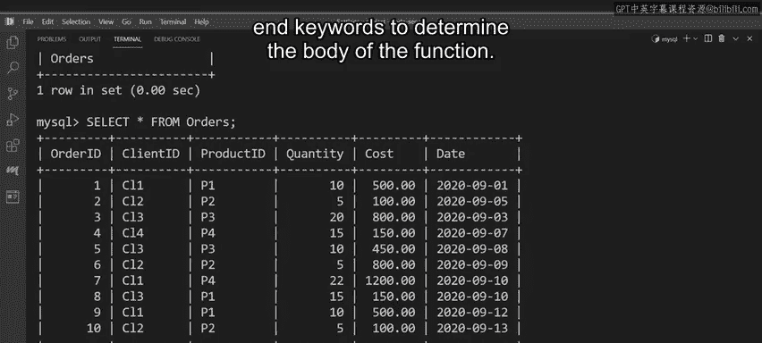

# 入门 112：开发自定义函数 🛠️

在本节课中，我们将学习如何在MySQL中创建用户自定义函数。我们将了解其基本概念、语法结构，并通过一个实际案例来演示如何开发一个满足特定业务需求的函数。

## 概述

您可能已经熟悉MySQL的内置函数。但如果这些内置函数都无法满足项目需求，您完全可以开发自己的用户自定义函数。本节视频将解释用户自定义函数是什么，并指导您如何创建自己的函数。

## 什么是用户自定义函数？ 🤔

您可能已经熟悉MySQL的内置函数，例如字符串或数值函数。用户自定义函数是为了执行那些无法通过内置函数完成的操作而创建的。用户需要编写代码来实现特定的方程或公式，以完成任务并返回结果。

让我们来分解这个过程：数据库工程师创建自己的代码，代码执行特定功能，然后函数返回所需的结果。

## 创建函数的基本语法

要在MySQL中构建函数，您可以使用 `CREATE FUNCTION` 命令，配合 `RETURNS` 子句和 `RETURN` 命令。这些命令和子句用于指定函数返回的数据类型和值。

以下是该语法的工作原理：

1.  以 `CREATE FUNCTION` 命令开始语句。
2.  为您的函数分配一个名称。
3.  在函数名后加上括号和参数。括号是必需的，但参数并非总是需要。
4.  指定返回数据类型，后跟关键字 `DETERMINISTIC`。`DETERMINISTIC` 意味着对于相同的输入参数，函数总是返回相同的结果。例如，如果一个求和函数被定义为确定性的，那么对于相加的数字，它总是返回相同的结果。
5.  最后，使用 `RETURN` 关键字实现逻辑。

让我们看看Lucky Shrub如何利用用户自定义函数。

## 案例：创建基础折扣函数

Lucky Shrub正在进行促销，对选定商品提供10%的折扣。但为每笔交易的每个商品重复编写相同的计算语句非常耗时。因此，Lucky Shrub需要您创建一个用户自定义函数，以便在需要计算折扣时调用。

Lucky Shrub可以使用以下语法创建一个名为 `FindTotalCost` 的函数：

```sql
CREATE FUNCTION FindTotalCost(cost DECIMAL(10,2)) RETURNS DECIMAL(10,2) DETERMINISTIC
RETURN cost - (cost * 0.10);
```

*   `cost` 参数具有十进制数据类型，用于传递用户输入的成本值。
*   `RETURNS` 子句将函数的返回类型定义为具有5位数字的十进制数。
*   `RETURN` 命令计算并返回扣除10%后的最终成本。

现在，每当Lucky Shrub需要确定商品的销售价格时，他们只需在 `SELECT` 语句中调用该函数，并在括号内填入当前价格即可。

## 开发更复杂的函数

上一节我们介绍了基础的自定义函数。本节中，我们来看看如何创建一个更复杂的函数，实现阶梯式折扣。

假设Lucky Shrub希望为消费100美元或以上的顾客提供10%的折扣，为消费500美元或以上的顾客提供20%的折扣。

第一步是使用 `DELIMITER` 命令，将整个函数作为一个复合语句进行编译。这需要使用 `BEGIN` 和 `END` 关键字。输入以下命令将分隔符从默认的分号更改为双斜杠：

```sql
DELIMITER //
```



接下来，使用 `CREATE FUNCTION` 命令并命名您的函数为 `GetTotalCost`。

以下是创建该函数的完整代码：

```sql
CREATE FUNCTION GetTotalCost(cost DECIMAL(10,2)) RETURNS DECIMAL(10,2) DETERMINISTIC
BEGIN
    DECLARE discount DECIMAL(10,2);
    IF cost >= 500 THEN
        SET discount = cost * 0.20;
    ELSEIF cost >= 100 THEN
        SET discount = cost * 0.10;
    ELSE
        SET discount = 0;
    END IF;
    RETURN cost - discount;
END //
```

*   函数包含一个 `cost` 参数，用于传递用户输入的成本值。
*   `RETURNS` 子句定义了函数的返回类型。
*   函数被定义为 `DETERMINISTIC`。
*   使用 `BEGIN` 和 `END` 关键字来确定函数体。
*   在函数体内，使用 `IF...ELSE` 语句来检查输入成本并扣除相应的折扣金额。
*   最后，使用 `RETURN` 命令计算扣除折扣后的最终成本。

输入完成后，创建新函数。然后将分隔符改回默认的分号，以便正常使用MySQL：

```sql
DELIMITER ;
```

## 测试与删除函数



现在，是时候使用 `SELECT` 语句来测试函数了。假设一位顾客刚刚进行了一笔价值500美元的购买，Lucky Shrub需要确定应用的折扣。

输入一个 `SELECT` 命令，后跟函数名以及在括号内的购买价值：

```sql
SELECT GetTotalCost(500);
```

执行该函数，输出结果是400美元。这意味着在应用20%的折扣后，这位顾客的购买现在价值400美元。

如果您想删除这个函数，只需使用 `DROP FUNCTION` 语句，后跟函数名：

```sql
DROP FUNCTION GetTotalCost;
```

执行后，函数即被删除。

## 总结

在本节课中，我们一起学习了如何在MySQL中创建用户自定义函数。我们了解了其基本概念和语法结构，并通过Lucky Shrub的案例，实践了如何开发一个基础折扣函数和一个更复杂的阶梯折扣函数。现在，Lucky Shrub可以根据需要轻松地将折扣应用于顾客的购买，而您也掌握了为特定项目创建自定义函数的方法。