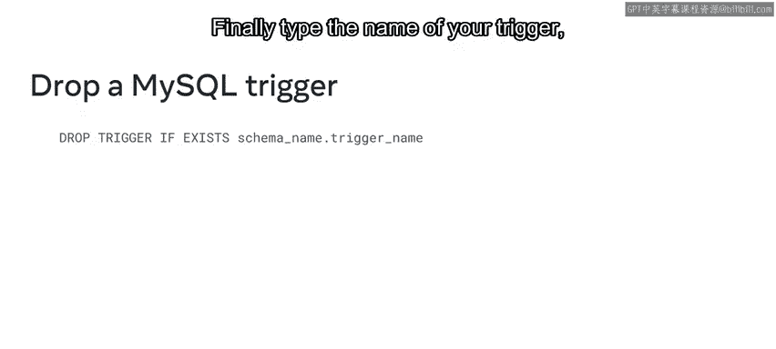
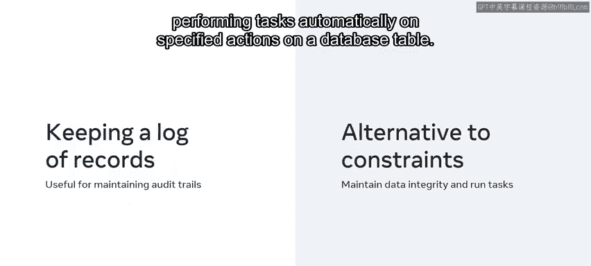

# 114：MySQL触发器是什么 🚀

在本节课中，我们将要学习MySQL触发器的基本概念、创建与删除语法，并通过一个实际案例了解其应用场景。

---

### **概述**

作为数据库工程师，您经常需要在特定事件发生时自动执行某些操作，例如在表中插入、更新或删除数据时。如何确保这些操作自动发生，而无需每次调用时重写代码？您可以通过使用MySQL触发器来实现。本节将介绍什么是MySQL触发器，以及如何编写和使用它们。

---

### **什么是MySQL触发器？**

MySQL触发器是一种以存储程序形式存在的一组操作。当特定事件发生时，这组操作会被自动调用。这些事件包括在MySQL数据库表中插入、更新和删除数据。

在使用触发器之前，您需要创建它。通常，在触发器完成其使命后，您也需要删除或丢弃它。

---

### **创建与删除触发器的语法**


上一节我们介绍了触发器的基本概念，本节中我们来看看如何创建和删除触发器。

#### **创建触发器**

创建触发器使用`CREATE TRIGGER`语句。

```sql
CREATE TRIGGER trigger_name
trigger_time trigger_event
ON table_name FOR EACH ROW
BEGIN
    -- 触发器逻辑
END;
```

以下是创建触发器语句各部分的说明：

*   **`CREATE TRIGGER`**：这是创建触发器的关键字。
*   **`trigger_name`**：触发器的名称。由于触发器通常是用户定义的，您可以创建自定义名称，但需确保其在数据库中是唯一的。
*   **`trigger_time`**：定义触发器执行的时间，例如在操作之前 (`BEFORE`) 或之后 (`AFTER`)。
*   **`trigger_event`**：定义触发触发器的事件，例如插入 (`INSERT`)、更新 (`UPDATE`) 或删除 (`DELETE`)。
*   **`ON table_name`**：指定触发器关联的表。
*   **`FOR EACH ROW`**：指定触发器应如何应用于表，通常表示对受影响的每一行数据执行。
*   **`BEGIN ... END`**：如果触发器逻辑包含多个语句，则必须将它们包含在`BEGIN`和`END`块中。

执行该语句即可创建触发器。

#### **删除触发器**

要删除已创建的触发器，可以使用`DROP TRIGGER`命令。

```sql
DROP TRIGGER IF EXISTS schema_name.trigger_name;
```

以下是删除触发器语句各部分的说明：

*   **`DROP TRIGGER`**：这是删除触发器的关键字。
*   **`IF EXISTS`**：此子句确保仅当MySQL能在数据库中找到该触发器时，删除命令才会执行。如果没有此子句而尝试删除不存在的触发器，MySQL将返回错误。
*   **`schema_name.trigger_name`**：使用点符号标识触发器所属的数据库（模式）和触发器名称。这确保MySQL仅从指定模式中删除触发器，而不是整个数据库。

执行该语句即可删除触发器。

> **重要提示**：如果您从数据库中删除或丢弃一个表，那么MySQL会自动删除与该表关联的所有触发器。



---

### **触发器应用案例：Lucky Shrub折扣审批**

了解了基本语法后，我们来看看Lucky Shrub的销售团队如何应用触发器。

Lucky Shrub的销售团队正在为产品添加折扣。然而，任何超过25%的折扣都必须由经理审核。这意味着销售团队需要在数据库中添加一个触发器，当员工尝试为商品添加超过25%的折扣时，该触发器会标记这些商品，然后必须向经理发送审批请求。

Lucky Shrub可以使用`CREATE TRIGGER`命令来创建此触发器。他们可以将触发器命名为`approval_request`。然后，他们指定触发器类型为`AFTER UPDATE`，以便在表内发生更新操作后执行触发器逻辑。最后，他们将触发器逻辑放在`BEGIN ... END`块中。

---

### **触发器的其他优势**


除了自动执行业务逻辑，触发器还有以下好处：

以下是触发器的一些主要优势：

*   **维护审计跟踪**：触发器可用于记录数据库中所做的更改，每次发生更改时都会向数据库插入一条记录，从而维护审计跟踪。
*   **替代约束**：触发器是约束的一种替代方案，通过确保所有数据按要求更新，有助于维护数据完整性。
*   **自动执行任务**：触发器可用于在数据库表上发生指定操作时自动执行任务。

---



### **总结**

本节课中，我们一起学习了MySQL触发器的基本概念。您现在应该知道什么是MySQL触发器，并理解了在数据库中创建和删除它们的基础知识。触发器是自动化数据库操作、维护数据完整性和记录变更的强大工具。