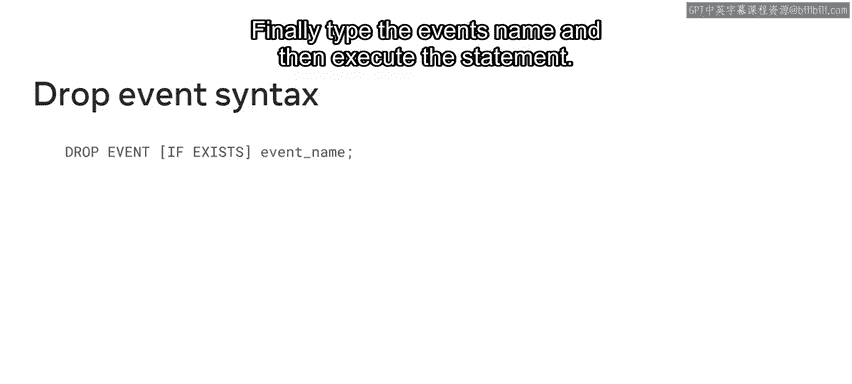
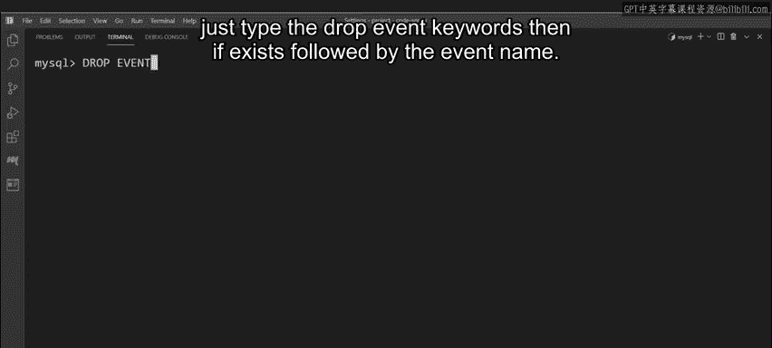

# 117：使用MySQL定时事件 🕐

在本节课中，我们将要学习MySQL中的定时事件功能。定时事件允许我们安排数据库在特定时间自动执行任务，例如生成报告或更新数据，即使我们不在现场。我们将了解定时事件的概念、创建语法，并通过实例来掌握其用法。

## 什么是MySQL定时事件？ 🤔

上一节我们介绍了课程目标，本节中我们来看看什么是MySQL定时事件。

MySQL中的定时事件是根据给定时间表执行的任务。换句话说，它是在指定时间发生的事件。每个事件都有一个唯一的名称，并包含一个或多个SQL语句。它们存储在数据库中，可以只执行一次，也可以是重复发生的事件。

在MySQL中，你将主要处理两种类型的定时事件：
*   **一次性事件**：仅发生一次的定时事件。例如，一小时后向表中插入数据。
*   **重复事件**：定期发生的定时事件。例如，每周从数据库生成报告。

## 如何创建定时事件？ 🛠️

了解了定时事件的基本类型后，本节中我们来看看如何创建它们。

在MySQL中，使用 `CREATE EVENT` 关键字来创建事件。以下是其基本语法结构：

```sql
CREATE EVENT [IF NOT EXISTS] event_name
ON SCHEDULE schedule
DO
    event_body;
```

以下是关键部分的解释：
*   `CREATE EVENT IF NOT EXISTS`：如果事件尚不存在，则创建它。
*   `event_name`：为事件指定一个唯一的名称。
*   `ON SCHEDULE`：指定事件必须发生的时间计划。
*   `DO`：此关键字后跟着事件主体，即使用SQL语句指定的事件逻辑。

### 创建一次性事件

对于一次性事件，需要使用 `AT` 子句来指定计划。它后面跟着一个时间戳和 `INTERVAL` 关键字，以及事件必须执行的具体时间。

例如，Lucky Shrub可以使用以下语法在12小时后生成一次性收入报告：

```sql
CREATE EVENT generate_report_once
ON SCHEDULE AT CURRENT_TIMESTAMP + INTERVAL 12 HOUR
DO
  -- 在此处放置SQL逻辑，例如：INSERT INTO report_table SELECT * FROM orders WHERE ...;
```

### 创建重复事件

重复事件的语法大体相同。关键区别在于必须使用 `EVERY` 子句代替 `AT`，后面跟着一个时间间隔。你还可以使用 `STARTS` 和 `ENDS` 关键字与时间戳和间隔一起，为事件指定特定的开始和结束点。

例如，Lucky Shrub可以使用重复事件语法创建一个每日库存检查事件：

```sql
CREATE EVENT daily_stock_check
ON SCHEDULE EVERY 1 DAY
STARTS CURRENT_TIMESTAMP
DO
  -- 在此处放置SQL逻辑，例如检查并更新库存；
```

## 如何删除定时事件？ 🗑️

学会了创建事件，有时我们也需要清理不再需要的事件。本节中我们来看看如何删除现有的MySQL事件。

使用 `DROP EVENT` 语句来删除事件。良好的实践是包含 `IF EXISTS`，这会告诉MySQL检查事件是否仍然存在且尚未从数据库中删除。

语法如下：

```sql
DROP EVENT IF EXISTS event_name;
```

## 实践案例：帮助Lucky Shrub 📊

现在你已经熟悉了定时事件及其语法，让我们通过实践来帮助Lucky Shrub解决实际问题。



### 案例一：生成月度收入报告

Lucky Shrub的财务部门需要一份本月所有订单的报告，并要求在当月最后一天的晚上11:59生成。现在是当月最后一天的中午，因此他们需要在12小时后生成报告。这是一个一次性事件。

以下是创建该事件的步骤：

1.  使用 `CREATE EVENT` 关键字开始。
2.  为事件分配一个唯一名称，例如 `generate_revenue_report`。
3.  指定计划。由于是一次性事件，使用 `AT` 子句，并安排事件在当前时间戳的12小时后发生。
4.  添加事件逻辑。键入 `DO` 关键字，然后是一个 `BEGIN ... END` 代码块。在此代码块内，指示MySQL选择本月插入订单表的所有数据，并将这些数据放入报告数据表中。

示例代码如下：

```sql
CREATE EVENT generate_revenue_report
ON SCHEDULE AT CURRENT_TIMESTAMP + INTERVAL 12 HOUR
DO
BEGIN
    INSERT INTO report_data (order_id, customer_id, amount, order_date)
    SELECT OrderID, ClientID, Cost, OrderDate
    FROM orders
    WHERE MONTH(OrderDate) = MONTH(CURRENT_DATE())
      AND YEAR(OrderDate) = YEAR(CURRENT_DATE());
END;
```

### 案例二：每日库存补货检查

Lucky Shrub需要确保在售的每种商品至少有50件库存。我们可以使用一个重复事件来帮助他们。

以下是创建该事件的步骤：

1.  创建事件并将其命名为 `daily_restock`。
2.  指定计划。由于是重复事件，使用 `EVERY` 子句并将其安排为每天执行一次。
3.  添加 `DO` 关键字，后跟一个 `BEGIN ... END` 代码块。在此代码块内，编写事件逻辑：MySQL必须检查产品表中是否有任何记录的商品数量低于50。如果找到低于50的记录，则必须更新该商品的数量。

示例代码如下：

```sql
CREATE EVENT daily_restock
ON SCHEDULE EVERY 1 DAY
STARTS CURRENT_TIMESTAMP
DO
BEGIN
    UPDATE products
    SET Quantity = 50
    WHERE Quantity < 50;
END;
```

如果将来需要删除此事件，只需执行：

```sql
DROP EVENT IF EXISTS daily_restock;
```



## 总结 📝

本节课中我们一起学习了MySQL定时事件的基础知识。我们了解了定时事件是自动执行计划任务的有力工具，区分了一次性事件和重复事件。我们掌握了使用 `CREATE EVENT ... ON SCHEDULE ... DO` 语法创建事件，以及使用 `DROP EVENT` 删除事件的方法。最后，我们通过为Lucky Shrub创建月度报告和每日库存检查两个实际案例，巩固了所学知识。现在，你应该能够在自己的数据库中设置定时任务了。