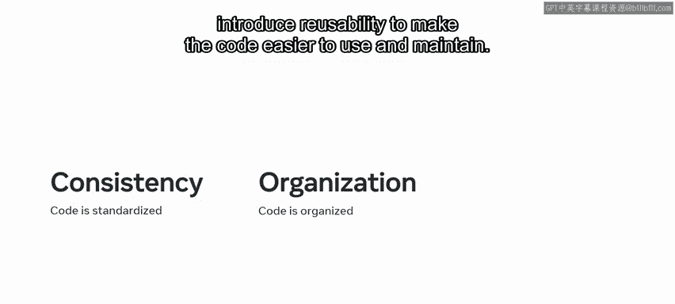
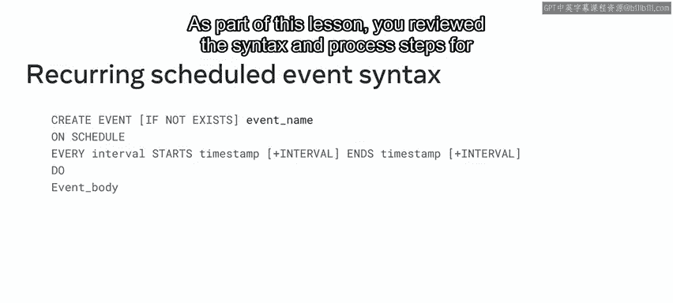

# 118：函数与触发器模块小结 🎯

在本模块中，我们学习了MySQL中的高级函数、存储过程、触发器以及事件。这些工具能帮助你封装代码、实现自动化操作，从而提升数据库的效率和可维护性。

## 课程介绍与目标 🎯

在第一课中，我们介绍了本课程。你了解了Meta高级数据库工程师的角色，与同学讨论了学习目标，并预览了课程将涵盖的主题。通过复习关键资源，你巩固了相关知识。

## 高级MySQL函数与存储过程 📊

上一节我们介绍了课程概览，本节中我们来看看高级MySQL函数与存储过程。你学习了创建存储过程和函数的主要目的是将代码封装在函数或过程的主体中。

以下是存储过程和函数的主要优点：
*   使代码更一致、更有条理。
*   引入可重用性，使代码更易于使用和维护。

你还了解到函数和存储过程的关键区别在于参数。**函数只能有输入参数**，而**存储过程可以同时拥有输入和输出参数**。

接着，你学习了如何利用变量和参数在MySQL中创建更复杂的存储函数和过程。
*   **变量**用于在SQL语句之间，或在过程与SQL语句之间传递值。你可以在存储过程内部或外部，以及在SELECT语句内部或外部创建变量。
*   **参数**用于从外部向函数或过程传递参数或值。在存储过程中，可以声明三种不同类型的参数：**IN**、**OUT** 和 **INOUT** 参数。

此外，你还学习了当MySQL内置函数无法满足项目需求时，如何开发用户自定义函数。数据库工程师可以编写自己的代码，该代码执行特定功能，然后返回所需结果。

## MySQL触发器与事件 ⚙️

在第三课中，我们探讨了MySQL触发器和事件。你了解到MySQL触发器是一组以存储程序形式存在的操作。当某些事件发生时，这组操作会自动被调用。这些事件的例子包括在MySQL数据库表中插入、更新和删除数据。

以下是用于管理SQL事件的两种主要触发器类型：
*   **行级触发器**
*   **语句级触发器**

接下来，你学习了如何在MySQL中创建和删除这些触发器。你现在可以使用 **`CREATE TRIGGER`** 语句创建触发器，并使用 **`DROP TRIGGER`** 命令删除触发器。

你还回顾了创建MySQL触发器时涉及的其他语法方面。这包括定义触发器名称和类型，以及通过将多个语句包含在 **`BEGIN...END`** 块中来指定逻辑。

作为本课的一部分，你还学习了MySQL计划事件。你回顾了在MySQL中创建计划事件的语法和步骤。

## 总结 📝

本节课中，我们一起学习了MySQL中的高级函数、存储过程、触发器以及计划事件。你现在应该能够在MySQL数据库中运用函数和触发器了。做得很好！我期待在下一个模块中继续指导你，在那里你将学习如何优化数据库。