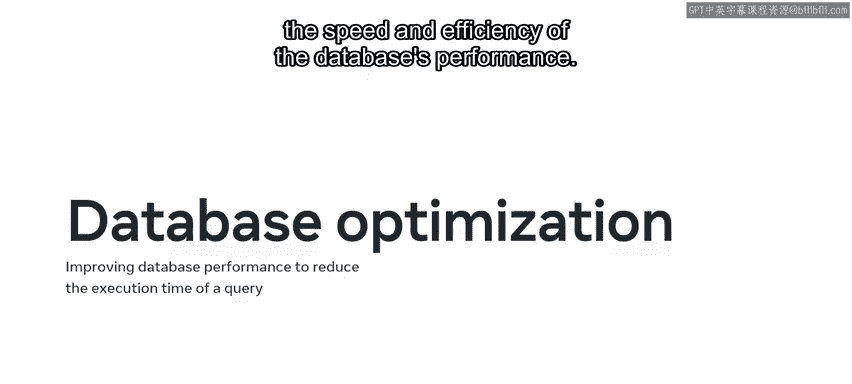
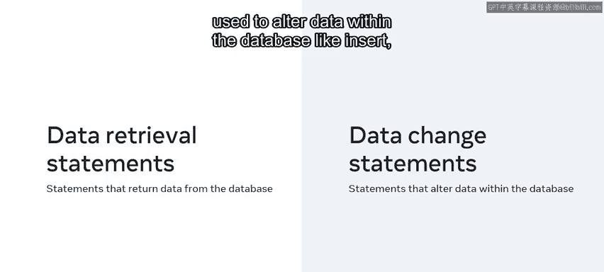
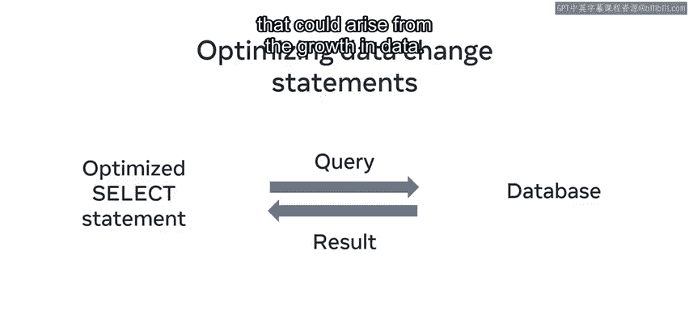

# 119：数据库优化概述 🚀

在本节课中，我们将要学习数据库优化的基本概念及其重要性。随着数据量的增长和业务需求的复杂化，数据库的响应速度可能会变慢。通过优化，我们可以提升数据库的性能，确保快速响应查询。

## 概述

数据库优化是提升数据库系统性能的过程，旨在减少查询、处理和传输用户请求所需的时间。本质上，它是最大化数据库运行速度和效率的方法。一个经过优化的数据库能够快速处理SQL查询并返回所需数据。值得注意的是，数据库性能同时依赖于硬件和软件。在本课程中，我们将重点学习使用MySQL软件来优化查询。

## SQL语句的分类

在课程的这个阶段，你已经接触了许多不同类型的SQL语句。这些语句主要可以分为两大类：**数据检索语句**和**数据更改语句**。

以下是这两类语句的简要说明：

*   **数据检索语句**：这类语句用于从数据库中返回数据，通常指`SELECT`语句。
*   **数据更改语句**：这类语句用于修改数据库中的数据，例如`INSERT`、`UPDATE`和`DELETE`语句。





这两种类型的语句需要不同的优化技术。在本模块的后续部分，我们将详细探讨这些技术，现在我们先了解一些基础知识。

## 优化数据检索语句

数据检索语句即`SELECT`语句。优化`SELECT`语句涉及大量工作，其中**索引**是典型且核心的方法。


索引是一种可以快速查找数据的“手柄”，它创建在表的列上。其基本概念可以表示为：
**索引** -> 快速定位数据


我们将在本课后面更深入地学习索引。

以下是本课中你将遇到的其他优化`SELECT`语句的方法：


*   在`SELECT`命令中明确指定所需的列，而不是使用`SELECT *`。
*   谨慎在查询条件（`WHERE`子句）中使用函数和通配符（如`%`）。
*   在可能的情况下，优先使用内连接（`INNER JOIN`）而非外连接（`OUTER JOIN`）。
*   了解`DISTINCT`和`UNION`子句的使用场景，避免不必要的开销。
*   使用`ORDER BY`子句对结果进行排序时，注意其对性能的影响。

## 优化数据更改语句

优化数据更改语句需要不同的方法。

例如，优化`UPDATE`和`DELETE`语句，首先需要优化其`WHERE`子句中的条件，以确保高效定位要修改的行。

对于`INSERT`语句，可以通过执行**批量插入**来优化。这意味着在单次`INSERT`操作中插入多行数据，其基本形式如下：
```sql
INSERT INTO table_name (column1, column2) VALUES
(value1a, value2a),
(value1b, value2b),
...;
```

目前，你只需要了解数据检索语句与数据更改语句在优化上的区别即可。我们将在本课后面进行更深入的探索。

## 优化的重要性

尽管数据库优化可能很复杂，但这项努力是值得的。正如你所了解的，一个经过优化的数据库能提供更快的响应时间，从而提升整体性能，同时还能减轻数据库不必要的负载。

通过优化数据库，Lucky Shrub公司可以更快速、更高效地处理其销售数据，避免因数据增长而可能出现的潜在问题。




## 总结

本节课中，我们一起学习了数据库优化的概念，并了解了可以优化的不同类型SQL语句。你现在应该对为什么需要进行优化以及优化的基本方向有了初步认识。干得不错！