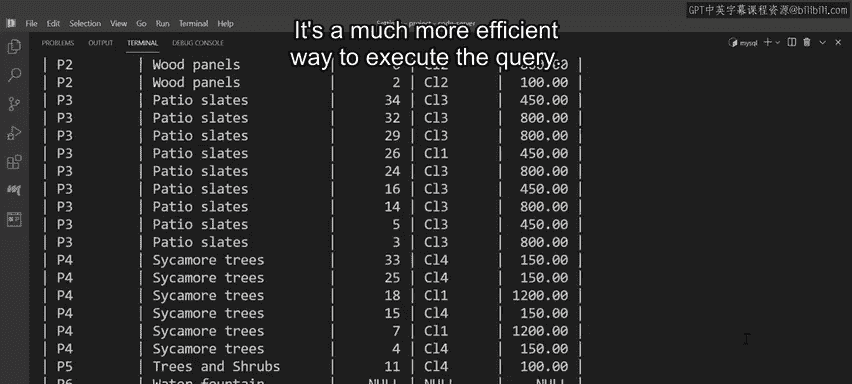

# 入门 121：优化SELECT语句

在本节课中，我们将学习如何优化MySQL数据库中的SELECT查询语句。通过分析Lucky Shrub公司的三个实际业务场景，我们将了解常见的查询性能问题及其高效的解决方案，包括避免在WHERE子句中使用函数、优化模糊查询以及选择合适的JOIN类型。

## 场景一：查询特定送达日期的订单

销售部门需要找出所有预计在9月12日送达的订单。

一种直接的方法是编写一个使用`WHERE`子句和`DATE_ADD`函数的SELECT查询。然而，在`WHERE`子句中使用函数（如`DATE_ADD`）会让数据库进行大量额外的计算，这会显著增加数据库的负载。

**低效查询示例：**
```sql
SELECT * FROM orders WHERE DATE_ADD(order_date, INTERVAL 7 DAY) = '2023-09-12';
```

一个更高效的方法是在订单表中预生成一个名为`expected_delivery_date`（预计送达日期）的自定义列。这个列直接存储每条订单的预计送达日期。

现在，Lucky Shrub只需要扫描该列，查找所有值等于‘2023-09-12’的记录，而不再需要使用函数进行计算。

**高效查询示例：**
```sql
SELECT * FROM orders WHERE expected_delivery_date = '2023-09-12';
```

通过将计算提前并存储结果，我们避免了查询时的实时计算，从而提升了查询效率。

## 场景二：查找特定姓氏的客户

销售部门的下一个任务是为一位姓氏为“Eto”的客户处理订单。首先，他们需要在数据库的客户表中找到该客户的详细信息。


一种方法是使用`SELECT`语句，结合前导通配符和`LIKE`操作符。但是，当`LIKE`操作符以通配符（`%`）开头时，MySQL无法利用索引，导致查询必须进行全表扫描，速度很慢。

**低效查询示例：**
```sql
SELECT * FROM clients WHERE full_name LIKE '%Eto';
```

解决方案是使用`ALTER TABLE`语句向客户表添加一个新列，命名为`reverse_full_name`。这个列包含客户姓名，但是反转存储的。也就是说，客户的姓氏在前，名字在后。

**添加列并更新数据：**
```sql
ALTER TABLE clients ADD COLUMN reverse_full_name VARCHAR(255);
UPDATE clients SET reverse_full_name = CONCAT(SUBSTRING_INDEX(full_name, ' ', -1), ' ', SUBSTRING_INDEX(full_name, ' ', 1));
```

接下来，使用`CREATE INDEX`语法在这个新列上创建一个索引。

**创建索引：**
```sql
CREATE INDEX idx_reverse_name ON clients (reverse_full_name);
```

现在，你可以在`reverse_full_name`列上使用后导通配符和`LIKE`操作符来达到相同的查询目的，并且仍然能够利用索引。

**高效查询示例：**
```sql
SELECT * FROM clients WHERE reverse_full_name LIKE 'Eto%';
```

通过将数据重组并建立索引，我们使得基于姓氏的模糊查询变得高效。

## 场景三：生成所有订单的财务报告

财务部门需要一份包含所有已下订单的报告。他们可以通过关联数据库中的`products`（产品）表和`orders`（订单）表来提取这些信息。

通常，这个任务可以通过使用`OUTER JOIN`（外连接）查询来完成。然而，这种类型的查询会返回两个表中所有不匹配的记录，即使这些记录并不需要。

一个更高效的查询方法是让Lucky Shrub使用`INNER JOIN`（内连接），并基于两个表共享的`product_id`列进行连接。

**高效查询示例：**
```sql
SELECT o.order_id, p.product_name, o.quantity
FROM orders o
INNER JOIN products p ON o.product_id = p.product_id;
```

`INNER JOIN`只返回在两个表中都有匹配的记录。对于只需要已下单产品信息的场景来说，这是一种更高效的查询执行方式。

## 总结



本节课中，我们一起学习了优化MySQL SELECT查询的三个核心技巧：

1.  **避免在WHERE子句中使用函数**：通过预计算并存储结果到新列中，可以消除查询时的计算开销。
2.  **优化模糊查询**：通过反转字符串并建立索引，可以将无法使用索引的前导通配符查询，转换为可以使用索引的后导通配符查询。
3.  **选择合适的JOIN类型**：根据业务需求选择`INNER JOIN`而非`OUTER JOIN`，可以避免返回不必要的非匹配记录，提升查询效率。


掌握这些基本的优化指南，将帮助你编写出更高效、响应更快的数据库查询语句。