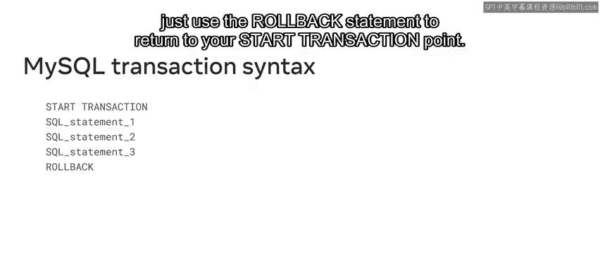
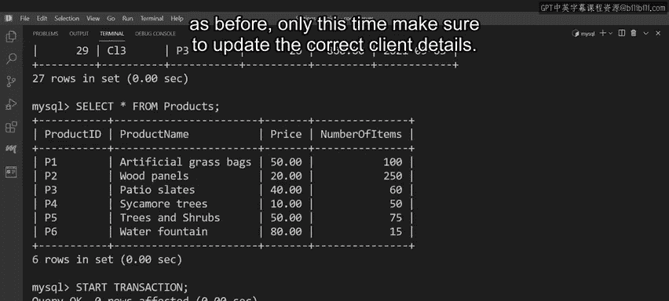

# 入门 123：MySQL事务管理 🛡️

在本节课中，我们将要学习MySQL中的事务管理。事务是确保数据库操作完整性和一致性的关键机制，尤其在进行一系列相关操作时至关重要。通过学习，你将掌握如何使用事务语句来开始、提交或回滚数据库操作，从而避免因错误导致的数据不一致问题。

## 什么是MySQL事务？ 🔄

上一节我们介绍了事务的重要性，本节中我们来看看事务的具体定义。正如Lucky Shrub公司的案例所示，MySQL事务是一个或多个查询的集合，这些查询可以作为一个整体被永久提交到数据库。如果其中任何一个查询未能按要求执行，数据库可以回滚到其原始状态。

MySQL提供了以下一组语句来管理数据库事务：
*   `START TRANSACTION`
*   `BEGIN` 或 `BEGIN WORK`
*   `COMMIT`
*   `ROLLBACK`

## 事务管理语句详解 ⚙️

现在我们已经了解了事务的基本概念，接下来详细探讨每个事务管理语句的用法。

### 开始事务

`START TRANSACTION` 是启动事务过程的标准SQL语句。其语法标记了如果你决定回滚进程，将返回到的点。

以下是开始事务的语法示例：
```sql
START TRANSACTION;
-- 你的SQL语句放在这里
```

例如，Lucky Shrub公司可以以 `START TRANSACTION` 语句开始他们的数据库更新，然后在其后列出所需的SQL查询。

然而，`START TRANSACTION` 并不是在MySQL中开始事务的唯一方式。你也可以使用 `BEGIN` 或 `BEGIN WORK` 别名作为启动事务的替代方法。

### 提交事务

无论你选择哪种方法开始事务，一旦你完成了SQL语句的输入并对结果满意，就是时候将事务提交到数据库了。你可以使用 `COMMIT` 语句将事务更改永久提交到数据库。

只需在你的代码块末尾键入 `COMMIT` 语句。

### 回滚事务

但是，如果你在事务过程中遇到错误怎么办？就像Lucky Shrub公司遇到的网络连接问题，或者你可能键入了错误的代码、执行了错误的语句或输入了不正确的数据。你可以使用 `ROLLBACK` 命令回滚当前事务并取消对数据库所做的更改。

只需将 `ROLLBACK` 语句添加到你的SQL语句末尾，即可返回到 `START TRANSACTION` 点。然而，重要的是要记住，`ROLLBACK` 语句必须在提交SQL语句之前执行。一旦你回滚了代码，就需要键入正确的SQL语句，并对这些语句满意后，键入 `COMMIT` 将更改提交到数据库。

## 事务流程总结 📝

所以，让我们快速回顾一下这个过程：
1.  使用 `START TRANSACTION` 开始你的事务。
2.  键入你所需的SQL语句。
3.  使用 `COMMIT` 将你的更改提交到数据库。
4.  如果你遇到任何错误或其他问题，只需使用 `ROLLBACK` 语句返回到你的 `START TRANSACTION` 点。



## 实战演练：帮助Lucky Shrub更新数据 🛒

现在你已经熟悉了MySQL事务及相关语句，让我们看看你是否能帮助Lucky Shrub公司更新其数据库表中的销售和库存水平。

**场景**：一位ID为`CL1`的客户刚刚在线订购了10袋人造草。该商品在`products`表中的产品ID为`P1`。目前库存有100袋。一旦处理完客户的订单，这个数字必须更新为90。

以下是操作步骤：

1.  **开始事务**：首先，键入 `START TRANSACTION` 来确定如果发生错误可以回滚到的点。
2.  **添加SQL语句**：现在，你需要添加所需的SQL语句。
    *   **第一条是 `INSERT INTO` 语句**：该语句将客户订单的新值集插入到`orders`表的所需列中。
    *   **然后键入 `UPDATE` 语句**：该语句通过从当前库存水平中扣除10个单位来更新`products`表中人造草的数量。
    *   **下一步是使用 `SELECT` 语句**：该语句使用两个表共有的`product ID`键，在`orders`和`products`表之间创建内连接。执行此语句以检查事务是否按预期完成。

**模拟错误与回滚**：不幸的是，看起来出现了错误。这些更新被应用到了ID为`CL11`的客户。似乎你在代码中键错了客户ID。

没问题。你可以使用 `ROLLBACK` 语句恢复数据。现在，再次使用 `SELECT` 语句检查`orders`和`products`表。所有数据都已恢复到其原始状态。

**重新执行正确的事务**：所以，让我们再次键入 `START TRANSACTION`，后面跟上与之前相同的SQL语句。只是这一次，确保更新正确的客户详细信息。完成新的SQL语句集后，检查输出是否符合预期。

很好，这次所有细节都正确。你现在可以键入 `COMMIT` 将更改提交到数据库。

## 课程总结 🎯



本节课中我们一起学习了MySQL事务管理的核心知识。你现在应该能够使用事务语句来管理MySQL数据库中的事务了。我们了解了事务的定义，掌握了 `START TRANSACTION`、`COMMIT` 和 `ROLLBACK` 等关键语句的用法，并通过一个实战演练模拟了完整的事务流程，包括错误处理和回滚操作。这能确保即使在复杂的多步数据库操作中，数据也能保持完整和一致。干得漂亮。