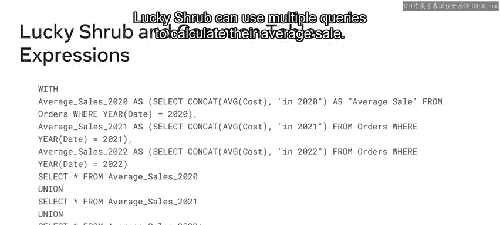
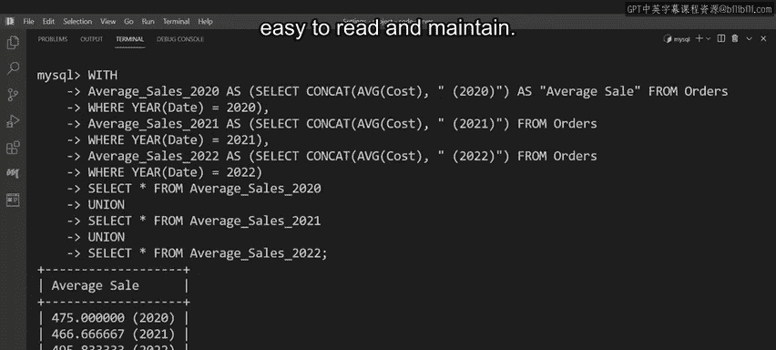

# 124：MySQL公共表表达式（CTE）📊

在本节课中，我们将要学习如何使用MySQL的公共表表达式（CTE）来优化复杂的SQL查询。CTE可以将冗长、难以管理的查询语句编译成简单、可重用的代码块，从而提升代码的可读性和可维护性。

## 什么是公共表表达式（CTE）？

当处理数据库时，您经常需要编写复杂的SQL查询。这些查询可能难以管理。然而，您可以通过使用公共表表达式（CTE）将它们编译成简单的代码块来优化这些查询。

公共表表达式是一种通过将复杂查询编译成简单代码块来优化数据库查询的方法。然后可以通过调用CTE来重写查询。这简化了查询，使其更易于阅读和维护。

## CTE的基本语法

上一节我们介绍了CTE的概念，本节中我们来看看如何创建它。公共表表达式可以为单个或多个查询创建。这完全取决于您的数据库需求。

让我们从单个CTE的语法示例开始。

### 创建单个CTE

单个CTE查询的语法使用 `WITH` 子句来开始公共表表达式。其后跟随CTE的名称（可以是自定义名称）。然后使用 `AS` 关键字将括号内的查询与CTE名称关联起来。最后，创建一个 `SELECT` 语句来查询公共表表达式的名称。

其基本代码结构如下：
```sql
WITH cte_name AS (
    -- 您的查询逻辑在这里
)
SELECT * FROM cte_name;
```

### 创建多个CTE

创建多个查询的语法稍微复杂一些。使用 `WITH` 子句开始代码块，然后在 `WITH` 子句下列出查询。确保每个查询都有唯一的名称，并且用逗号分隔。最后，键入您的 `SELECT` 语句。



以下是多个CTE的代码结构：
```sql
WITH
    cte_name1 AS ( ... ),
    cte_name2 AS ( ... ),
    cte_name3 AS ( ... )
SELECT * FROM cte_name1
UNION
SELECT * FROM cte_name2
UNION
SELECT * FROM cte_name3;
```

要执行CTE，请在 `SELECT` 语句后键入其名称。或者，您可以一次执行多个CTE。要在单个 `SELECT` 语句中执行多个CTE，请在语句之间放置 `UNION` 运算符，以在输出结果中返回所有语句的数据。

## 实践案例：优化Lucky Shrub的查询

现在，让我们将学到的知识应用到一个实际案例中。Lucky Shrub公司的财务部门需要计算过去三个财年每位客户的平均销售额。他们的当前方法是创建三个独立的 `SELECT` 语句（每年一个），并使用 `UNION` 运算符组合它们。

每个语句都使用聚合函数和字符串连接函数来计算平均成本。数据从 `orders` 表中提取，条件使用 `WHERE` 子句指定。虽然这些查询能达到目的，但它们相当复杂且难以管理。

我们可以使用公共表表达式来提高它们的可读性。以下是优化的步骤：

1.  首先使用 `WITH` 子句。
2.  将第一个表达式重写为 `average_sales_2020`，后跟所需的逻辑。您可以使用 `AS` 关键字将其别名为 `average_sale` 以提高可读性。
3.  然后创建第二个和第三个表达式。使用 `AS` 关键字将表达式与查询关联，并确保每个表达式用逗号分隔。
4.  现在，您只需要键入三个 `SELECT` 语句。每个语句使用星号 (`*`) 符号从三个表达式中提取所有数据。
5.  在查询之间放置 `UNION` 运算符以组合结果。
6.  最后，执行代码。

优化后的查询输出结果与原始查询相同。然而，这次您创建了一个更优化的查询。所有表达式现在都包含在一个易于阅读和维护的简单代码块中。

## 总结



本节课中我们一起学习了MySQL公共表表达式（CTE）的使用。您应该已经熟悉了如何使用CTE来优化数据库查询。通过将复杂逻辑封装到命名的临时结果集中，CTE使SQL代码更加清晰、模块化和易于维护。这是一种处理复杂报表和多步骤数据操作的强大工具。