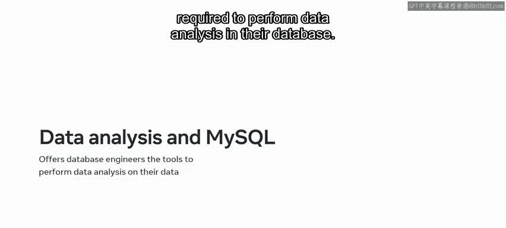
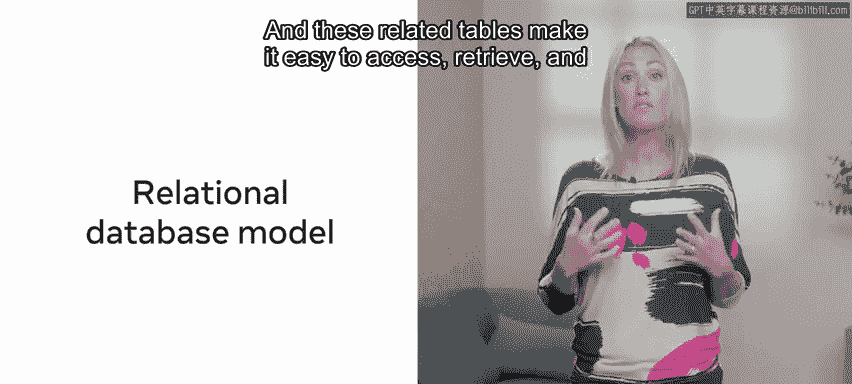
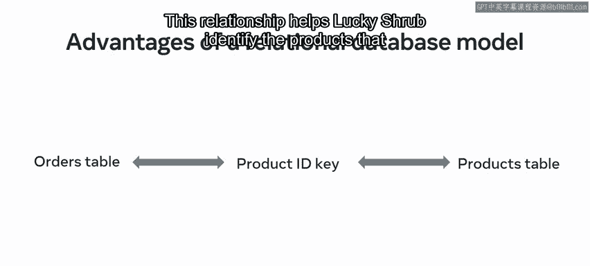
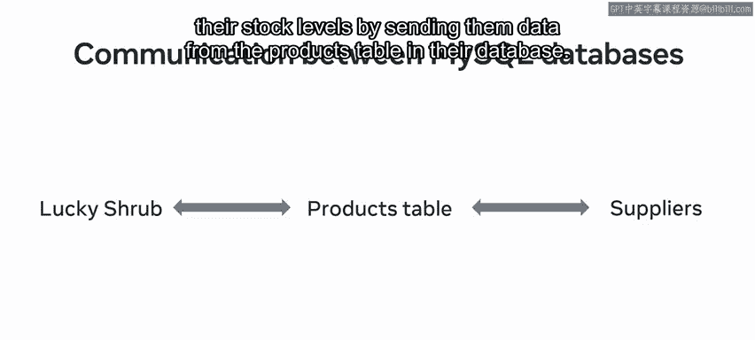
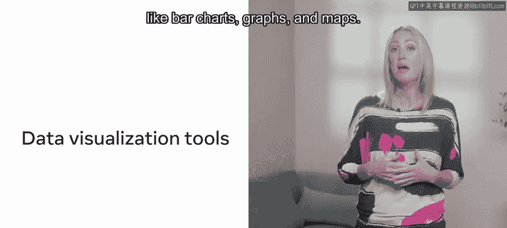
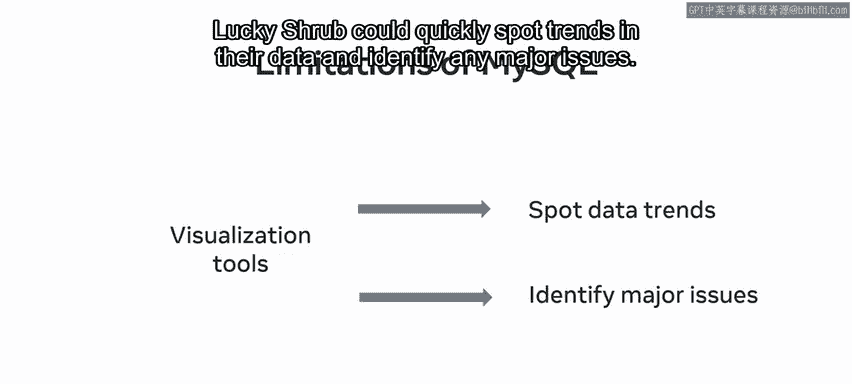

**P129：使用MySQL进行数据分析**

在本节课中，我们将探讨MySQL与数据分析之间的关系，并了解MySQL作为数据分析工具的优势与局限性。

通过前面的学习，你应该已经熟悉了数据分析的概念及其与数据处理的区别。本节中，我们将具体看看MySQL如何应用于数据分析场景。

---

**MySQL在数据分析中的应用**

Lucky Shrub公司利用MySQL来存储数据并进行数据分析。他们的数据库每天处理大量数据，包括在线订单、客户信息以及产品数据。MySQL为他们提供了一套有效的工具来管理和处理这些数据。

接下来，我们将了解Lucky Shrub如何利用MySQL来分析这些数据。

---

**MySQL的优势**

随着课程的深入，你已经了解到MySQL的强大功能。MySQL的另一个优势在于，它为数据库工程师提供了对数据库中数据进行**数据分析**所需的工具。

然而，与其他更高级的数据分析工具相比，MySQL也存在其局限性。让我们花点时间来探讨这些方面。

**关系型模型**
MySQL数据库基于**关系型数据库模型**构建。正如你在先前课程中学到的，关系模型将数据集组织在相互关联的表中，这些关联表使得访问、检索和分析相关信息变得容易。

通过MySQL，Lucky Shrub可以使用**外键**来连接他们的数据库表。这意味着他们可以利用一个表来定位另一个表中的信息。例如，`orders`表和`products`表通过`product_id`键连接。这种关系帮助Lucky Shrub识别每位客户订购了哪些产品。

**开源与成本**
MySQL是一个免费、开源的数据库管理系统。因此，在使用MySQL管理数据库时，无需考虑许可或知识产权成本。这对Lucky Shrub非常有益，因为它降低了业务运营成本。

**广泛使用**
由于其容量和可访问性，MySQL是一个非常广泛使用的数据库管理系统。大量企业、政府和其他组织使用MySQL来收集、存储和处理数据。这使得这些组织之间更容易沟通数据并改进其数据分析。

例如，Lucky Shrub的供应商也使用MySQL管理数据。因此，Lucky Shrub可以通过从数据库的`products`表中发送数据，让供应商及时了解其库存水平信息。

---

**MySQL的局限性**

尽管有上述优势，MySQL也存在一些局限性。

**分析能力有限**
MySQL执行数据分析的能力比其他更高级的数据分析工具有限得多。使用其他工具，数据库工程师可以借助强大的人工智能执行更复杂的数据分析。

**缺乏数据可视化功能**
MySQL缺乏数据可视化功能。其他数据库分析工具为数据库工程师提供了如条形图、曲线图和地图等可视化功能。与仅以表格形式呈现数据相比，这些工具是传达信息的更有效方式。借助这些可视化工具，Lucky Shrub可以快速发现数据趋势并识别任何重大问题。

---

**总结**

本节课中，我们一起学习了将MySQL用作数据库管理系统的一系列广泛优势：它是免费开源的、能在关系系统中存储大量数据，并且被各种组织广泛使用。

然而，与其他更先进的数据分析工具相比，其数据分析和可视化能力较为有限。理解这些优势和局限，有助于你在实际工作中为不同的数据分析任务选择合适的工具。