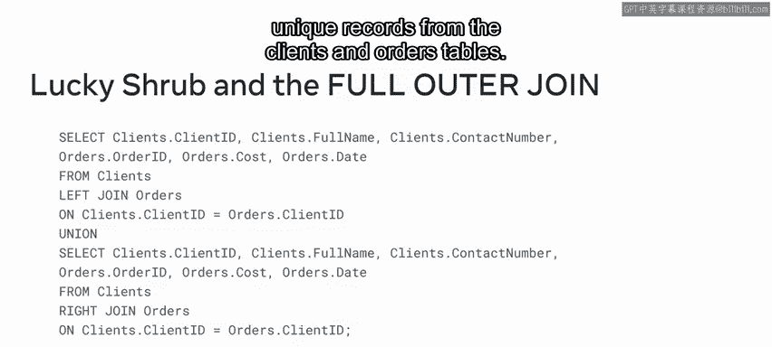
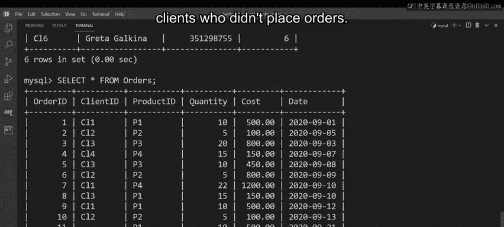

# 入门 131：在MySQL中模拟全外连接 🧩

在本节课中，我们将学习如何在MySQL中模拟“全外连接”（Full Outer Join）。全外连接是一种能够同时返回两个表中所有记录（包括匹配和不匹配的记录）的查询方式。由于MySQL本身不直接支持`FULL OUTER JOIN`语法，我们将通过组合`LEFT JOIN`、`RIGHT JOIN`和`UNION`（或`UNION ALL`）操作符来实现相同的效果。

## 什么是全外连接？

在SQL中，全外连接会返回左表和右表中的所有记录。当在两个表之间找到匹配项时，它会返回匹配的记录；如果没有找到匹配项，它也会返回不匹配的记录，并用`NULL`值填充缺失侧的列。

然而，MySQL数据库并不原生支持`FULL OUTER JOIN`。因此，我们需要通过其他方法来模拟这一功能。

## 模拟全外连接的方法

要模拟全外连接，核心思路是分别获取左连接和右连接的结果，然后将它们合并。以下是两种主要的合并方式：

1.  **使用 `UNION ALL` 操作符**：合并两个查询的结果集，并保留所有重复的记录。
2.  **使用 `UNION` 操作符**：合并两个查询的结果集，并自动去除重复的记录。

接下来，我们详细看看这两种方法的语法结构。

### 方法一：使用 UNION ALL 保留所有记录

以下是使用`UNION ALL`模拟全外连接的基本语法框架：

```sql
SELECT [所需列]
FROM 左表
LEFT JOIN 右表 ON 左表.匹配列 = 右表.匹配列
UNION ALL
SELECT [相同顺序的所需列]
FROM 左表
RIGHT JOIN 右表 ON 左表.匹配列 = 右表.匹配列;
```

**语法解析**：
*   第一个`SELECT`语句使用`LEFT JOIN`，会返回左表的所有记录，以及右表中匹配的记录（不匹配的右表列显示为`NULL`）。
*   `UNION ALL`操作符将直接拼接两个结果集，即使存在完全相同的行也会保留。
*   第二个`SELECT`语句使用`RIGHT JOIN`，会返回右表的所有记录，以及左表中匹配的记录（不匹配的左表列显示为`NULL`）。
*   两个`SELECT`语句选择的列必须数量相同且数据类型兼容。

### 方法二：使用 UNION 去除重复记录

如果希望结果集中不包含重复的行，可以使用`UNION`操作符。其语法与`UNION ALL`非常相似，只需替换关键字即可：

```sql
SELECT [所需列]
FROM 左表
LEFT JOIN 右表 ON 左表.匹配列 = 右表.匹配列
UNION
SELECT [相同顺序的所需列]
FROM 左表
RIGHT JOIN 右表 ON 左表.匹配列 = 右表.匹配列;
```

**核心区别**：`UNION`会自动对合并后的结果集进行去重，而`UNION ALL`则不会。

## 实战演练：为Lucky Shrub公司提取数据



现在，让我们通过一个实际案例来应用上述知识。假设Lucky Shrub公司需要一份完整的报告，包含：
1.  所有新订单及其对应的客户信息。
2.  所有客户的信息，包括那些尚未下过订单的客户。

相关数据存储在`clients`（客户）表和`orders`（订单）表中。我们将使用`UNION`操作符来获取不重复的完整记录。

以下是具体的SQL查询语句：



```sql
SELECT 
    clients.ClientID, 
    clients.FullName, 
    clients.ContactNumber,
    orders.OrderID, 
    orders.Cost, 
    orders.Date
FROM clients
LEFT JOIN orders ON clients.ClientID = orders.ClientID
UNION
SELECT 
    clients.ClientID, 
    clients.FullName, 
    clients.ContactNumber,
    orders.OrderID, 
    orders.Cost, 
    orders.Date
FROM clients
RIGHT JOIN orders ON clients.ClientID = orders.ClientID;
```

**语句执行效果**：
*   查询结果将展示所有的`ClientID`及其关联的`OrderID`。
*   对于成功匹配的订单和客户，所有字段都有值。
*   对于没有下过订单的客户，其`OrderID`、`Cost`和`Date`字段将显示为`NULL`。
*   对于（理论上）没有对应客户信息的订单，其客户信息字段将显示为`NULL`（尽管外键约束通常避免这种情况）。
*   由于使用了`UNION`，完全相同的行（即匹配成功的记录）只会出现一次。

执行此语句后，Lucky Shrub公司便能获得他们所需的来自两个表的所有记录。

## 总结

本节课中，我们一起学习了如何在MySQL中模拟全外连接。我们了解到，虽然MySQL不直接支持`FULL OUTER JOIN`，但可以通过`LEFT JOIN`、`RIGHT JOIN`配合`UNION`或`UNION ALL`操作符来实现相同的功能。关键步骤是：
1.  编写一个`LEFT JOIN`查询以获取左表全部记录及匹配的右表记录。
2.  编写一个`RIGHT JOIN`查询以获取右表全部记录及匹配的左表记录。
3.  使用`UNION ALL`合并两者以保留所有记录，或使用`UNION`合并以去除重复记录。

掌握这一技巧，你就能灵活处理需要同时分析两个表全部数据的复杂查询场景了。