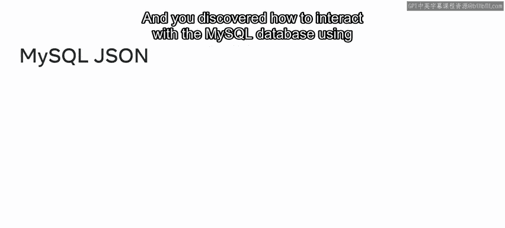
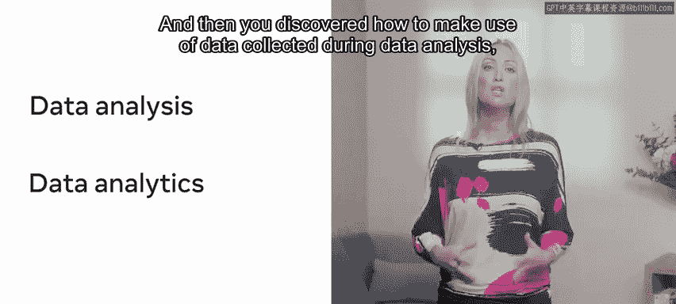
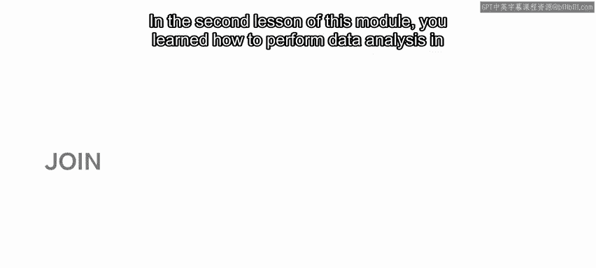

**MetaP134：高级MySQL课程回顾**

在本节课中，我们将回顾《高级MySQL》课程的核心内容。课程涵盖了函数与存储过程、数据库优化技术以及MySQL在数据分析中的应用等关键主题。让我们一起总结所学知识。

---

**模块一：高级MySQL编程**

上一节概述了课程目标，本节中我们来看看模块一的具体内容。本模块主要介绍了MySQL中的高级编程对象。

**函数与存储过程** 🛠️

在这一课中，你学习了如何在MySQL中创建和使用函数以及存储过程，以便复用或调用代码块来执行特定操作。

以下是本课的核心知识点：
*   **创建函数与存储过程**：你学会了使用 `CREATE FUNCTION` 和 `CREATE PROCEDURE` 语句来封装可重用的逻辑。
*   **使用变量与参数**：你掌握了如何利用变量和参数来创建更复杂的存储函数和过程，使其更加灵活。
*   **开发用户定义函数**：当MySQL的内置函数无法满足项目需求时，你学会了如何开发自定义函数（UDF）。

**触发器与事件** ⏰

接着，你学习了如何使用MySQL的触发器和事件来自动化数据库任务。

以下是本课的核心知识点：
*   **理解触发器**：你了解到MySQL触发器是一种存储程序形式的一组操作，当特定事件（如INSERT、UPDATE、DELETE）发生时会被自动调用。
*   **创建触发器**：你熟悉了 `CREATE TRIGGER` 命令的语法，包括定义触发器名称、类型，并使用 `BEGIN ... END` 块来封装触发器的执行逻辑。
*   **使用计划事件**：你理解了如何利用计划事件来确保数据库任务在特定时间自动执行。

---

**模块二：数据库优化核心**

在掌握了高级编程技巧后，我们进入模块二，学习提升数据库性能的核心规则与指南。

**优化数据库查询** ⚡

本课首先探讨了如何优化数据库查询，理解了数据库优化的概念及其为MySQL数据库带来的优势。

以下是本课的核心知识点：
*   **优化SELECT语句**：你回顾了优化SELECT语句的技术，例如仅选择必需的列、避免使用复杂函数，以确保查询快速高效执行。
*   **使用索引**：你学习了如何在MySQL中使用索引来加速数据检索查询的性能。

**高级优化技术** 📈

本模块的第二课概述了更多高级优化技术。

以下是本课的核心知识点：
*   **管理事务**：你学会了如何使用MySQL事务语句（如 `BEGIN`, `COMMIT`, `ROLLBACK`）来管理数据库事务，确保数据一致性。
*   **使用公共表表达式**：你发现了如何利用公共表表达式（CTE）将复杂的SQL查询组织成单个代码块，提高可读性和可维护性。
*   **使用预处理语句**：你学会了如何使用预处理语句（Prepared Statements）来限制MySQL编译和解析代码的次数，提升效率。
*   **使用JSON数据类型**：你探索了如何利用MySQL的JSON数据类型来存储和查询半结构化数据。

---

**模块三：MySQL与数据分析**

最后，我们进入模块三，探索MySQL与数据分析之间的关系。

**评估MySQL用于数据分析** 📊

本课首先帮助你理解了数据库分析与MySQL之间的关系，并学习了如何将数据分析过程中收集的数据转化为能为未来决策提供依据的有用信息。

以下是本课的核心知识点：
*   **数据分析类型**：你探索了可以在数据库中执行的不同类型的数据分析。
*   **MySQL的利弊**：你了解了MySQL作为数据分析工具的优势与局限性。

**在MySQL中执行数据分析** 🔍

在第二课中，你学习了如何使用SQL查询在MySQL中执行实际的数据分析。

以下是本课的核心知识点：
*   **使用SQL进行数据分析**：你掌握了使用连接（JOIN）、子查询和视图等SQL查询来进行数据分析。
*   **模拟全外连接**：你探索了如何在MySQL中模拟全外连接（FULL OUTER JOIN），以提取两个表中的所有记录，包括不匹配的记录。
*   **从多表提取数据**：你最终学会了如何使用JOIN方法从多个表中提取和整合数据。

---

**总结**

在本节课中，我们一起回顾了《高级MySQL》课程的核心内容。你学习了如何通过函数、存储过程、触发器和事件来增强MySQL的编程与自动化能力；掌握了优化数据库查询和使用索引、事务、CTE等高级技术来提升性能；并探索了如何利用MySQL进行有效的数据分析。

课程回顾至此结束。现在，是时候在分级评估中尝试运用你所学的知识了。祝你好运！😊