# Python 1：课程介绍 🐍

在本节课中，我们将要学习Meta《数据库工程师》课程中Python编程部分的整体介绍。我们将了解Python语言的特点、应用领域以及本课程的核心模块内容。

Python是一种多用途的高级编程语言，可在多种平台上使用。它是一种被各种规模的公司用来构建多样化应用程序的语言。Python的应用领域包括Web开发、数据分析和商业预测。Python编程语言的语法与英语非常相似，它很直观，初学者通常能快速理解其逻辑。对于有经验的程序员来说，Python也是一个绝佳选择，他们会欣赏其强大功能和适应性。由于Python是一个非常流行的软件开发工具，作为新开发者，了解其工作原理并掌握如何使用它进行编码非常重要。

本课程涵盖了开始Python编程所需了解的关键要点。

## 模块一：Python入门与基础概念

从模块一开始，您将开始学习Python编程语言及其相关的基础概念。

以下是您将在模块一中学习的主要内容：
*   您将学习识别Python的常见应用。
*   您将能够解释基础的软件工程概念。
*   您将使用运算符来编程输出。
*   您将使用控制流和循环来解决编码问题。

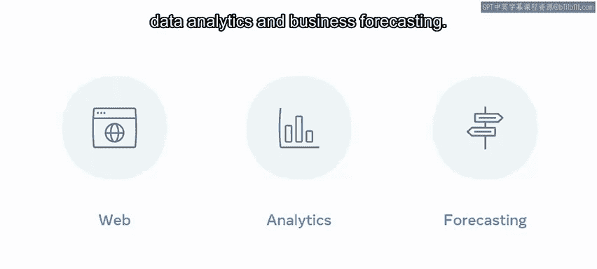

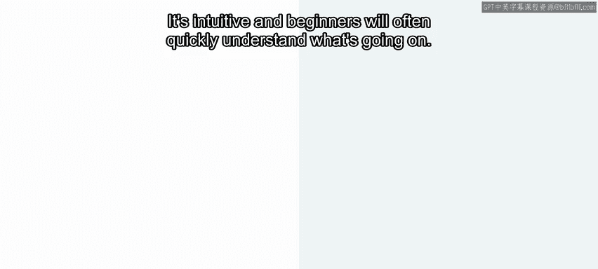

## 模块二：核心概念与数据处理

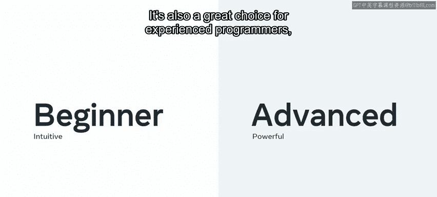

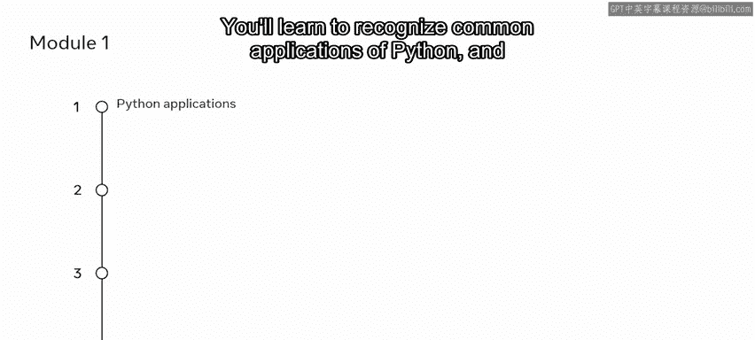

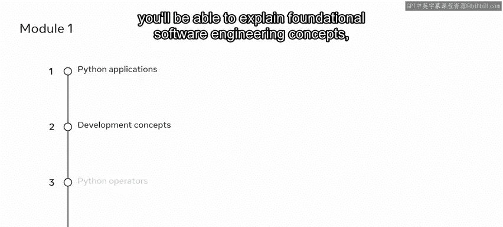

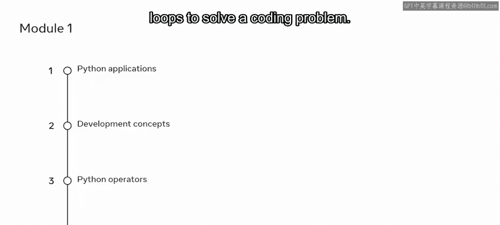

上一节我们介绍了入门基础，本节中我们来看看Python的核心概念。

在模块二中，您将在第一个模块的基础上，学习支撑Python编程语言的核心概念：变量和不同的数据类型。您将学习使用控制流和循环在特定条件下执行代码。

这个模块还会向您介绍如何在Python中使用函数和数据结构。

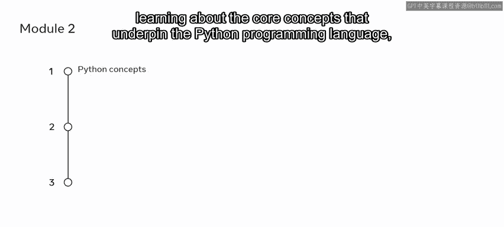

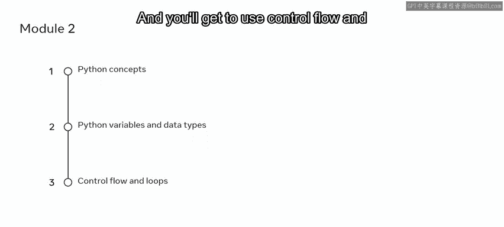

以下是模块二的其他关键学习点：
*   识别错误，确定其原因并决定如何处理它们。
*   在文件中创建、读取和写入数据。

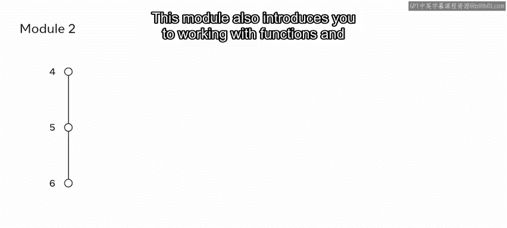

## 模块三：编程范式与高级特性

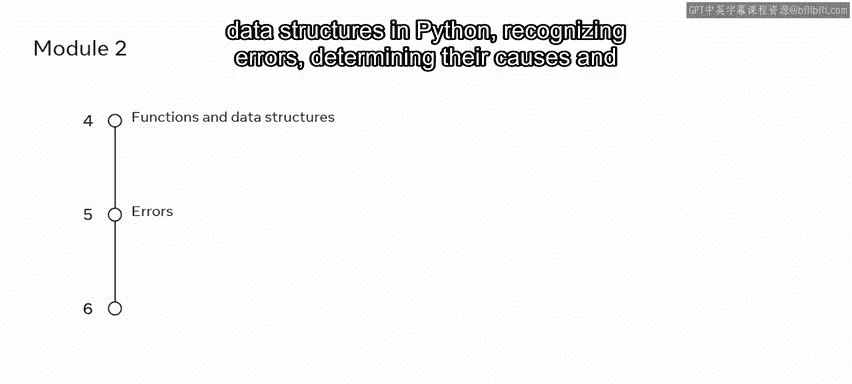

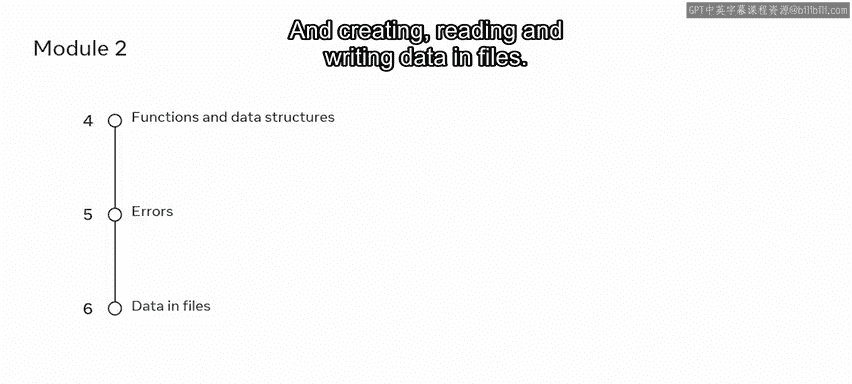

在掌握了核心概念后，模块三将带您进入更高级的编程领域。

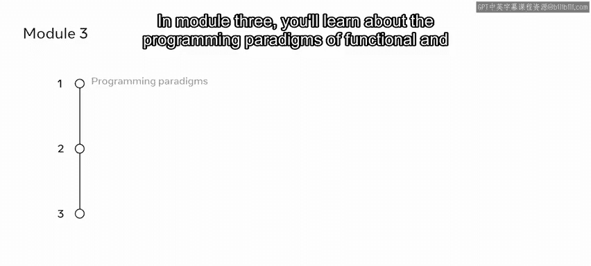

在模块三中，您将学习函数式编程和面向对象编程的编程范式。您将使用函数来探索算法思维。此外，您还将学习如何在Python中处理对象、类和方法。

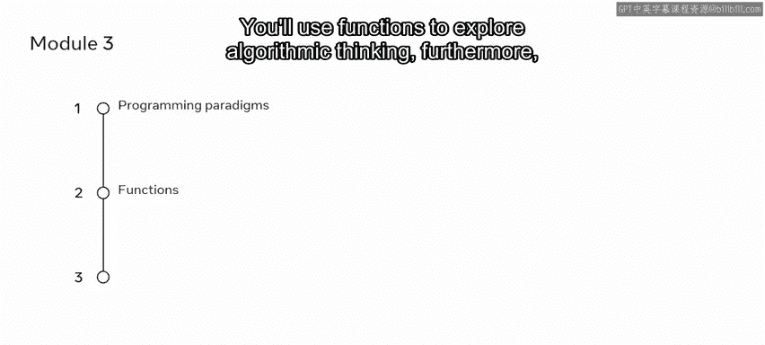

## 模块四：模块、包与开发工具

了解了编程范式，接下来我们将学习如何利用现有资源提升开发效率。

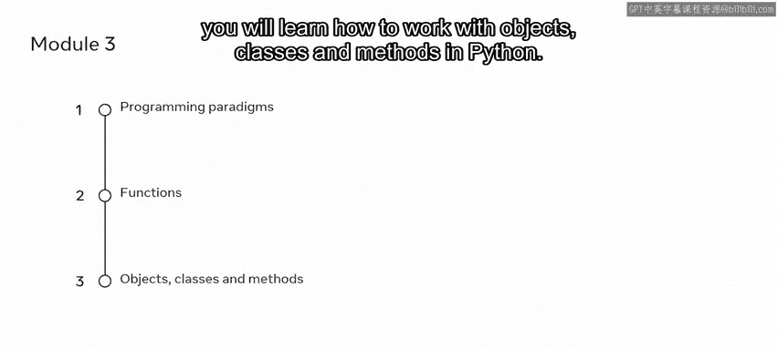

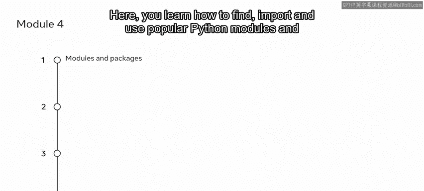

在模块四中，您将学习如何处理模块、包、库和工具。在这里，您将学习如何查找、导入和使用流行的Python模块和包。您将利用强大的工具来优化编程工作流程。您将发现不同类型的测试及其特点，并且能够使用测试工具来编写测试。

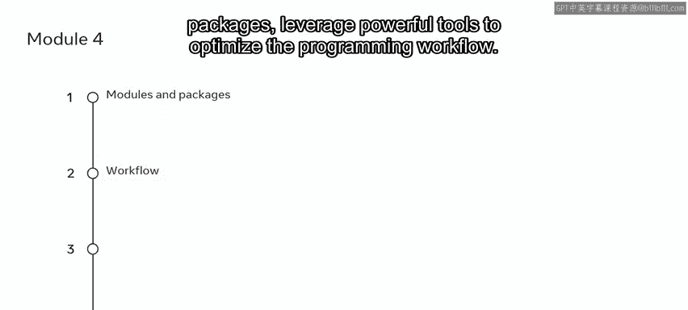

## 模块五：结业评估与展望

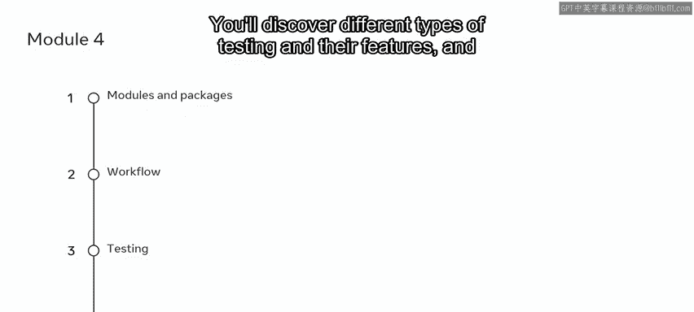

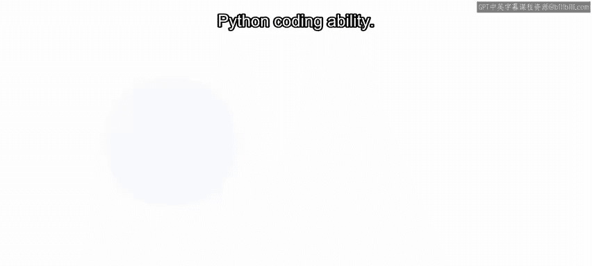

最后，我们将通过实践来检验学习成果。

模块五是分级评估，您可以在此展示您的Python编码能力。您将能够运用本课程所学的技能和知识，并有机会反思课程内容以及您未来的学习路径。

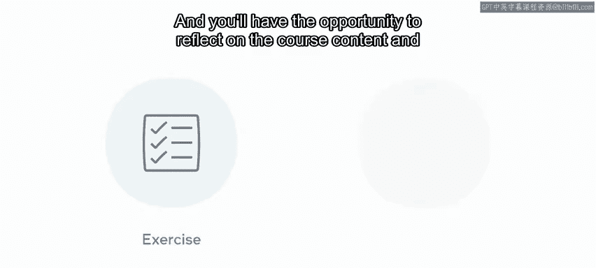

您可能在本视频中遇到了一些尚未完全理解的概念或术语。现在不必担心。本课程旨在解决所有此类问题，并为您打下坚实的Python编码基础。

本节课中我们一起学习了Python编程课程的完整结构，从基础语法到核心概念，再到高级编程范式和实用工具，最后以实践评估收尾。希望您享受这门课程。