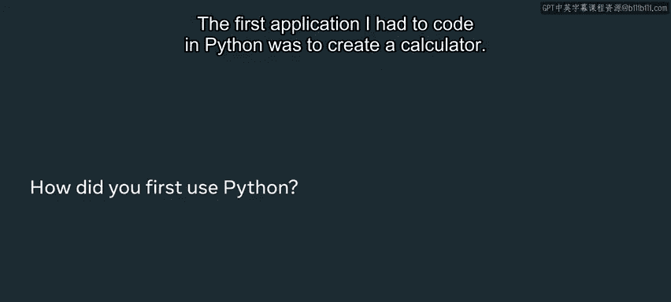
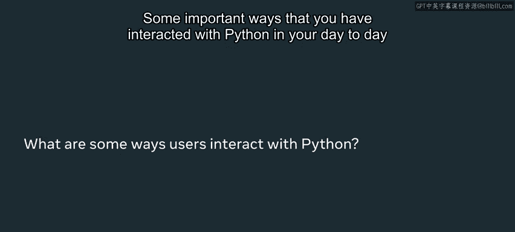
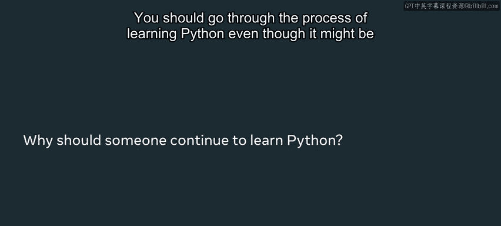

# Python 2：Python在现实世界中的应用 🐍

在本节课中，我们将了解Python编程语言的起源，聆听一位资深工程师的经验分享，并探索Python在当今科技行业中的广泛应用。我们将看到，Python不仅是一门简洁易学的语言，更是驱动众多流行服务和尖端技术的核心力量。

## Python的命名起源

Python的创造者非常喜欢英国喜剧团体“蒙提·派森的飞行马戏团”。因此，他选择了“Python”作为这门编程语言的名字，认为它简短且神秘，而不是指代蛇类。

## 工程师视角：Leilla Risby的经验

我是Leilla Risby，是Instagram后端团队的一名软件工程师，在旧金山工作。我使用Python编程已有10年之久。Python是我学习的第一门编程语言。我在Meta的日常工作中每天都会使用Python。它是我最喜欢的编程语言，因为它非常易于使用且简单。

我第一个需要用Python编写的应用程序是一个计算器。由于Python是我学习的第一门语言，构建我的第一个Python应用程序对我来说有些棘手。学习如何缩进、如何空格、学习语法、理解什么是循环以及所有这些核心的计算机科学概念对我来说非常困难。但我努力尝试，最终成功了。

## Python在日常生活中的应用

以下是一些你在日常活动中可能已经接触到的、由Python驱动的重要应用：
*   使用Instagram。
*   使用Facebook。
*   使用Google或Spotify。

Python是一门如此普遍的语言，无论你是否意识到，你很可能都已经使用过它。

## Python在工业与科技领域的应用

Python也被用于TensorFlow，这是一个机器学习框架。Airbnb用它来对图像进行分类，一些医疗保健公司用它来对MRI数据进行分类。

在Meta，Python被用于Instagram的后端。它被用于我们的广告机器学习算法。它也被我们的生产工程师用来维持服务的存活和运行。

## 学习Python的建议

即使学习过程可能充满挑战，你也应该坚持学习Python。因为它是一门相对容易学习的语言，它很简单。它拥有大量支持库，这使得构建更多功能变得更加容易。因为已经有很多工程师在使用它，所以可以更快地开发功能。使用Python，你可以更快地看到成果。

## 总结

本节课中，我们一起学习了Python命名的有趣起源，了解了资深工程师Leilla Risby从初学者到专家的学习路径。我们探讨了Python如何渗透到我们的日常生活（如Instagram、Facebook）以及工业界（如TensorFlow、Meta的广告系统）的方方面面。最后，我们明确了学习Python的价值：其简洁性、丰富的库和庞大的社区支持，使其成为快速开发和取得成果的强大工具。感谢观看今天的视频，祝你成为一名软件工程师的旅程顺利！