# 3：2_编程简介

## 概述
在本节课中，我们将要学习编程的简要历史，并了解计算机编程的基本工作原理。我们将从早期的计算设备开始，逐步深入到计算机如何理解指令，以及编程的本质是什么。

---

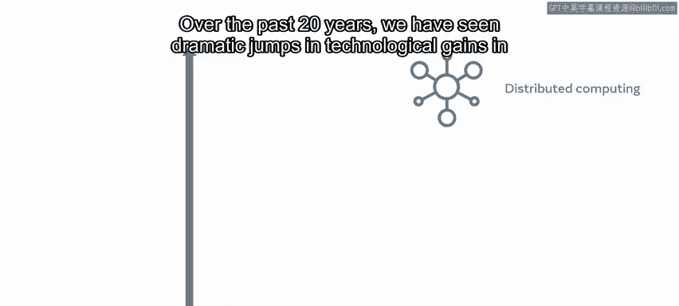

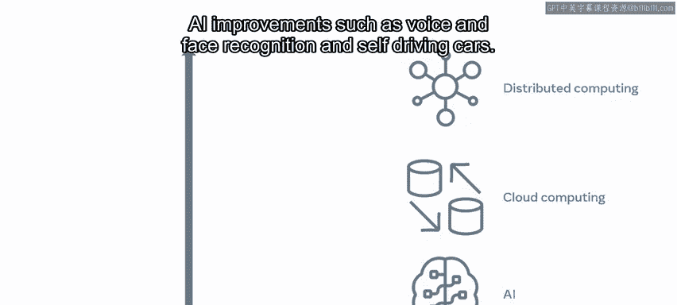

## 编程历史的开端 🕰️

计算机及其程序以我们难以想象的规模融入了我们的生活。

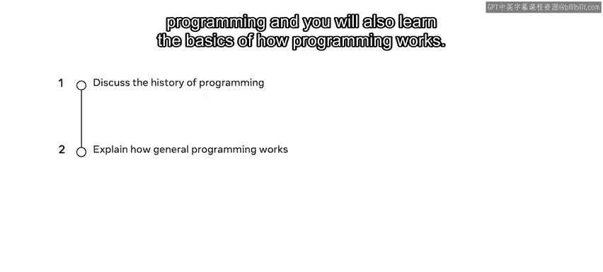

在过去的20年里，我们在分布式计算、云计算以及人工智能（如语音和面部识别、自动驾驶汽车）等领域见证了技术的巨大飞跃。

接下来，让我们简要回顾一下编程的历史，并学习编程的基本工作原理。

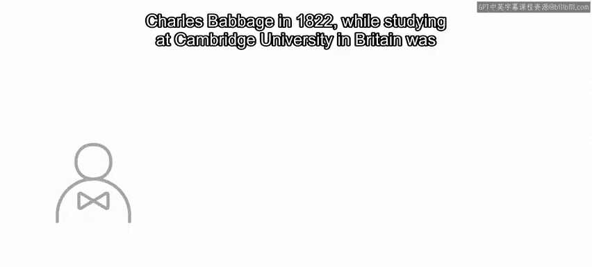

### 早期计算设备

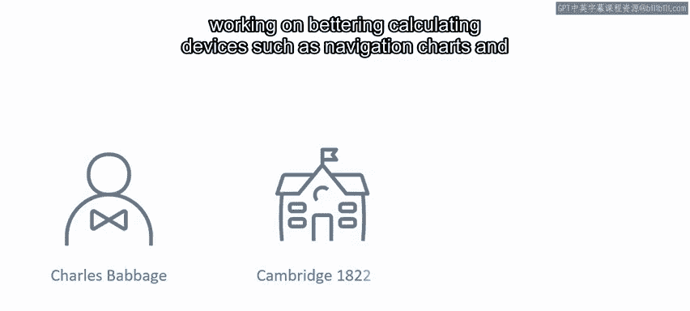

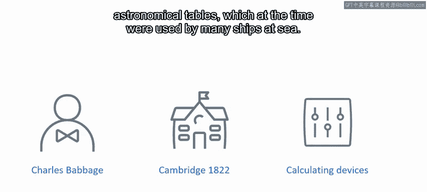

计算的历史可以追溯到很久以前。1822年，查尔斯·巴贝奇在英国剑桥大学学习期间，致力于改进导航图和天文表等计算设备，这些设备在当时被许多海上船只使用。

巴贝奇意识到，所有这些计算设备都包含不同程度的人为错误，他思考是否存在更好的解决方案。

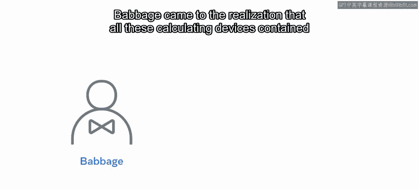

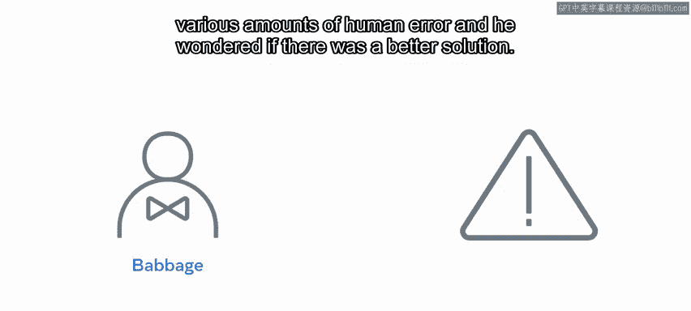

### 差分机与分析机

他的解决方案是差分机。差分机使用机械齿轮，齿轮的间隙上刻有数字0到9，由齿轮齿分隔。它的关键功能是执行一个通过手动摇动手柄计算的操作，直到最终答案显现。

在建造了一个工作原型后，巴贝奇花费多年时间进一步改进他的设计，并构建了原始想法的改进版本。他创造了另一个名为差分机2号的设备，但最终提出了一个更新、更好的概念——分析机。

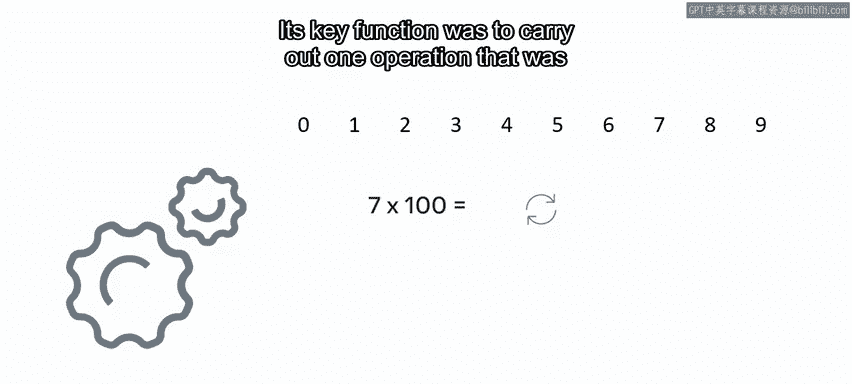

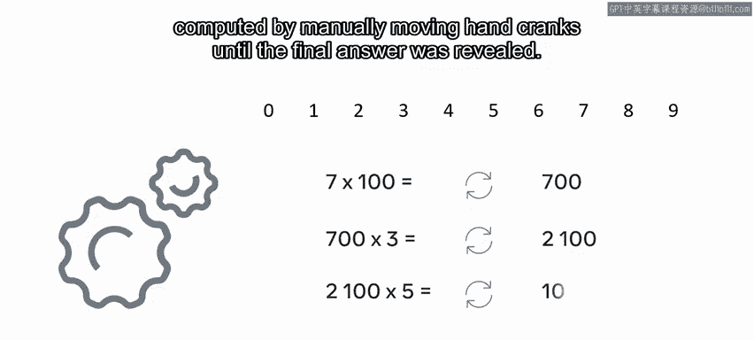

分析机被广泛认为是现代计算的基础。

巴贝奇的朋友艾达·洛夫莱斯发表了一份文件，描述了分析机如何执行一系列计算，这本质上就是计算机程序所做的。然而，分析机从未完成，而且像许多开发者一样，巴贝奇也没有在良好的文档记录上投入精力。

---

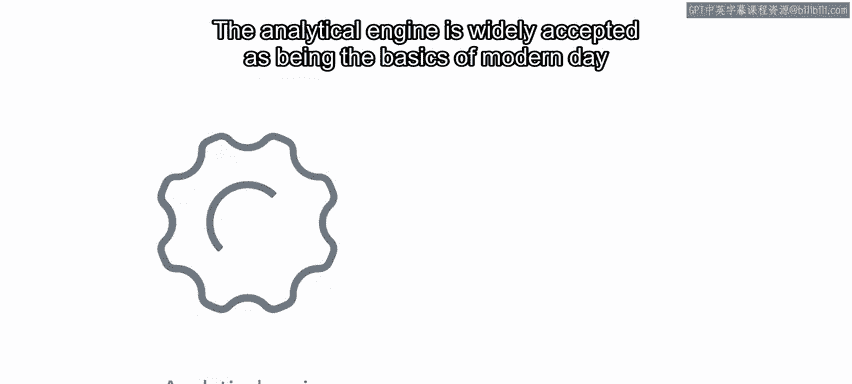

## 计算机如何工作？💡

上一节我们介绍了编程的早期历史，本节中我们来看看计算机在最基本层面是如何工作的。

在解释编程之前，了解计算机在最基本层面的工作原理是有帮助的。

### 二进制：计算机的语言

计算机只理解二进制代码，它由两个数字组成：**0** 和 **1**。

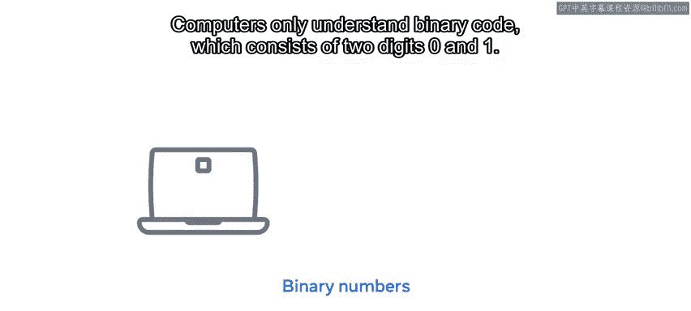

这起初可能看起来很奇怪，但稍作解释就会明白。0和1对应不同的电状态，类似于电灯开关：**0等于关闭，1等于开启**。

例如，在编程中，当你计算数字、成本或进行任何算术运算时，你主要使用十进制数字。

每个编写的程序都需要转换为二进制代码或机器代码。

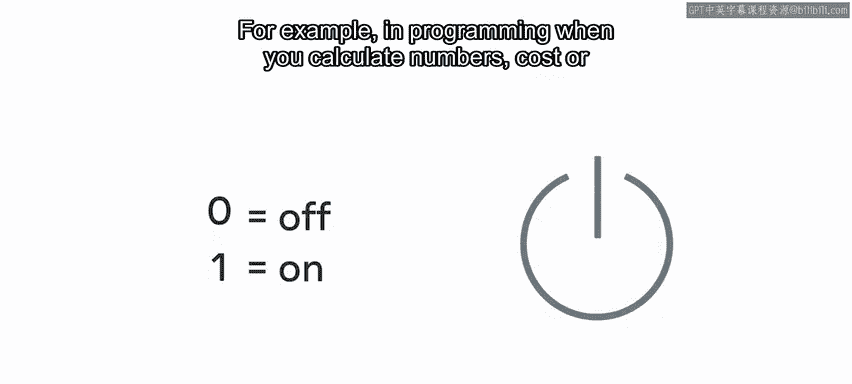

以下是一个十进制到二进制转换的例子：
*   十进制 **1** 是二进制 **1**。
*   十进制 **2** 是二进制 **10**。
*   十进制 **3** 是二进制 **11**，依此类推。

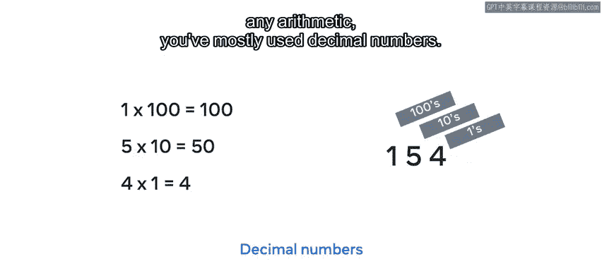

### 从代码到执行

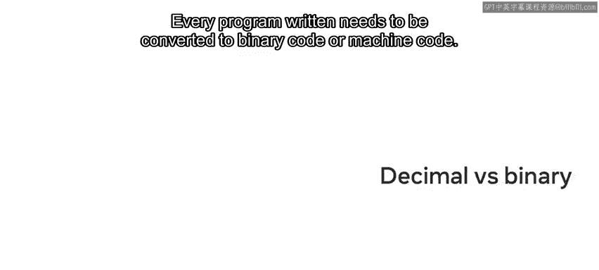

计算机通过称为晶体管的微小电导体来表示二进制代码。这些晶体管位于中央处理器（CPU）内部，CPU本质上是计算机的大脑。

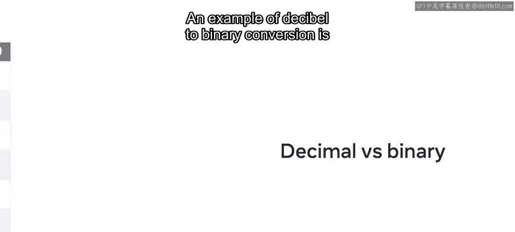

当使用任何类型的语言编写程序时，它需要被**编译**或**解释**。

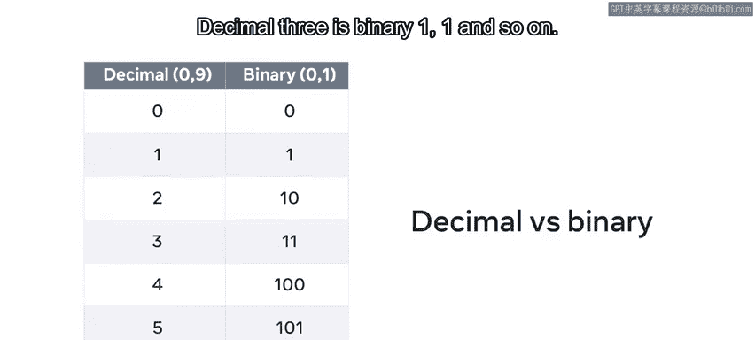

其目的是将我们可读的编程代码转变为计算机可读的编程代码。

人类阅读和理解二进制极其困难，因此使用它容易出错。对我们来说，阅读和编写编程语言要容易得多。

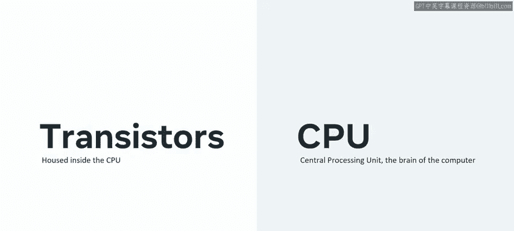

---

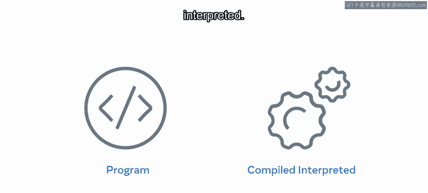

## 什么是编程？🧑‍💻

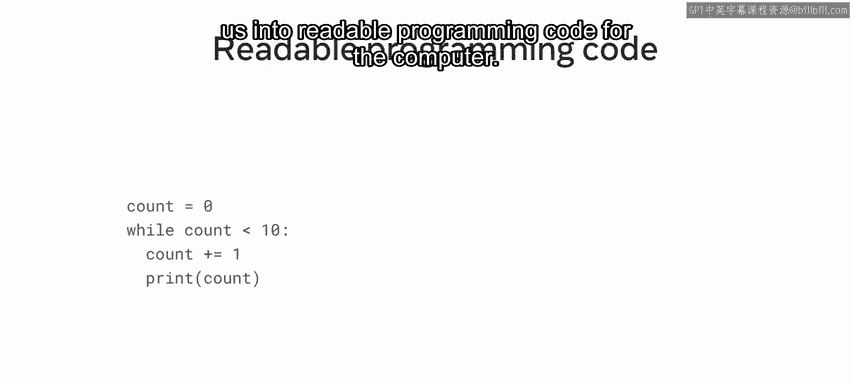

上一节我们了解了计算机的底层语言，本节我们来探讨编程的本质。

### 编程的定义

编程是**以计算机能够理解的特定语言为其提供一组指令，并让它执行这些操作或任务的能力**。

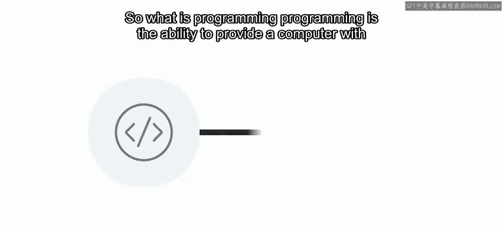

换句话说，你需要以一种计算机能够理解的格式化语言告诉它你想要它做什么。

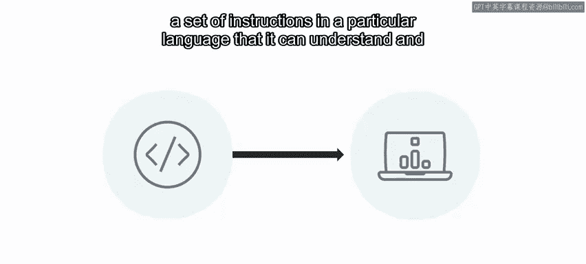

### 编程的特点

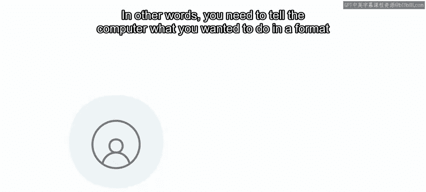

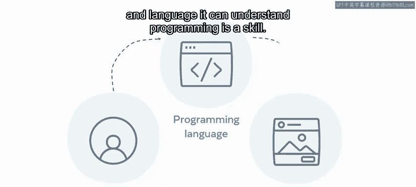

编程是一项技能，你练习和学习得越多，你就会变得越好。

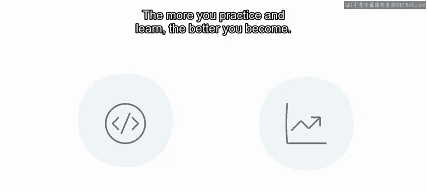

起初，编写简单的程序可能需要相当长的时间。随着你的进步，你会更加熟悉语言以及如何应用逻辑和条件。

编程也是一项创造性技能。这是因为你可以编写计算机程序，以多种不同的方式解决问题。

---

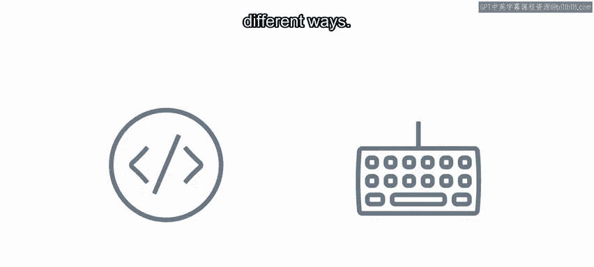

## 总结

本节课中，我们一起学习了编程的简要历史，从巴贝奇的差分机和分析机开始。我们探讨了计算机如何通过二进制（0和1）工作，以及程序如何被编译或解释为机器代码。最后，我们定义了编程的本质：它是一种为计算机提供可执行指令的创造性技能。理解这些基础概念是成为一名程序员的第一步。