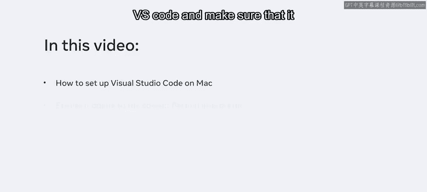
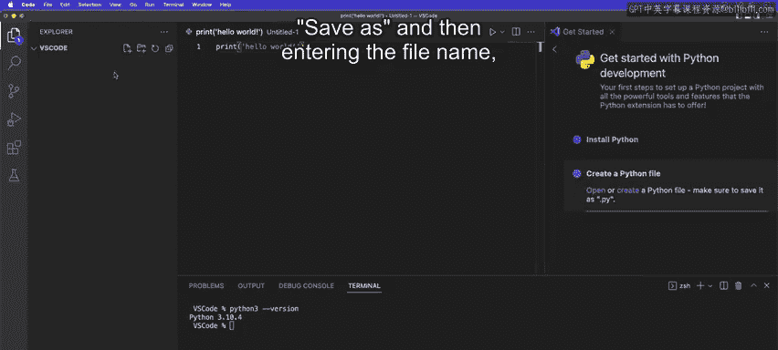
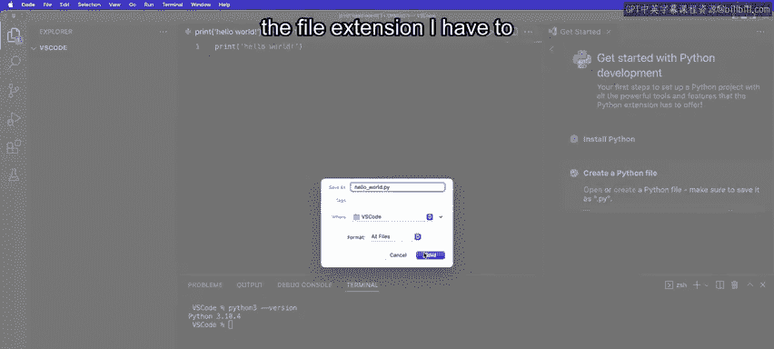
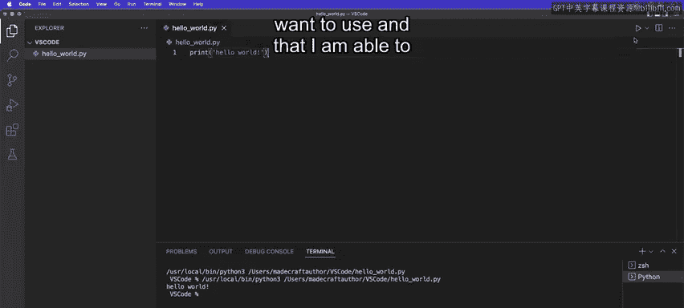
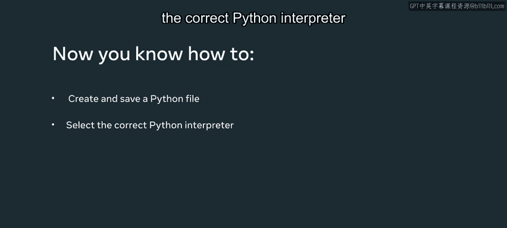

# 6：Mac环境检查 🍎

在本节课中，我们将学习如何在Mac操作系统上，为Visual Studio Code（VS Code）设置正确的Python解释器，并验证其是否能正常运行Python脚本。这是开始Python开发前的重要一步。

## 检查Python安装

上一节我们介绍了课程目标，本节中我们来看看如何确认Python已正确安装在你的Mac上。



首先，需要打开终端来检查已安装的Python版本。在VS Code中，你可以通过点击界面左下角的按钮，然后选择“终端”标签页来打开内置终端。


在终端中，输入以下命令并按回车键：

```bash
python --version
```

该命令会返回当前系统默认的Python版本号。请注意，Mac系统通常预装的是Python 2.7版本，但现代开发通常需要使用更新的Python 3版本。因此，你需要确认命令返回的是类似 `Python 3.10.x` 这样的版本信息。

## 设置VS Code与Python解释器

确认Python安装后，下一步是确保VS Code指向正确的Python解释器。

在VS Code的欢迎界面，通常有一个“开始使用Python开发”的引导指南。如果主界面没有显示，你可以通过点击“更多”选项来找到它。该指南能帮助你验证所有设置是否正确。

以下是设置解释器的关键步骤：

1.  在引导指南中，点击“选择Python解释器”。
2.  这会打开一个下拉菜单，显示你系统上所有已安装的Python版本。
3.  从列表中选择通过Homebrew或其他方式安装的最新Python 3版本（通常会被标记为“推荐”）。





你也可以通过快捷键 `Command + Shift + P` 打开命令面板，然后输入 `Python: Select Interpreter` 来快速打开解释器选择菜单。

## 创建并运行Python文件

设置好解释器后，我们可以创建一个简单的Python文件来测试环境是否工作正常。

在“开始使用Python开发”引导中，点击“创建Python文件”。在新文件中，输入以下代码：

```python
print("Hello World")
```

`print()` 是一个Python内置函数，用于在终端中输出指定的值。现在，你需要保存这个文件。

点击菜单栏的 `文件` -> `另存为`，将文件命名为 `hello_world.py`。`.py` 是Python源文件的标准扩展名。

文件保存后，即可运行它。在VS Code编辑器界面的右上角，你会看到一个三角形的“播放”按钮，其旁边有一个下拉菜单。

点击下拉菜单，选择“运行Python文件”，然后点击播放按钮。程序运行后，你会在下方的终端面板中看到输出的结果：`Hello World`。

至此，你已经成功验证了VS Code正确指向了你想要使用的Python版本，并且能够在IDE中直接运行和执行脚本。



## 总结



本节课中我们一起学习了在Mac上配置Python开发环境的核心步骤。你学会了如何检查Python版本、在VS Code中设置正确的Python解释器、创建并保存Python文件，以及最终运行一个简单的脚本。这些是开始任何Python项目前的基础准备工作。