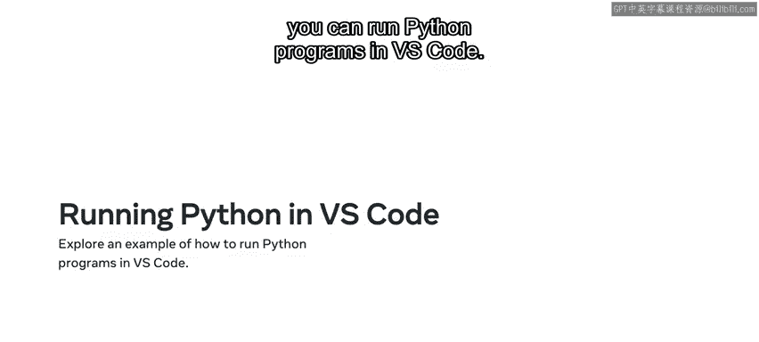
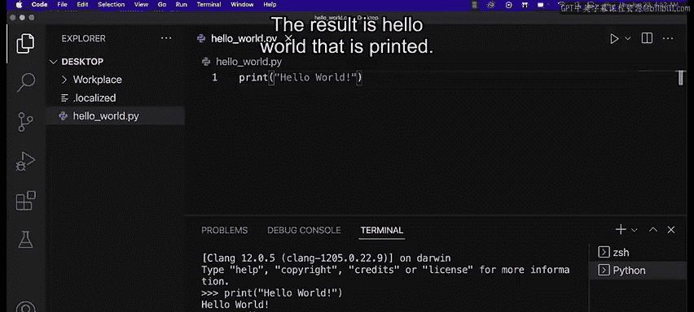

# Python 7：命令行与IDE运行代码 🖥️

在本节课中，我们将学习运行Python代码的两种主要方式：通过命令行/终端，以及通过集成开发环境（IDE）。我们将探讨每种方法的核心差异、适用场景以及具体操作步骤。

---

## 概述

Python程序可以通过两种主要方式执行：在命令行/终端中直接运行，或使用集成开发环境（IDE）。理解这两种方法的区别和各自的优势，对于高效编写和测试代码至关重要。

---

## 运行Python程序的两种主要方式

上一节我们概述了课程内容，本节中我们来看看运行Python代码的具体方法。主要有以下两种途径：

1.  **使用Python Shell**
2.  **直接从命令行终端运行Python文件**

### 1. 使用Python Shell

Python Shell适用于运行和测试小型代码片段。它允许你直接输入并执行代码，而无需创建新的 `.py` 文件。

以下是使用Python Shell的步骤：
*   打开命令行（Windows）或终端（Mac/Linux）。
*   输入 `python` 命令并按下回车键，进入Python交互式环境。
*   在此环境中，你可以直接输入代码并立即看到执行结果。

例如，在Shell中输入：
```python
print("Hello World")
```
按下回车后，会立即输出 `Hello World`。

### 2. 直接从命令行运行Python文件



现在，让我们探索第二种方法：直接从命令行或终端运行Python文件。任何扩展名为 `.py` 的文件都可以通过以下命令运行。

操作命令的通用格式是：
```
python 文件名.py
```

例如，要运行名为 `hello_world.py` 的文件，你需要在终端中输入：
```
python hello_world.py
```
然后按下回车键。

---

## 为什么选择使用IDE（如VS Code）？

虽然可以使用Python Shell或终端直接运行代码，但使用IDE（例如Visual Studio Code）通常是更好的选择。因为它不仅包含了上述两种运行方式，还提供了大量增强功能，能显著提升编码体验。

VS Code提供的核心功能包括：
*   **自动补全**：帮助你快速编写代码。
*   **调试工具**：便于查找和修复代码错误。
*   **语法高亮**：使代码结构更清晰易读。
*   **空格与缩进辅助**：确保代码格式符合Python规范。

---

## 在VS Code中运行Python程序的演示

接下来，我将演示在VS Code中运行Python程序的不同方法。在VS Code中，你同样可以通过终端运行，也可以使用IDE内置的便捷按钮。

### 方法一：通过VS Code内置终端运行

首先，从IDE内部打开终端窗口。点击“终端”菜单，选择“新建终端”。


然后，在终端中直接运行Python脚本。输入命令：
```
python hello_world.py
```
按下回车键，结果将输出 `Hello World`。

此外，你也可以在终端中启动Python Shell。只需输入 `python` 并回车，即可进入交互模式，直接执行代码。输入 `exit()` 并回车可以退出Shell，返回命令行窗口。

### 方法二：使用VS Code的运行按钮

关闭终端窗口，我们来看看更便捷的方式。你可以直接在IDE中运行Python脚本。



操作步骤如下：
1.  在代码编辑界面，找到屏幕右上角的运行按钮。
2.  点击下拉菜单，可以选择“运行Python文件”或“调试Python文件”。
3.  点击运行按钮，终端会自动打开并显示执行结果，例如打印出 `Hello World`。


---

## 总结

本节课中，我们一起学习了运行Python代码的两种核心方式：通过命令行/终端，以及通过集成开发环境（IDE）。你现在已经了解了从命令行运行代码与通过IDE运行代码的核心区别，并且能够演示如何使用Python来运行程序。掌握这些方法将为你后续的Python学习和项目开发打下坚实的基础。