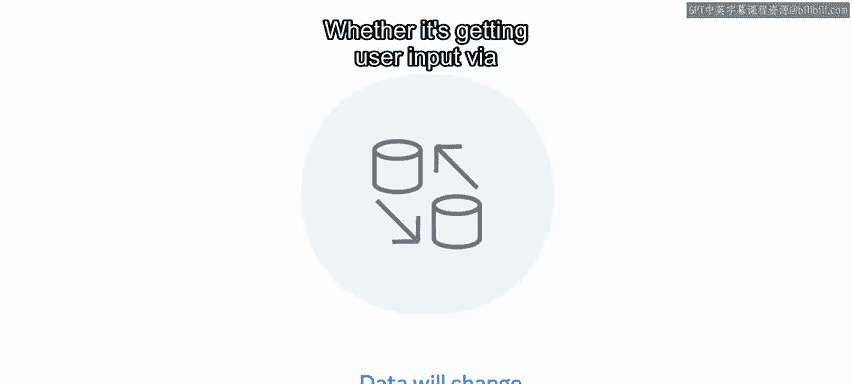
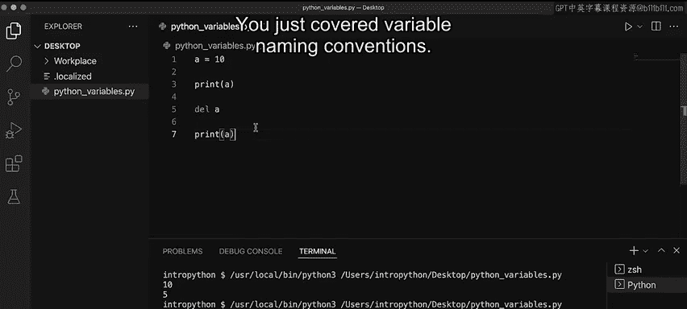

# Python 9：变量 🧮

在本节课中，我们将要学习编程中的一个核心概念：变量。变量是存储各种类型数据的基本单元，可以说是编程的基石。它们允许你处理和操作数据，因此，学会识别变量并理解其用法至关重要。

## 什么是变量？

变量是编程中必不可少的部分，它们用于存储各种不同类型的数据。可以说，变量是编程的基石。这是因为它们允许你处理和操作数据。因此，能够识别变量并理解其使用方式非常重要。

在Python中声明变量非常简单。你只需要声明一个名称并为其赋值。变量这个词指的是可以改变的东西。在Python中，要改变一个已声明的变量，你只需要重新赋值或重新声明它。

## 变量命名的重要性

到目前为止，示例中使用的都是简单的命名约定，例如X、Y和Z。当与其他开发人员合作项目时，了解这些变量的含义或所指内容会变得越来越困难。作为一名程序员，随着时间的推移，你会编写大量代码。如果过了几个月，你很可能不记得代码的具体功能了。

使用像X和Y这样的通用变量，无法提供关于该变量及其用途的任何信息。为变量赋予在给定上下文中有意义的名称，将使你和其他程序员能够轻松理解代码的意图。

## 变量的核心功能



作为一名程序员，理解数据在程序生命周期中会发生变化这一点很重要。无论是通过网页表单获取用户输入，还是在代码内部处理变量，变量的关键功能都是保持对某种值的引用。

**核心概念**：变量是一个指向某个值的引用。其基本操作是赋值，例如：
```python
x = 10
```

## 变量命名规范

现在你对变量及其在Python中的作用有了基本了解，接下来让我们更实际地演示变量及其使用方法。

我将演示如何在Python中使用变量，但首先我想简要谈谈命名规范。作为开发人员，在命名变量时，你有不同的选择。

一种选择是**驼峰命名法**。第一个单词的首字母小写，之后每个单词的首字母大写，单词之间没有空格。例如，如果我有一个变量叫`myName`，我会将`my`的`m`小写，`name`的`n`大写，其余字母小写，单词之间没有空格。

另一种方法是**蛇形命名法**。使用蛇形命名法时，所有字母都保持小写，但单词之间使用下划线连接。所以，如果我想创建变量`my_name`，使用这种方法的结果就是`my_name`。

尽管作为开发人员你有不同的选择，但在整个程序中创建变量时保持一致是一个好主意。

## 变量的声明与使用

让我清空屏幕以便开始。在Python中，我通过初始化一个变量并为其赋值来创建变量。我只需要命名变量即可，例如，如果我输入`x = 5`，我就声明了变量并为其赋值。

我也可以通过调用`print`语句并传入变量名（本例中为`x`）来打印变量的值。所以我输入`print(x)`。当我运行程序时，我得到值`5`，这是我赋予初始变量的值。

让我再次清空屏幕。在声明变量时，你有几个选项。你可以声明任何不同类型的变量值。例如，`x`可以等于一个名为“hello”的字符串。为此，我输入`x = "hello"`。然后我可以再次打印该值，运行它，我发现输出是单词“hello”。

在幕后，Python会自动为你分配数据类型。你将在后续关于数据类型的视频中了解更多信息。

## 多重赋值与变量操作

你也可以声明多个变量并将它们赋值为同一个值。例如，让`a`、`b`和`c`都等于10。我通过输入`a = b = c = 10`来实现。我分别打印所有三个值，当我再次点击运行按钮时，我发现所有这三个赋值都具有值10。

同样，在继续下一个示例之前，我清空屏幕。

你还有另一个选项，即进行多重赋值。例如，我输入用逗号分隔的`a, b, c`，等于用逗号分隔的`1, 2, 3`。通过这种方式，我将每个值分配给了对应的字母，所以`a`等于1，`b`等于2，`c`等于3。为了测试这一点，我可以打印所有三个变量。点击运行，我会发现值1、2、3与上面的声明相对应。

## 变量的重新赋值与删除

你应该了解的另一个重点是变量赋值以及如何更改它。变量是可以改变的。在程序的生命周期中，你将更改变量的值或赋值本身，因此你需要知道如何操作。让我们探讨另一个例子。

我输入`a = 10`并打印该值。之后，我将`a`的值更改为5，并再次打印该值。当我点击运行按钮时，第一行打印出10，第二行打印出5，因为值被重新赋值了。

最后，你需要知道如何删除变量。我的变量是`a`，它的值是10，我已经打印出来了，然后在新的一行我输入删除命令`del`，后跟一个空格和字母`a`，它代表我的变量。然后我使用`print`函数打印该变量，接着我点击运行按钮。首先给出的值是10，因为变量仍然存在，但在删除之后，它显示一个错误，说`a`未定义。

## 总结



本节课中我们一起学习了变量的核心知识。

你刚刚学习了变量命名规范。现在你知道如何声明变量并为其赋值。你也知道如何声明不同类型的变量值。你可以声明多个变量并将它们赋值为同一个值，也可以进行多重赋值。最后，你还学习了如何删除变量。

这为我们带来了本视频的结尾。你现在可以识别变量并了解如何在Python中使用它们了。