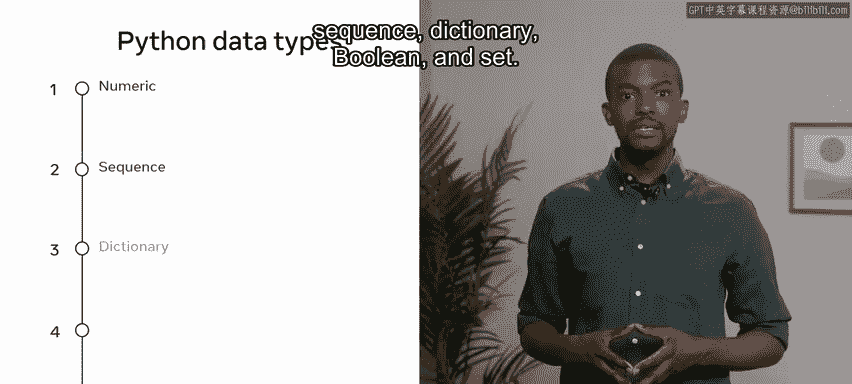
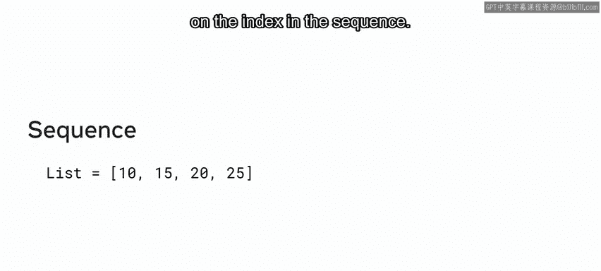
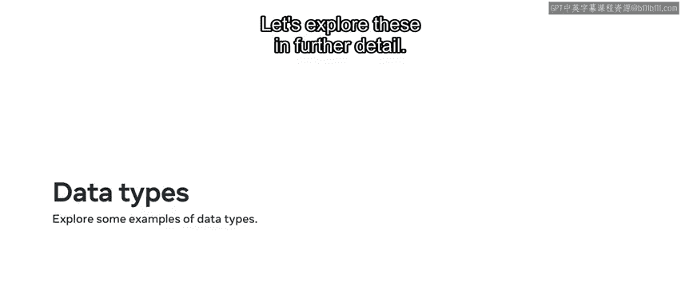
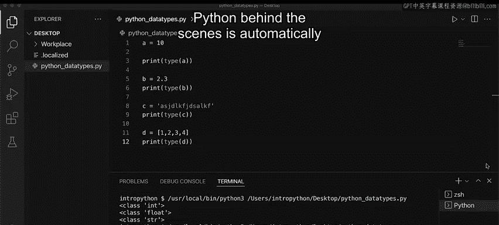

# 1：基本数据类型

在本节课中，我们将要学习Python编程语言中的基本数据类型。理解数据类型是编程的基础，它决定了计算机如何解释和处理数据。我们将逐一介绍Python的五种主要字面量数据类型，并通过示例说明它们的特点和用法。

## 概述

计算机系统需要解释编程中不同的数据值，数据可以有不同的类型。数据类型是与数据相关联的属性，它告诉计算机系统如何解释其值。了解使用何种数据类型可以确保数据以期望的格式被收集和处理，同时保证每个属性的值符合预期。

## 数据类型简介

Python提供了原始数据类型，允许将数据赋值给变量或常量。五种主要的字面量数据类型包括：数值型、序列型、字典型、布尔型和集合型。

其中一些数据类型可以进一步细分。例如，数值型数据类型可以包含整数、浮点数和复数。现在，让我们从数值型开始，更详细地讨论这些数据类型。

## 数值型数据类型

在编程中，你需要决定哪种类型适合你的需求。例如，在处理货币时，你很可能会使用浮点数类型，因为它允许计算小数位。为了确定变量的类型，Python提供了一个名为 `type` 的函数，它将根据传入的变量返回其类型。

Python提供了三种不同的数值类型：整数、浮点数和复数。

*   **整数**：`int` 类表示任何非分数数字，即没有小数位的整数。这些数字可以是正数或负数，例如 `10` 或 `-10`。
*   **浮点数**：`float` 类是包含小数位的数字。例如 `10.5` 或 `6.7`。
*   **复数**：`complex` 类用于表示复数，由实数和虚数部分组成。例如 `a = 10 + 10j`。

## 序列型数据类型

上一节我们介绍了数值型，本节中我们来看看序列型数据类型。序列类型被归类为容器类型，它们在一个有序列表中包含一个或多个相同类型的元素。序列中的元素可以根据其索引进行访问。

Python有三种不同的序列类型：字符串、列表和元组。

以下是每种类型的简要说明：

*   **字符串**：字符串是由单引号或双引号括起来的字符序列。字符串由 `str` 类表示。
*   **列表**：列表是一个或多个不同或相似类型的序列，本质上是一个数组，数据存放在方括号 `[]` 内。每个项目都可以通过其索引访问。
*   **元组**：元组在许多方面与列表相似，它包含一个或多个类型的有序序列，但主要区别在于它是**不可变**的。这意味着元组内的值不能被修改或更改。元组由 `tuple` 类表示，数据包裹在圆括号 `()` 内。

## 字典型数据类型

接下来要探讨的数据类型是字典。字典以键值对的对象结构存储数据。每个值都可以通过其键直接访问。字典也可以存储任何数据类型。

例如，假设你声明一个名为 `Ed` 的变量并为其分配一个字典。该字典包含一组键值对：第一对是 `‘a’: 22`，其中 `‘a’` 是键，`22` 是值；第二对是 `‘b’: 44.4`，其中 `‘b’` 是键，`44.4` 是值。然后，你可以通过访问其键 `‘a’` 来输出值 `22`。

## 布尔型数据类型

现在，让我们探索布尔数据类型，它简单地表示为 `True` 或 `False`。结合逻辑运算符，布尔值用于检查条件是真还是假。

在这个例子中，我检查值 `True` 和 `False` 的底层数据类型，返回的类是 `bool`，意味着它是布尔型。

## 集合型数据类型

最后一个数据类型是集合，它是一个无序、无索引且不包含重复值的集合。

让我演示一下这个数据类型的一个例子。假设我将一组四个项目赋值给名为 `example_set` 的变量。然后，我通过将其传递给 `type` 函数来检查 `example_set` 变量中存储的值的类型。Python报告说，`example_set` 变量保存的底层数据类型是一个集合。

## 变量与类型推断

在编程中，数据类型是一个重要的概念。变量可以存储不同类型的数据，而不同类型的数据可以做不同的事情。让我们更详细地探讨这些。

每当你在Python中声明一个变量时，数据类型会根据该变量的值自动分配给你。

让我通过输入一个名为 `a` 的变量并将其赋值为 `10` 来演示这一点。为了检查Python分配的数据类型，我选择 `print` 并使用 `type` 函数，然后将变量 `a` 作为参数传入并运行。从终端的输出中，我可以看到分配了 `int` 类。

这是另一个例子：我使用变量 `b` 并为其分配一个小数值 `2.3`。为了检查Python分配的数据类型，我打印出 `type(b)` 并运行。从终端的输出中，我可以看到分配了 `float` 类，因为这里有一个小数点。这与标准的整数赋值不同。

要声明一个字符串变量，我用单引号或双引号将文本括起来。再次运行带有 `type` 函数的 `print` 语句，并将变量 `c` 作为参数传入。当我运行时，终端中的输出现在显示类 `int`、`float` 和 `str`。

这个序列也适用于其他数据类型。例如，我可以使用变量 `d` 并通过赋值 `[1, 2, 3, 4]` 来创建一个数字列表。当我运行带有 `type` 函数的 `print` 语句并将变量 `d` 作为参数传入时，在我点击运行后，会显示 `list` 类。

每次我为特定变量赋值时，Python在后台会自动分配该变量的正确数据类型。

## 总结

本节课中我们一起学习了Python中的不同数据类型。我鼓励你在练习代码中开始尝试使用这些数据类型。掌握它们是进行有效Python编程的关键第一步。