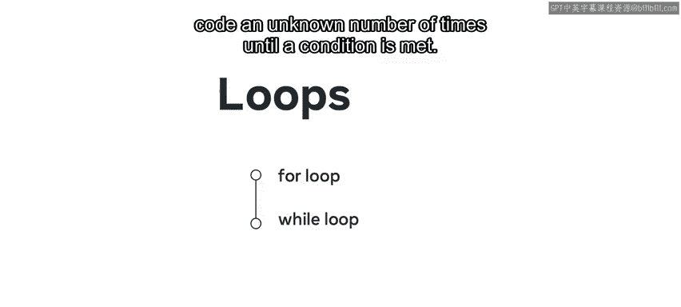
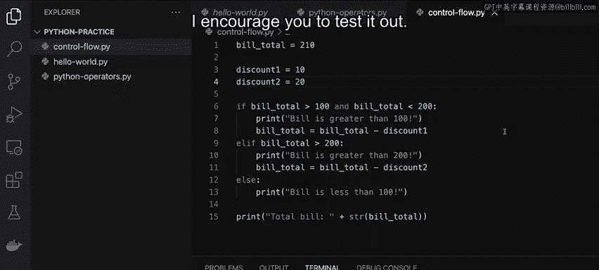

# Python 15：控制流 if else else if 🔄

在本节课中，我们将要学习如何在Python编程中控制代码的执行顺序，即“控制流”。我们将重点介绍如何使用 `if`、`else` 和 `elif` 等条件语句来根据不同的情况执行不同的代码块。

## 什么是控制流？🤔

控制流指的是程序中指令执行的顺序。所有程序都需要根据不同的情况做出决策，并因此执行不同的操作或走向不同的分支。在Python中，有两种主要的控制流结构：**条件语句**（如 `if`、`else`、`elif`）和**循环**（如 `for` 循环和 `while` 循环）。本节我们将重点探讨条件语句。

## 条件语句详解

条件语句允许程序根据特定条件的真假来决定执行哪部分代码。以下是核心概念：

*   **`if` 语句**：如果条件为真（`True`），则执行其下的代码块。
    ```python
    if condition:
        # 条件为真时执行的代码
    ```
*   **`else` 语句**：捕获所有未被前面 `if` 或 `elif` 条件捕获的情况。
    ```python
    else:
        # 所有前述条件均为假时执行的代码
    ```
*   **`elif` 语句**（即 `else if`）：如果前面的条件不成立，则尝试检查此条件。
    ```python
    elif another_condition:
        # 前一个条件为假，且此条件为真时执行的代码
    ```

上一节我们介绍了控制流的基本概念，本节中我们来看看如何通过一个餐厅折扣系统的实际例子来应用这些条件语句。

## 实践：餐厅折扣系统 💰

假设一家餐厅希望根据顾客的消费金额应用不同的折扣。我们将编写代码来实现这个逻辑。



首先，我们定义一个变量来表示顾客的账单总额。

```python
bill_total = 114
```

### 第一步：使用 `if` 语句

如果账单金额大于100，我们打印一条消息并应用一个折扣。

以下是实现此逻辑的步骤：

1.  创建一个折扣变量。
2.  使用 `if` 语句检查条件。
3.  在条件满足时，更新账单总额并打印信息。
4.  最后，打印最终账单。

```python
discount1 = 10

if bill_total > 100:
    print("账单大于100")
    bill_total = bill_total - discount1

print("总账单是：" + str(bill_total))
```

运行此代码，输出为：
```
账单大于100
总账单是：104
```

### 第二步：引入 `else` 语句

如果账单金额不大于100呢？我们需要处理这种情况。将 `bill_total` 改为95并运行代码，你会发现只输出了总金额。为了更清晰，我们添加一个 `else` 语句来打印另一条消息。

```python
bill_total = 95
discount1 = 10

if bill_total > 100:
    print("账单大于100")
    bill_total = bill_total - discount1
else:
    print("账单小于等于100")

print("总账单是：" + str(bill_total))
```

现在运行代码，输出为：
```
账单小于等于100
总账单是：95
```

到目前为止，你已经学会了使用 `if` 和 `else` 来控制程序的流程。接下来，我们让这个流程更进一步。

### 第三步：使用 `elif` 添加更多条件

现在，餐厅希望为消费超过200的账单增加一个更大的折扣。我们需要添加一个新的条件。

以下是实现此功能的步骤：

1.  定义第二个折扣变量。
2.  修改第一个 `if` 条件，使其只处理100到200之间的账单。
3.  使用 `elif` 语句添加处理大于200的账单的条件。
4.  在 `elif` 代码块中应用第二个折扣。

```python
bill_total = 210
discount1 = 10
discount2 = 20

if bill_total > 100 and bill_total < 200:
    print("账单大于100且小于200")
    bill_total = bill_total - discount1
elif bill_total > 200:
    print("账单大于200")
    bill_total = bill_total - discount2
else:
    print("账单小于等于100")

print("总账单是：" + str(bill_total))
```

运行此代码，输出为：
```
账单大于200
总账单是：190
```



程序流程发生了变化：第一个条件（`bill_total > 100 and bill_total < 200`）为假，因此代码检查第二个 `elif` 条件（`bill_total > 200`）。该条件为真，所以打印了相应消息并应用了 `discount2`。由于前面的 `elif` 条件已满足，程序跳过了最后的 `else` 块。

## 总结 📝

本节课中我们一起学习了Python中控制流的核心——条件语句。你掌握了如何使用 `if`、`else` 和 `elif` 来根据不同的条件引导程序执行不同的路径。编写条件语句是编程的基本功，建议你在自己的代码中多加练习。下次当你需要做出决策时，可以思考一下其中涉及的条件，并尝试用Python代码将它们表示出来。