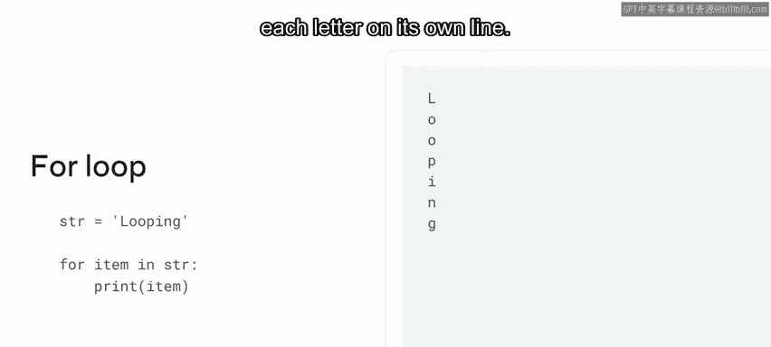
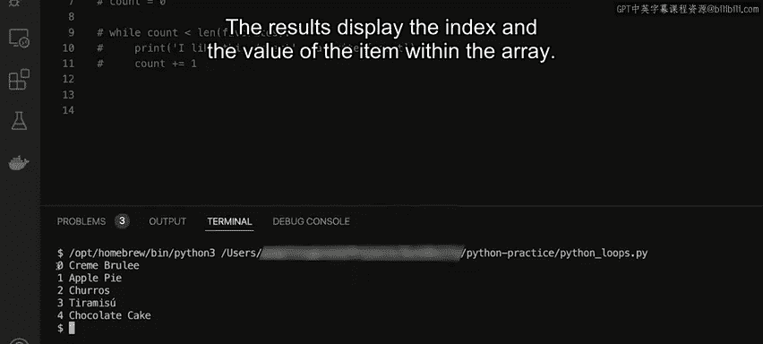

# Python 17：循环结构 🔄

在本节课中，我们将要学习Python中的循环结构。循环是一种强大的编程工具，它允许我们重复执行一段代码，直到满足特定条件为止。就像反复播放一首喜欢的歌曲一样，循环让程序能够高效地处理重复性任务。我们将重点介绍两种主要的循环类型：`for`循环和`while`循环，并通过简单的示例来理解它们的工作原理。

## 循环的基本概念

上一节我们介绍了循环的比喻，本节中我们来看看循环在Python中的具体含义。

循环用于遍历序列并访问其中的每个元素。在Python中，字符串、列表等都被视为序列。一个序列就是一个有序的集合。

## 使用`for`循环遍历字符串

让我们从一个使用字符串的基本循环示例开始。

首先，声明一个名为`str`的字符串类型变量。在Python中，字符串是一个序列，这意味着你可以遍历字符串中的每个字符。

以下是`for`循环的基本结构：

```python
str = "looping"
for item in str:
    print(item)
```



变量`item`是一个占位符，用于存储序列中的当前字符。你可能还记得，可以通过索引访问序列中的任何字符。`for`循环以同样的方式访问字符，并将当前值赋给`item`变量。这使我们能够访问当前字符并将其打印输出。

当代码运行时，输出将是单词“looping”的每个字母，每个字母单独占一行。

## 探索`for`循环与`while`循环

现在你已经了解了Python中的循环结构，让我通过一些代码示例来进一步演示它们如何工作，以输出一系列美味的甜点。

Python为我们提供了多种进行循环的方式，你现在将学习`for`循环以及`while`循环。

### 简单的`for`循环

让我们从简单的`for`循环基础开始。

要声明一个`for`循环，我使用`for`关键字。现在需要一个变量来存放值，这里我使用`i`。我还使用`in`关键字来指定要遍历的范围。我添加了一个名为`range`的新函数来指定范围内的项目数量，这里以10为例。

接下来，我通过按回车键移动到新行来执行一个简单的打印语句。我选择`print`函数，并在括号内输入文本“looping”和变量`i`的值。然后我点击运行按钮。

输出表明迭代循环遍历了0到9的范围。需要注意三个要点：
*   迭代从0开始，这是基于项目本身的索引。
*   每个`for`循环通常从0开始。
*   大多数数组从0开始，因为它是数组中的第一个项目或索引中的第一个项目。在这种情况下，数组或索引中的最后一项将是9。

### 遍历列表的`for`循环

现在我想改变循环遍历的内容作为示例，我将在上方输入一个简单的数组并称之为`favorites`。

为此，我首先移除`favorites`前面的注释符号。接下来，我将当前`for`循环中的`range`函数替换为`favorites`以进行遍历。作为`for`循环一部分声明的`i`可以更改为任何值，这里我使用`item`。

我现在更改我的打印语句，在打印循环中包含`item`。我还将文本更改为“I like this dessert”。我点击运行按钮来打印输出流。

在这种情况下，它会依次调用五个甜点名称中的每一个，我们的打印语句将它们组合成一个句子。

### 使用`while`循环

接下来讨论的循环选项是`while`循环。

`while`循环与`for`循环略有不同。为了演示这种循环，我首先注释掉屏幕上的`for`循环。

让我们从使用`while`关键字开始。与`for`循环一样，我需要指定一个条件，根据值本身使循环运行n次。

首先，我需要声明一个计数器。我通过在循环语句上方输入`count = 0`来实现。接下来，我在`while`关键字后输入`count`，后跟小于号`<`和单词`favorites`。现在我插入函数`len()`来提供`favorites`的长度。这意味着循环将在`count`小于`favorites`长度时运行，换句话说，就是小于5时。

为了打印循环语句的值，我按回车键移动到新行。然后我选择`print`函数，在括号内输入文本“I like this dessert”。这里的关键区别在于，我需要使用索引来访问`favorites`数组中的项目。为此，我输入`favorites[count]`来表示索引。

重要的是，我现在需要递增`count`，以便它基本上与循环语句匹配。如果我不递增`count`，最终会陷入所谓的**无限循环**。这意味着它将一直循环下去，直到编译器因内存耗尽而停止它。

为了递增`count`，我按回车键移动到新行并添加`count += 1`。我清空屏幕并点击运行按钮。我得到了与`for`循环相同的打印输出。

### 在`for`循环中获取索引

需要注意的是，在标准的`for`循环中，我无法直接访问索引，但我可以使用`enumerate`函数来实现。

因此，我更改当前的`for`循环语句，添加`idx`，它变为`for idx, item in enumerate(favorites):`。在下一行，为了打印输出，我将文本“I like this desserts”替换为`idx`，然后点击运行按钮。

结果显示数组内项目的索引和值。



## 总结

本节课中我们一起学习了Python中的循环结构。我们探讨了`for`循环如何用于遍历序列（如字符串和列表），以及`while`循环如何在满足特定条件时重复执行代码块。我们还了解了如何避免无限循环，以及如何使用`enumerate`函数在`for`循环中同时获取元素的索引和值。掌握这些循环结构是进行有效编程和数据处理的基础。