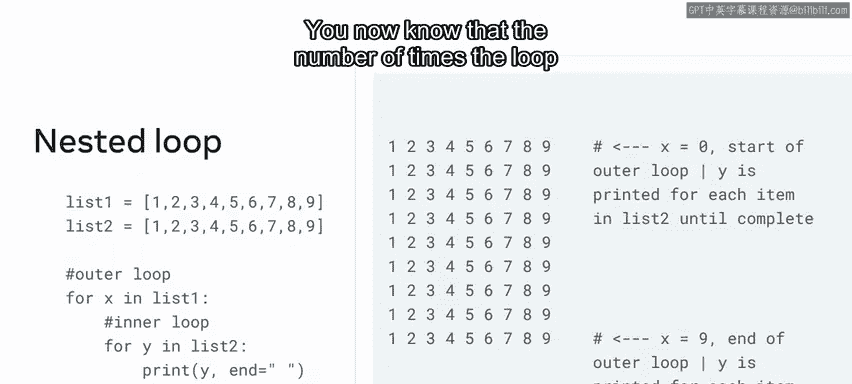
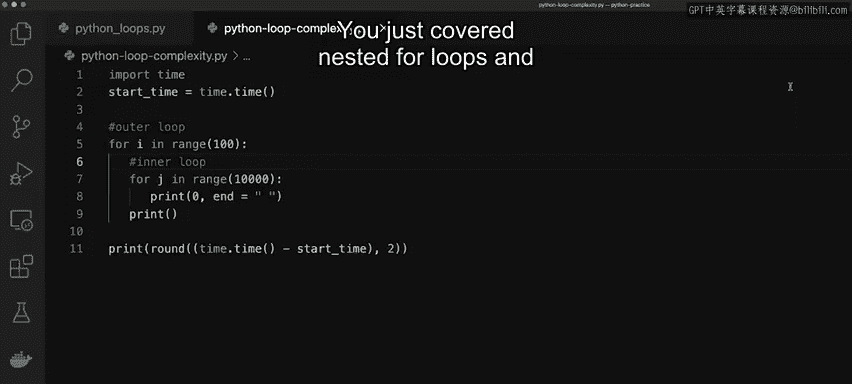

# Python 18：嵌套循环及对算法复杂度的影响 🔄

在本节课中，我们将要学习Python中的嵌套循环。嵌套循环是解决更复杂问题的强大工具，例如遍历多维数据结构。我们将详细拆解嵌套循环的工作原理，并通过代码示例直观展示其执行过程。同时，我们也会探讨嵌套循环对程序运行时间的影响，即算法的时间复杂度问题。

## 嵌套循环的工作原理

上一节我们介绍了基本的循环结构，本节中我们来看看如何将一个循环放置在另一个循环内部，即嵌套循环。

在Python中，嵌套循环通过在外层循环内部缩进编写内层循环来实现。其执行流程如下：
1.  首先，外层循环开始执行。
2.  然后，程序进入内层循环。
3.  内层循环会一直运行，直到达到其自身的范围限制（例如，循环10次）。
4.  一旦内层循环执行完毕，程序会返回到外层循环，进行下一次迭代。
5.  接着，程序再次进入内层循环。
6.  这个过程会持续进行，直到外层循环也达到其自身的范围限制。

## 嵌套循环示例：遍历两个列表

为了更具体地理解嵌套循环，让我们看一个遍历两个列表的例子。



假设我们有两个包含1到9整数的列表，以及一个初始值为0的计数器变量。我们使用两个循环：外层循环遍历第一个列表，内层循环遍历第二个列表。

以下是代码逻辑的简化描述：
```python
list_one = [1, 2, 3, 4, 5, 6, 7, 8, 9]
list_two = [1, 2, 3, 4, 5, 6, 7, 8, 9]
count = 0

for i in list_one:        # 外层循环运行9次
    for j in list_two:    # 内层循环运行9次
        count += 1        # 每次内层循环迭代，计数器加1
```
运行此代码后，计数器`count`的输出结果为**81**。让我们来分解一下：
*   外层循环总共运行 **9** 次。
*   对于外层循环的每一次迭代，内层循环都会完整地运行 **9** 次。
*   因此，内层循环总共运行的次数是 **9 × 9 = 81** 次。

为了可视化这个过程，我们可以稍微修改循环代码，使其打印出每次迭代的索引。

## 代码演示：构建二维网格

现在，让我们在代码编辑器中实际编写一些嵌套循环的例子。

首先从一个简单的例子开始，编写一个`for`循环：
```python
# 外层循环
for i in range(10):
    # 内层循环
    for j in range(10):
        print(0, end=" ")  # 打印0并以空格结尾，保持输出整齐
    print()  # 打印空行，使每次外层迭代后换行
```
如果运行这个`for`循环，系统会打印出一个10x10的、由0组成的二维数组网格。这演示了嵌套循环如何工作。

*   当外层`i`循环开始时，程序会进入内层`j`循环。
*   内层循环必须完全执行完毕（打印10个0）后，程序才会返回到外层循环开始下一次迭代（`i`增加1），然后再次进入内层循环。

我们可以通过修改外层循环的范围来验证这一点。例如，将外层循环改为`range(2)`，则只会打印出两行0。

## 嵌套循环与时间复杂度

使用嵌套循环时需要考虑的一个重要问题是复杂度，通常被称为**时间复杂度**。

数组（或循环范围）越大，代码运行所需的时间就越长。让我通过为一个更大范围的循环添加时间戳来展示这一点。

以下是测量代码运行时间的示例：
```python
import time

# 记录开始时间
start_time = time.time()

# 嵌套循环
for i in range(100):
    for j in range(100):
        pass  # 执行某些操作，这里用pass省略

# 记录结束时间并计算耗时
end_time = time.time()
elapsed_time = end_time - start_time
print(f"代码运行耗时：{round(elapsed_time, 2)} 秒")
```
运行后，可能会输出类似`0.0`秒的时间，因为循环较小，运行极快。

现在，让我们逐步增加循环范围，观察时间变化：
*   **情况一**：`range(100)` 和 `range(100)` -> 耗时约 `0.01`秒。
*   **情况二**：`range(100)` 和 `range(1000)` -> 耗时增加到约 `0.04`秒。
*   **情况三**：`range(100)` 和 `range(10000)` -> 耗时显著增加到约 `0.45`秒。

由此可见，数组或循环范围越大，程序完成所需的时间就越长。在处理大型数据集时，这种影响会非常巨大。

因此，始终牢记如何优化代码以提高运行效率，并考虑代码运行所需的时间，是非常重要的。

## 总结

本节课中我们一起学习了嵌套循环及其对算法复杂度的影响。

我们首先了解了嵌套循环的基本概念和执行流程，即内层循环在外层循环的每次迭代中完整执行一次。接着，我们通过遍历两个列表的例子和构建二维网格的代码演示，直观地看到了嵌套循环的工作方式。最后，我们探讨了嵌套循环带来的核心问题——时间复杂度，并通过实验验证了循环范围（数据规模）的增大会导致运行时间显著增加，这强调了编写高效代码和进行算法优化的重要性。



你刚刚学习了嵌套`for`循环，并了解了时间复杂度这一重要问题。