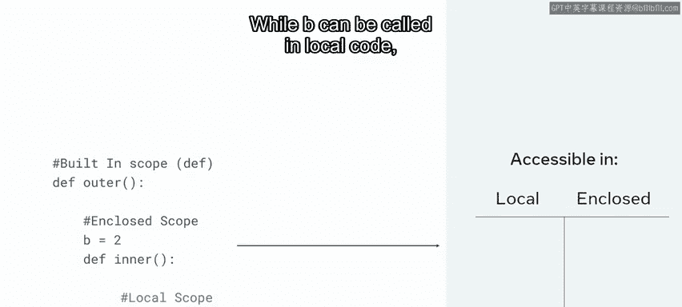
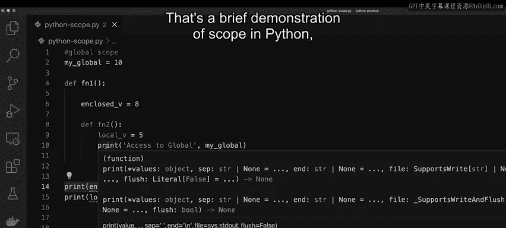

# 变量作用域 🐍

在本节课中，我们将要学习Python中一个至关重要的概念——**变量作用域**。理解作用域能让你更好地控制代码中的元素，减少因意外修改而导致的错误。课程结束时，你将能够理解Python作用域的基础知识，并识别四种不同类型的作用域。

## 概述：什么是作用域？

在深入探讨作用域的细节之前，首先需要明确一点：Python拥有不同类型的作用域。作用域的目的是**保护变量**，使其不会被代码的其他部分意外更改。例如，如果你在全局作用域中声明了变量A，那么你可以在局部代码中调用它；但反过来，在局部作用域中声明的变量，则无法从外部直接访问。

## 四种作用域类型

以下是Python中四种作用域，按照覆盖范围从小到大排列：

1.  **局部作用域**
2.  **闭包作用域**
3.  **全局作用域**
4.  **内置作用域**

它们合称为 **LEGB**。位于内置作用域和全局作用域中的变量，可以从代码的任何位置访问。

## 作用域规则详解



上一节我们介绍了四种作用域类型，本节中我们来看看它们的具体规则和访问权限。

*   **全局与局部访问**：全局变量可以在局部代码中被调用。但局部变量无法从外部访问。
*   **嵌套访问**：最内层的函数可以访问外部几乎所有内容（即可以访问闭包变量和全局变量）。
*   **外部限制**：从外部无法访问嵌套或闭包作用域中的变量（包括局部变量和闭包变量）。

通常，在应用程序中**不鼓励使用全局变量**，因为它会增加输出出错的可能性。

## 实践演示：四种作用域

现在，我将通过一个实际的代码演示来探索Python的四种不同作用域。

首先，我声明一个全局变量 `my_g` 并赋值为10。

```python
my_g = 10  # 全局变量
```

接下来，我声明一个名为 `fn1` 的函数。

```python
def fn1():
```

在这个函数内部，我声明另一个变量，称之为局部变量 `local_v`，并赋值为5。

```python
    local_v = 5  # 局部变量
```

为了展示全局变量可以从任何地方访问，我可以执行一个打印语句。

```python
    print("访问全局变量:", my_g)  # 可以访问全局变量my_g
```

要运行这个函数，我需要显式地调用它。

```python
fn1()  # 调用函数
```

运行后，全局变量 `my_g` 的值10被打印出来。但是，如果我尝试在函数 `fn1` 外部打印其内部的局部变量 `local_v`，则会返回一个错误。

```python
print(local_v)  # 这将导致 NameError: name 'local_v' is not defined
```

这是因为 `local_v` 只能在函数 `fn1` 的局部作用域内访问。

接下来，为了说明闭包作用域，我将在 `fn1` 内部声明第二个函数 `fn2`。

```python
def fn1():
    local_v = 5
    print("访问全局变量:", my_g)

    def fn2():  # 内部函数，创建闭包作用域
        enclosed_v = 8  # 闭包变量
        print("访问闭包变量:", enclosed_v)  # 在fn2内部可以访问enclosed_v
        print("访问全局变量（从fn2）:", my_g)  # 也可以访问全局变量

    fn2()  # 在fn1内部调用fn2

fn1()  # 调用fn1
```

运行上述代码，会打印出“访问全局变量: 10”和“访问闭包变量: 8”。这演示了内部函数 `fn2` 可以访问其外部的闭包变量 `enclosed_v` 以及全局变量 `my_g`。

然而，同样的规则对外部依然适用。如果我尝试在 `fn1` 外部访问变量 `enclosed_v` 或 `local_v`，会得到变量未定义的错误。

最后一种作用域是**内置作用域**，你在编写Python代码时一直在使用它。内置作用域指的是诸如 `print` 和 `def` 之类的**保留关键字**。内置作用域覆盖了Python的所有语言特性，这意味着你可以在最外层的作用域或函数、类的最内层作用域中访问它。



## 总结

本节课中我们一起学习了Python变量作用域的核心概念。我们了解到作用域通过限制变量的可访问范围来保护数据，并详细探讨了四种作用域类型：局部、闭包、全局和内置（LEGB）。记住，内部代码可以访问外部变量，但外部代码通常无法访问内部变量，且应谨慎使用全局变量以避免意外错误。掌握这些知识，将帮助你编写出更健壮、更易维护的Python代码。