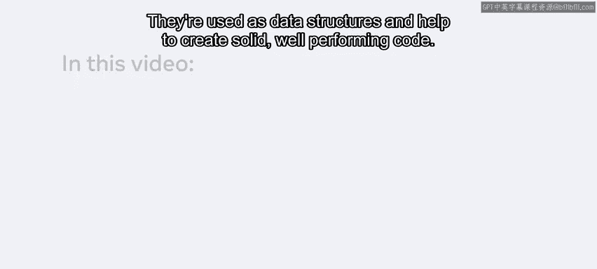
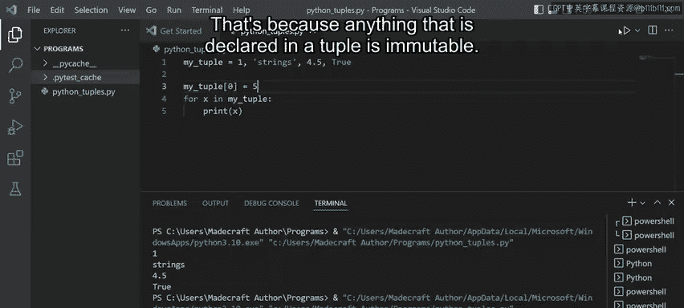
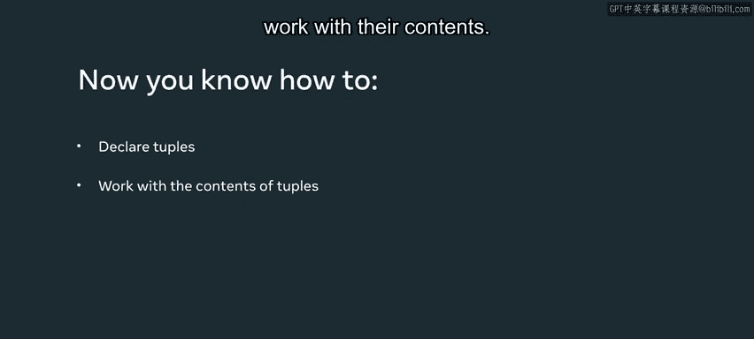

# Python 23：元组

## 概述

在本节课中，我们将要学习Python中的元组。元组是一种用于存储多种类型数据的数据结构，它能帮助我们创建结构良好、性能优异的代码。我们将学习如何声明元组、访问其中的元素、使用相关方法，并理解其与列表的关键区别。

## 声明元组

要声明一个元组，首先需要定义一个变量，然后使用赋值运算符`=`，最后用圆括号`()`来包裹元组内的元素。



**代码示例：**
```python
my_tuple = (1, "strings", 4.5, True)
```

一个元组可以接受任何数据类型的混合，范围可以从整数（如1）、字符串、浮点数（如4.5）到布尔值（如True）。

## 访问元组元素

要访问元组中的任何元素，可以使用与列表类似的方法，即通过索引来引用。

**代码示例：**
```python
print(my_tuple[1])
```

记住，索引总是从0开始。运行上述代码，它将返回字符串`”strings”`。

## 确定元组类型

Python提供了`type`函数来确定变量的类型。

**代码示例：**
```python
print(type(my_tuple))
```

运行此代码，将得到`<class ‘tuple’>`，表明这是一个元组类。

## 元组的替代声明方式

我们也可以不使用圆括号来声明元组，它会产生相同的效果，并且仍然被归类为元组。然而，最佳实践是使用圆括号，以提高代码的可读性。

## 元组的方法

元组提供了`count`和`index`两种主要方法。

以下是`count`方法的使用示例，它用于查找某个值在元组中出现的次数。

**代码示例：**
```python
print(my_tuple.count("strings"))
```

运行此代码，将返回计数`1`。

接下来，我们看看`index`方法。它用于返回某个值在元组中首次出现的索引位置。

**代码示例：**
```python
print(my_tuple.index(4.5))
```

运行此代码，将返回索引`2`，这意味着浮点数`4.5`位于元组的索引2位置。

## 遍历元组

我们也可以对元组进行循环遍历，即迭代其中的所有值并打印出来。

**代码示例：**
```python
for x in my_tuple:
    print(x)
```

运行此代码，将依次输出：`1`、`”strings”`、`4.5`和`True`，即元组中的所有值。

## 元组与列表的关键区别

元组与列表的一个关键区别在于，元组的值是**不可变的**。这意味着一旦元组被创建，其中的元素就不能被修改。

为了证明这一点，我们尝试修改元组中的第一个元素。

**代码示例：**
```python
my_tuple[0] = 5
```



运行此代码，将会得到一个错误：`TypeError: ‘tuple’ object does not support item assignment`。这是因为元组中声明的任何内容都是不可变的。

## 总结



本节课中，我们一起学习了Python中的元组。我们了解了如何声明元组、访问其内容、使用`count`和`index`方法，以及如何遍历元组。最重要的是，我们理解了元组的**不可变性**是其与列表的核心区别，这决定了元组适用于那些不应在程序运行过程中被修改的数据集合。