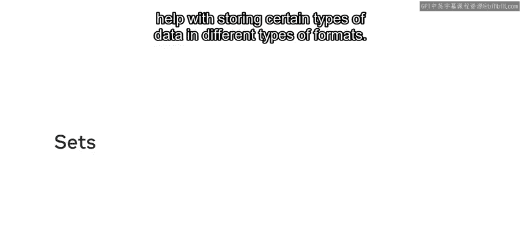
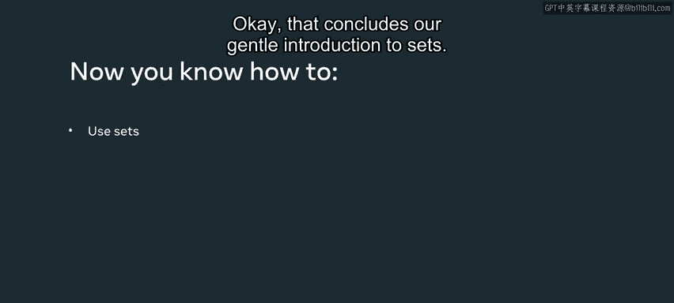

# 24：集合操作入门指南 🧮

在本节课中，我们将要学习Python中的集合（Set）。集合是一种非常有用的数据结构，它可以帮助我们以特定的格式存储某些类型的数据。我们将了解如何创建集合、它与列表的区别，以及如何使用集合进行各种数学运算。

## 创建与打印集合



首先，我们来声明一个集合。我们可以通过声明一个名为`setA`的简单变量，然后使用花括号来定义集合本身。

以下是创建集合的代码：
```python
setA = {1, 2, 3, 4, 5}
```

然后，我们可以进行一个简单的打印来证明我们拥有一个集合。
```python
print(setA)
```

点击运行后，我们会得到打印出的值1到5。

## 集合与列表的区别

集合与列表略有不同，因为它不允许重复值。

我们可以通过放入另一个`5`来演示这一点。
```python
setA = {1, 2, 3, 4, 5, 5}
print(setA)
```

当我点击运行时，会发现第二个`5`没有在列表中打印出来。

## 集合的常用方法

集合也有一些我们可以使用的方法。

我可以使用一个方法来添加新内容。如果我使用`setA.add(6)`，就可以添加数字`6`。
```python
setA.add(6)
print(setA)
```

点击运行后，会发现值`6`被添加到了集合中。

我也可以使用`remove`方法。
```python
setA.remove(2)
print(setA)
```

当我点击运行时，会发现数字`2`从集合中被移除了。

还有一个`discard`方法，它的作用基本上与`remove`相同。
```python
setA.discard(3)
print(setA)
```

使用`discard`方法，当我点击运行时，会得到相同的输出效果。

在继续之前，让我先清空控制台。

## 集合的数学运算

还有一些有用的方法可以与集合一起使用，以执行数学运算。现在我来演示其中一些。

首先，我将创建一个新的集合`setB`，并重置`setA`的值为原始值。
```python
setA = {1, 2, 3, 4, 5}
setB = {4, 5, 6, 7, 8}
```

有两种方式可以使用数学运算符。例如，对于并集（union），我可以这样做：
```python
print(setA.union(setB))
```

然后我可以点击运行按钮看看会发生什么。我发现它将两个集合连接在一起，并去除了像`4`和`5`这样的重复值。并集将它们合并为一个集合，所以你得到了一个集合`{1, 2, 3, 4, 5, 6, 7, 8}`。

对于并集的其他选项，我可以使用竖线符号`|`，它的工作方式相同。
```python
print(setA | setB)
```

在继续之前，让我先清空控制台。

## 交集运算

我可以使用的另一个运算是交集。我可以通过编写`setA.intersection(setB)`并将其应用于`setA`。
```python
print(setA.intersection(setB))
```

当我点击运行时，我得到了`setA`和`setB`中都匹配的所有项。这里我们得到了`4`和`5`。

交集也可以用`&`符号表示，并且工作方式相同。
```python
print(setA & setB)
```

当我点击运行时，我也得到了`4`和`5`。

在继续之前，让我再次清空控制台。

## 差集运算

我可以使用的另一个数学运算是集合差集。要使用这个，我将打印`setA.difference(setB)`。
```python
print(setA.difference(setB))
```

这应该会返回所有只在`setA`中而不在`setB`中的元素。当我点击运行时，我们得到了正确的输出`{1, 2, 3}`。

我也可以用减号`-`来表示差集。
```python
print(setA - setB)
```

当我点击运行时，我也会得到相同的值`{1, 2, 3}`。

## 对称差集运算

我将讨论的最后一个运算叫做对称差集。这由`symmetric_difference`函数表示，使用方式类似。
```python
print(setA.symmetric_difference(setB))
```

当我点击运行时，我得到了`{1, 2, 3, 6, 7, 8}`。换句话说，就是所有存在于`setA`或`setB`中，但不同时存在于两个集合中的元素。

对称差集也可以用`^`运算符表示。
```python
print(setA ^ setB)
```

当我点击运行时，我得到了相同的值。

## 集合的无序性

关于集合，另一个重要的事情是，集合是一个没有重复项的集合，但它也是一个无序项的集合，不像列表那样可以基于索引打印内容。

如果我尝试打印`setA[0]`来获取集合中的第零个元素，我会得到一个错误。
```python
print(setA[0])
```

在尝试打印此输出之前，让我先清空控制台。当我点击运行时，我得到一个类型错误，提示集合对象不可下标。

这意味着集合不是一个序列。它不包含内部所有元素的有序索引。

## 总结



本节课中我们一起学习了Python集合的基础知识。我们了解了如何创建集合，它与列表的关键区别在于不允许重复值且元素无序。我们练习了使用`add`、`remove`和`discard`方法来修改集合。更重要的是，我们探索了集合的四种核心数学运算：并集（`union` 或 `|`）、交集（`intersection` 或 `&`）、差集（`difference` 或 `-`）和对称差集（`symmetric_difference` 或 `^`）。最后，我们明白了由于集合的无序性，不能像列表那样通过索引访问其元素。掌握这些操作将帮助你在处理需要唯一值或进行集合运算的数据时更加得心应手。