# Python 27：什么是异常 🐍

在本节课中，我们将要学习Python编程中两个非常重要的概念：错误（Errors）和异常（Exceptions）。理解它们之间的区别以及如何处理它们，是每位新开发者成长的关键一步。

## 错误与异常概述

错误是编码过程中不可避免的一部分，它们可能由多种原因引发。让我们从探索两种主要类型开始：语法错误（Syntax Errors）和异常（Exceptions）。语法错误通常由人为失误导致，而异常则是已知的、需要在代码中处理的问题。

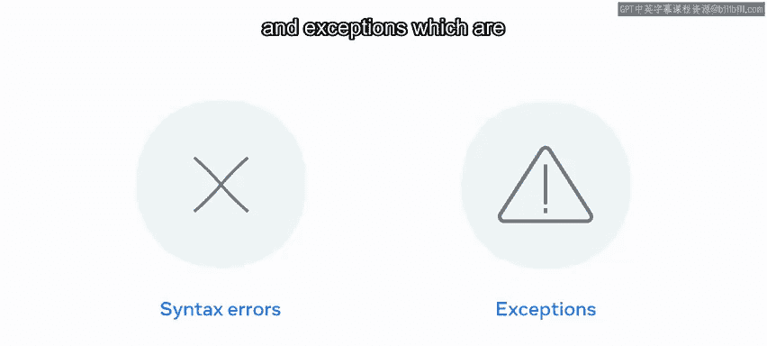

## 语法错误

上一节我们介绍了错误的基本分类，本节中我们来看看第一种类型——语法错误。这类错误通常由开发者造成，可能是代码中的拼写错误或打字错误。

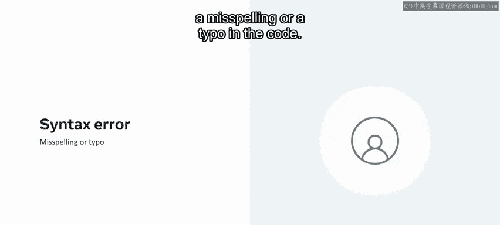


通常，这类错误的影响较小，因为大多数集成开发环境（IDE），例如Visual Studio Code，会警告开发者并提供修复线索。

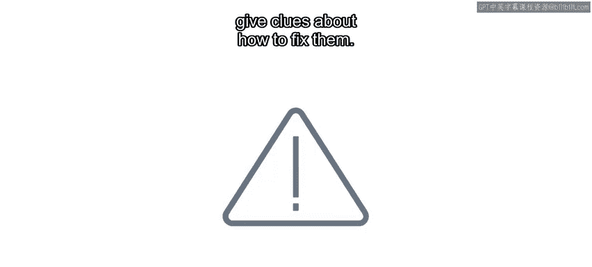


以下是Python初学者常见的语法错误示例：

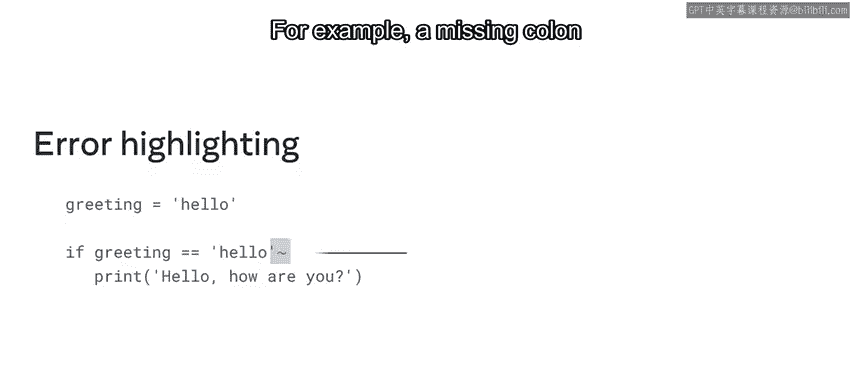

*   **遗漏冒号**：在学习Python时，一个常见错误是在条件语句或循环语句末尾忘记添加冒号。
    ```python
    if x > 5  # 错误：缺少冒号
        print("x is greater than 5")
    ```
    如果使用具有语法检查功能的代码编辑器，此类错误会在出错点被高亮显示。运行代码将导致 `SyntaxError: invalid syntax`。

*   **缩进问题**：Python使用缩进来定义代码块，因此缩进不正确也会导致语法错误。
    ```python
    def my_function():
    print("Hello")  # 错误：函数体内的语句需要缩进
    ```
    这将引发 `IndentationError`。


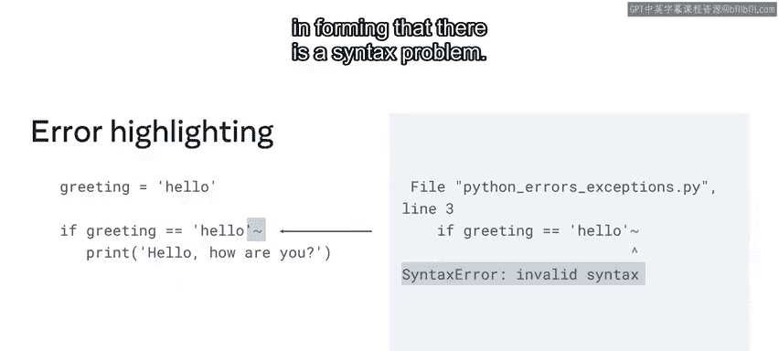

随着你不断学习Python，你将越来越少地遇到这类错误，因为你会变得更擅长编写和分析自己的代码。

## 异常

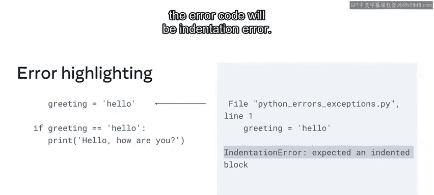

现在让我们继续学习异常错误。它们发生在代码执行期间，对于未经训练的眼睛来说很容易被忽视。

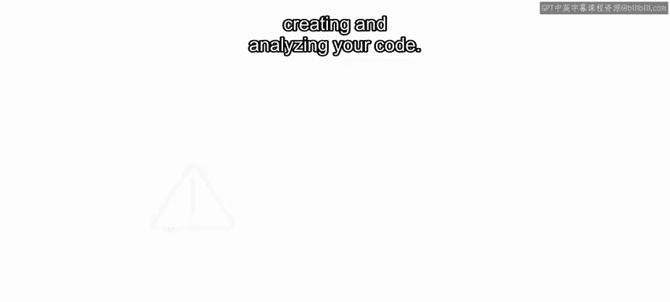

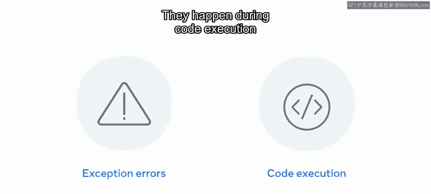

但是，异常需要由开发者来处理。开发者需要处理代码库中任何潜在的问题，以防止应用程序失败。


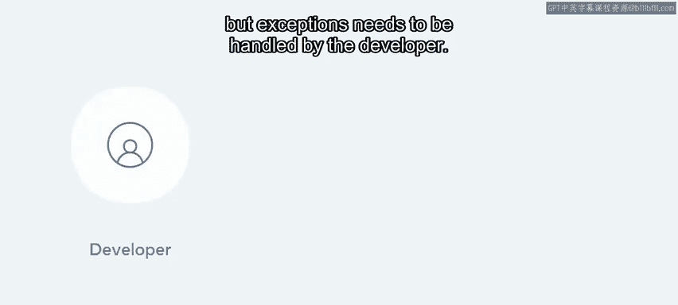


让我们来探索一个抛出异常的例子。你的代码可能在语法上是完全正确的，但如果它试图执行一个无意义的操作，例如除以零，就会引发异常。

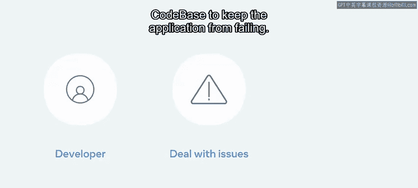

```python
result = 5 / 0  # 这将引发 ZeroDivisionError
```

从数学上讲，任何数除以零是没有意义的。因此，当你运行这段程序时，会抛出 `ZeroDivisionError` 异常。

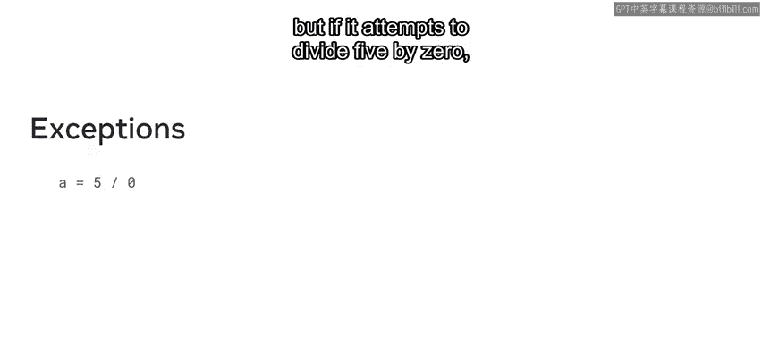


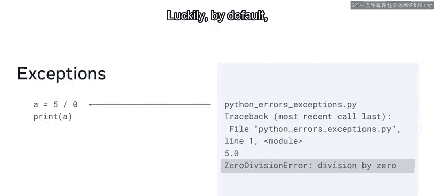

幸运的是，Python默认内置了许多异常类型，你可以利用它们来捕捉代码中的潜在问题。

## 总结

本节课中我们一起学习了Python中错误与异常的基础知识。我们区分了由开发者失误导致的语法错误和在程序运行时发生的异常。理解这些概念是朝着成为一名更优秀的Python程序员迈出的正确一步。记住，处理异常是构建健壮、稳定应用程序的关键技能。