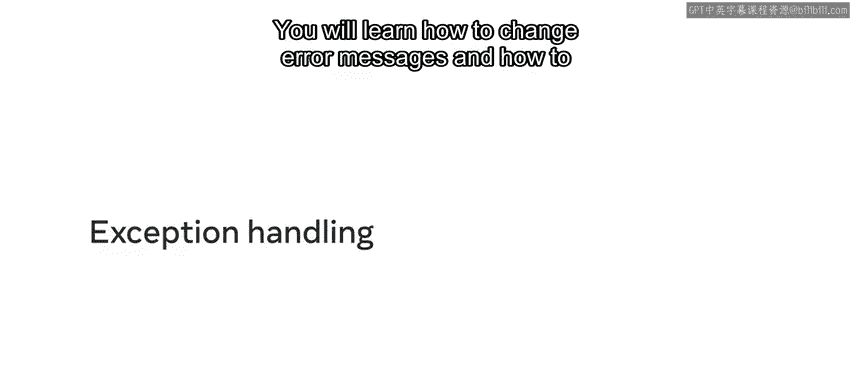
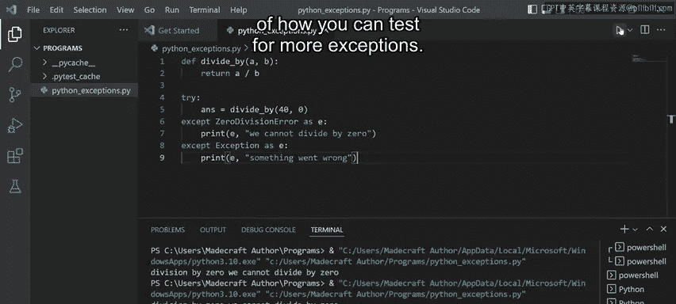
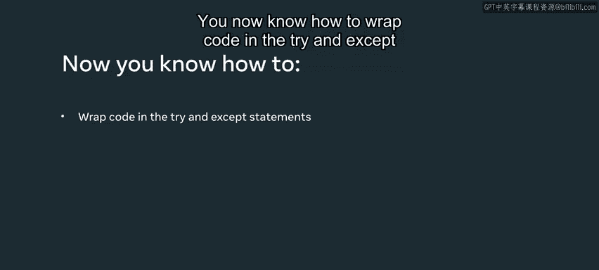

# Python 28：异常处理 🐍

在本节课中，我们将要学习如何在Python中处理异常。你将了解如何改变错误信息，以及如何使用 `try` 和 `except` 语句来包装你的代码，从而让程序在遇到问题时更加健壮和用户友好。

## 概述



程序在运行时可能会遇到各种意外情况，例如除以零、文件不存在等。这些情况被称为“异常”。如果不加处理，程序会崩溃并显示复杂的错误信息。通过异常处理，我们可以优雅地捕获这些错误，并给出清晰的提示，从而提升用户体验和程序的稳定性。

上一节我们介绍了函数的基本概念，本节中我们来看看如何让函数在面对错误输入时也能妥善应对。

## 一个简单的除法函数

首先，我们创建一个简单的数学函数作为例子。

我定义了一个名为 `divide_by` 的新函数，它接受两个参数 `A` 和 `B`。这个函数的目的是返回两个数字相除的结果。

```python
def divide_by(A, B):
    return A / B
```

现在，我添加一个打印语句来调用这个函数。在打印语句内部，我传入数值40和4。

```python
print(divide_by(40, 4))
```

我点击运行，返回的值是10，这是正确的，因为40除以4等于10。

## 触发异常

现在，让我们测试一下如果传入40和0会发生什么。

```python
print(divide_by(40, 0))
```

当我点击运行时，我得到了一个错误，或者说一个“异常”。这个异常显示为 `ZeroDivisionError: division by zero`。它给出这个错误是因为在数学中，任何数都不能除以0。

你可能会同意，让用户看到这种晦涩的错误信息会让他们感到困惑。那么问题来了：如何以更友好的方式处理错误？

## 使用 Try 和 Except 语句

如何防止用户看到实际打印出来的异常呢？你可以使用Python的 `try` 和 `except` 语句来实现。

基本语法是：输入 `try:`，然后在下一行输入 `except:`。你将想要运行的代码放在 `try` 语句块中。

我删除底部的打印语句，并将 `divide_by` 函数调用包裹在 `try` 语句中。

```python
try:
    ans = divide_by(40, 0)
except:
    print("Something went wrong.")
```

让我清空终端以便你能专注于输出。我点击运行，现在打印出来的是我们自定义的错误语句。

那么发生了什么？`try` 语句会尝试执行你添加在其中的代码。如果发生异常，它将触发 `except` 行，并执行 `except` 语句块下的任何代码。

## 捕获特定异常信息

但是Python允许你让 `except` 语句更具体。如果你想捕获异常本身，可以在 `except` 后面添加基类 `Exception`。基类 `Exception` 用于Python中编写的所有异常。

你可以通过使用 `as E` 来访问异常信息。变量 `E` 充当异常的别名。我可以在打印语句中使用 `E` 来打印出异常。

让我们编辑打印语句。我在错误信息的末尾添加 `E`。

```python
try:
    ans = divide_by(40, 0)
except Exception as e:
    print("Something went wrong.", e)
```

我按下运行，会发生什么？我们的自定义消息被打印出来，同时 `e` 的内容也被打印了。所以这次它显示：`Something went wrong. division by zero`。

在Python中，你还可以访问实际发生的异常类型或类。为此，我添加另一个打印语句：`e.__class__`。

```python
try:
    ans = divide_by(40, 0)
except Exception as e:
    print("Something went wrong.", e)
    print(e.__class__)
```

我再运行一次这个语句。这次，输出也包含了错误的类，即 `<class ‘ZeroDivisionError’>`。

让我再次清空终端。

## 提供更具体的用户反馈

让我们更进一步，为最终用户提供更具体的反馈。

在 `except` 语句中，我将基类 `Exception` 替换为实际打印出来的错误，即 `ZeroDivisionError`。我将更改打印语句，首先通过在该语句开头添加 `e` 来打印实际错误，然后添加一些用户友好的文本，说明“我们不能除以0”。

```python
try:
    ans = divide_by(40, 0)
except ZeroDivisionError as e:
    print(e, "We cannot divide by zero.")
```

我点击运行，现在的输出是：`division by zero We cannot divide by zero.`。

到目前为止，你已经了解了如何用 `try` 和 `except` 语句包装你的代码，以及如何优化用户看到的消息。

## 处理多个异常

但是，如何在不提前知道它们是什么的情况下处理多个异常呢？

幸运的是，你可以通过添加另一个 `except` 语句来更改异常处理结构。假设代码没有在第一个 `except` 语句中触发零除错误，你可以添加另一个 `except` 语句来测试通用异常。

现在我将再次添加基类 `Exception`。我添加一个带有 `e` 和包含一些通用信息的消息的打印语句。

```python
try:
    ans = divide_by(40, 0)
except ZeroDivisionError as e:
    print(e, "We cannot divide by zero.")
except Exception as e:
    print(e, "A general error occurred.")
```

我点击运行，在这种情况下，因为仍然存在数学错误，函数仍然会在第一个 `except` 语句处被捕获。但这让你很好地了解了如何测试更多的异常情况。



以下是处理多个异常时的结构要点：
*   **顺序很重要**：特定的异常（如 `ZeroDivisionError`）应放在通用的异常（如 `Exception`）之前。
*   **兜底处理**：通用的 `except Exception` 可以捕获所有未被前面特定 `except` 块处理的异常。
*   **保持清晰**：为每种异常类型提供清晰的错误信息，有助于调试和用户体验。

## 总结



本节课中我们一起学习了Python异常处理的核心知识。你知道了程序运行中难免会出现意外，而异常处理机制就是应对这些意外的安全网。我们通过一个除法函数的例子，逐步探索了如何使用 `try` 和 `except` 语句来捕获错误，如何从异常对象中获取详细信息，以及如何为不同的异常类型提供定制化的友好提示。记住，良好的异常处理不仅能防止程序崩溃，还能极大地改善用户的体验。恭喜你，现在你已经知道如何用 `try` 和 `except` 语句包装代码，以处理代码中所有潜在的异常了。