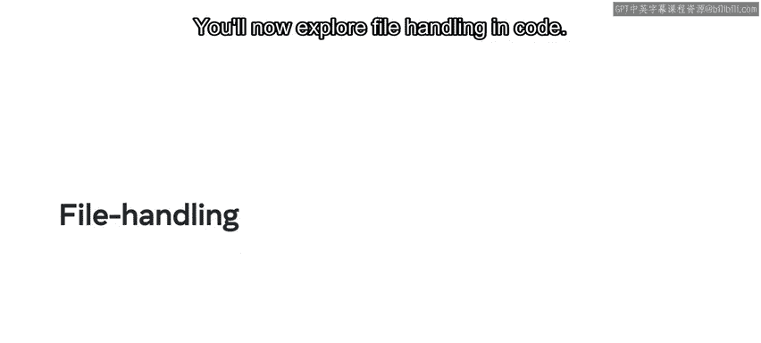
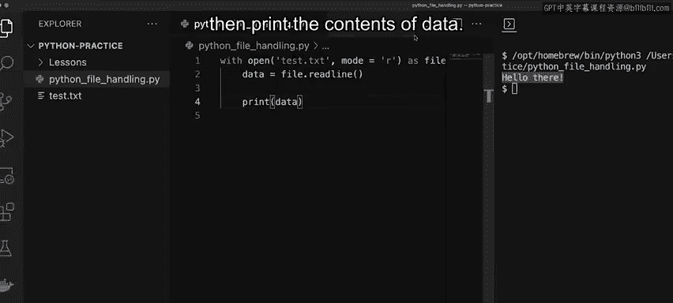

# Python 29：Python中的文件处理 📂

## 概述

在本节课中，我们将要学习Python中文件处理的核心概念与操作方法。文件处理是Python编程的重要组成部分，它允许我们创建、读取、写入和操作存储在文件中的数据。这对于处理大量数据、配置文件或任何需要持久化存储的信息至关重要。

---

## 文件处理基础

文件处理是学习Python的关键部分。Python提供了多个内置函数来创建和操作文件。文件处理包括打开、读取、写入以及其他文件操作。作为开发者，你可能会处理大量数据，而文件处理使这项工作变得更加容易。因此，学习如何操作文件非常重要。

无论你是在处理计算机上的数据、网络数据还是云端数据，这些数据很可能以某种文件形式保存。Python中有两个主要的文件处理函数：`open`和`close`。让我们首先探索`open`函数。

### `open`函数

`open`函数用于读取、写入和创建文件。它接受两个参数：
1.  第一个参数是**文件名**和/或**文件路径**。
2.  第二个参数是**模式**。

模式指明了所需的操作，例如读取、写入或创建。它还指定了你希望文件以文本格式还是二进制格式输出。

以下是Python中可用的文件处理模式：
*   **`r`**：以文本格式打开并读取文件。
*   **`rb`**：以二进制格式打开并读取文件。
*   **`r+`**：打开文件用于读取和写入。
*   **`w`**：打开文件用于写入。**注意**：`w`模式会覆盖现有文件。
*   **`a`**：打开文件用于编辑或追加数据。

### `close`函数

`close`函数用于关闭已打开的文件连接。**注意**：它不接受任何参数。

在Python中，还有另一种打开和关闭文件的方式，那就是使用`with open`语句。使用它的优势在于它会自动关闭文件，我们稍后会进行演示。

---

## 文本格式与二进制格式

到目前为止，你已经了解了如何为特定操作打开文件，但你可能想知道以文本格式和二进制格式打开文件有什么区别。

在Python中，你通常以两种方式处理文件：文本格式或二进制格式。

*   **文本格式**对用户更友好，因为人类可以阅读它。
*   你**无法直接阅读**二进制格式的文件，但它们更加紧凑，因此能带来更好的性能。

现在，让我们介绍如何在Python中指定文件处理的类型。

Python默认使用**文本格式**进行文件处理。因此，仅传递任何用于读取或写入的模式都会自动将其设置为文本格式。

若要将文件处理设置为**二进制格式**，你需要在读取或写入选项后加上字母`b`。



例如：
*   `open('文件名', 'rb')` 用于以二进制格式读取文件。
*   `open('文件名', 'ab')` 用于以二进制格式追加或添加数据到文件。

---

## 代码实践

上一节我们介绍了文件处理的理论基础，本节中我们来看看如何在代码中实际操作文件。

首先，我将声明一个名为`file`的简单变量，并将`open`函数赋值给它以获取对文件的访问权限。但在使用`open`函数之前，我需要先创建一个用于测试的新文件，我们称之为`test.txt`。在这个文本文件中，我添加了一行简单的文本：“hello there”。

现在回到Python文件。在`open`函数的括号内，我可以添加第一个参数，即字符串`'test.txt'`。对于第二个参数，我输入`mode='r'`，表示以读取模式打开。

至此，名为`file`的变量将能够访问`test.txt`的内容。但要实际读取文件，你需要添加`readline()`或`readlines()`函数。`readline()`只返回文件的第一行，而`readlines()`会输出一个包含多行的数组。

由于我们的文件中只有一行文本，我将使用`readline()`函数。我输入`file.readline()`并将其赋值给一个新变量`data`。然后我添加一个`print`语句来打印`data`的内容。最后，我添加`close()`函数来关闭对`test.txt`文件的访问。

```python
file = open('test.txt', mode='r')
data = file.readline()
print(data)
file.close()
```

我点击运行，文件的内容（即“hello there”）被打印出来。

接下来，我将演示在Python中访问文件的另一种方式：将`open`函数改为`with open`语句。

为什么要使用`with open`函数？`with open`语句能更好地处理异常，并且会自动为你关闭文件。

与之前类似，我创建第二个变量`data`，使用`readline()`，然后打印`data`的内容。

```python
with open('test.txt', mode='r') as file:
    data = file.readline()
    print(data)
```

我点击运行，和之前一样，文件的内容被打印出来。

---



## 总结

本节课中我们一起学习了如何在Python中处理文件。这包括用于创建和操作文件的内置函数，以及打开、读取和写入文件的函数。我们探讨了`open`和`close`函数，了解了不同的文件打开模式（如`r`、`w`、`a`及其二进制变体`rb`、`wb`等），并比较了文本格式与二进制格式的区别。最后，我们通过代码示例实践了使用标准`open()`和更推荐的`with open`语句来安全地读取文件内容。掌握这些基础知识是进行有效数据管理和后续更复杂数据库操作的第一步。