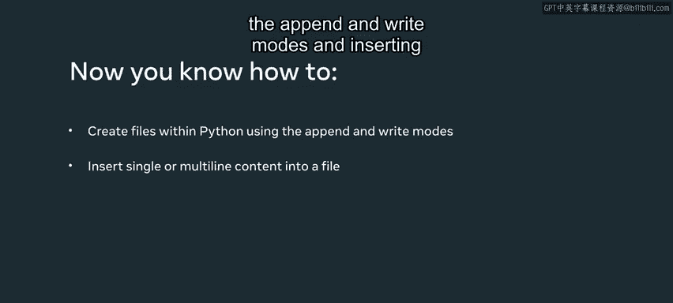

# Python 30：创建文件 📄

在本节课中，我们将要学习如何在Python中创建文件，并探索向新文件中插入内容的不同方法。文件用于永久存储数据。代码变量中的数据仅存在于随机存取存储器（RAM）中。由于计算机关闭时RAM会丢失数据，因此能够创建文件以保存数据供将来使用或作为永久记录至关重要。

在Python中，我们可以使用 `open` 函数并启用正确的模式来创建新文件。

---

## 使用 `open` 函数创建文件

让我们从一个简单的例子开始。我将使用 `with` 语句。


以下是创建文件的基本语法：
```python
with open('new_file.txt', mode='w') as file:
    # 对文件进行操作
```
`open` 函数接受两个主要参数：文件名和模式。模式 `'w'` 代表“写入”。如果文件不存在，Python会创建它；如果文件已存在，`'w'` 模式会覆盖原有内容。

一种简写模式的方法是直接输入代表所需模式的单个字符。例如，可以用 `'w'` 代替 `mode='w'`，两者含义相同。

现在，我可以通过变量 `file` 访问新创建的文件，并开始使用写入函数向其中添加内容。

---

## 向文件写入内容

上一节我们介绍了如何创建文件，本节中我们来看看如何向文件中写入内容。

### 写入单行内容

使用 `write()` 方法可以向文件写入字符串。以下是具体步骤：
```python
with open('new_file.txt', 'w') as file:
    file.write('This is a new file created.')
```
运行此代码后，会在当前目录下生成一个名为 `new_file.txt` 的文件，其中包含指定的文本。

### 写入多行内容

如果需要向文件写入多行内容，而不是单行，可以使用 `writelines()` 方法。

`writelines()` 方法接受一个列表作为参数。在Python中，列表由方括号 `[]` 表示，列表项之间用逗号分隔。

以下是写入多行内容的示例：
```python
with open('new_file.txt', 'w') as file:
    file.writelines(['This is a new file created.', 'This is another line to be added.'])
```
运行此代码后，`new_file.txt` 文件中将包含由 `writelines()` 函数创建的两行文本。

但是，输出结果可能不符合预期。Python会严格按照列表中指定的格式添加内容。如果希望内容在新行上显示，需要在字符串中指定换行符 `\n`（无空格）。

以下是修正后的代码：
```python
with open('new_file.txt', 'w') as file:
    file.writelines(['This is a new file created.\n', 'This is another line to be added.'])
```
现在，当运行代码时，`new_file.txt` 文件的内容将更易读，每个句子都在单独的一行。

---

## 文件写入模式：覆盖与追加

每次运行写入模式（`'w'`）的脚本时，它都会替换当前文件的内容。例如，如果在第一行文本中插入数字“2”并运行脚本，新的文件内容将覆盖旧文件，只保留修改后的第一行。

另一方面，如果希望向文件添加内容而不是每次替换它，需要更改模式的行为。将字母 `'w'` 替换为 `'a'`，它代表“追加”（append）。

以下是追加模式的示例：
```python
with open('new_file.txt', 'a') as file:
    file.write('This line will be appended.\n')
```
如果运行此代码多次，每次都会将新行添加到文件末尾，而不是覆盖原有内容。

然而，追加时可能不会完全按照预期换行。原因是在第一句之前没有指定换行符。因此，可以在字符串开头添加 `\n` 来确保新内容从新行开始。

如果需要先清空文件再写入，可以将模式改回 `'w'` 以确保覆盖最后一个文件。之后，若想再次追加内容，再将模式改回 `'a'`。

---

## 处理文件操作异常

在文件操作中，处理可能出现的异常至关重要。我们可以使用 `try` 和 `except` 语句来捕获和处理异常。

以下是如何在文件操作中添加异常处理的示例：
```python
try:
    with open('sample/new_file.txt', 'w') as file:
        file.write('Testing exception handling.')
except FileNotFoundError as e:
    print(f'Error: {e}')
```
为了触发错误，可以尝试访问一个不存在的目录。例如，如果请求的目录 `sample` 在当前目录中不存在，Python将引发 `FileNotFoundError`。

运行上述代码后，终端将打印出错误信息：“Error: [Errno 2] No such file or directory: 'sample/new_file.txt'”。

因此，在创建文件时，请确保要放置文件的目录确实存在。在这种情况下，必须确保目录已存在，或者从Python内部创建目录，然后在其中创建文件。

---

## 总结



本节课中我们一起学习了在Python中创建文件的核心知识。我们介绍了如何使用 `open` 函数以及 `'w'`（写入）和 `'a'`（追加）模式来创建和操作文件。我们探讨了如何向文件中写入单行和多行内容，并强调了使用换行符 `\n` 来格式化输出的重要性。最后，我们了解了文件操作中异常处理的重要性，特别是使用 `try-except` 块来捕获 `FileNotFoundError` 等常见错误，从而编写出更健壮、可靠的代码。