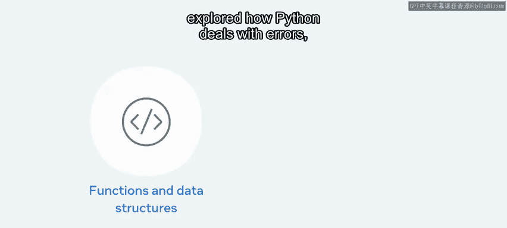
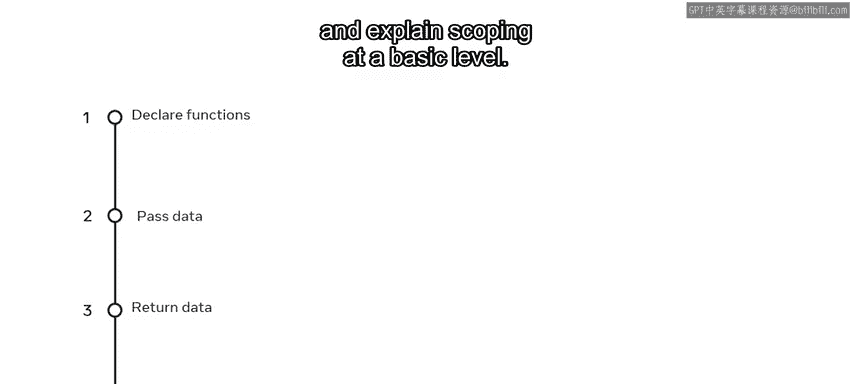
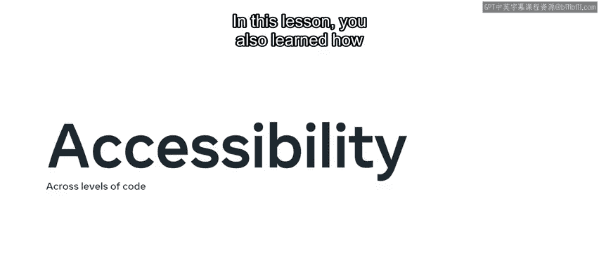
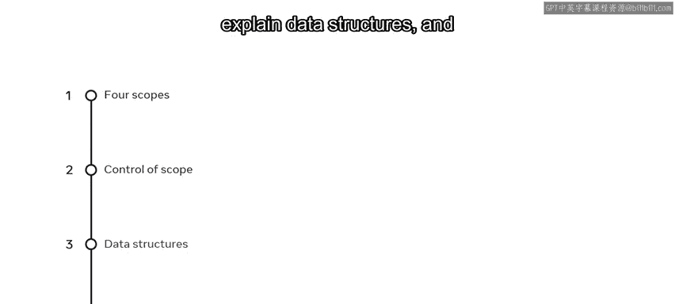
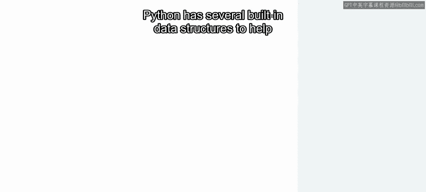
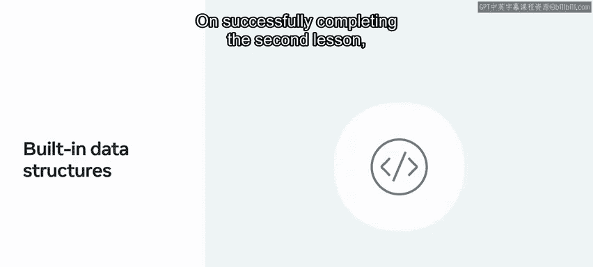
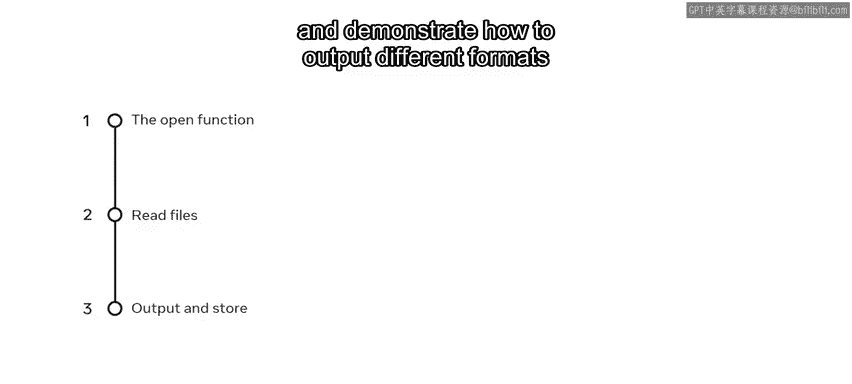

# 32：模块小结 🎯

在本节课中，我们将对Python基础编程模块的核心内容进行回顾与总结。我们将梳理函数、数据结构、错误与异常处理以及文件操作的关键知识点。

## 模块内容回顾 📝



上一节我们完成了Python基础编程模块的学习。在这个模块中，我们系统性地介绍了Python函数、数据结构、错误与异常处理以及文件操作。

以下是本模块涵盖的核心主题：
*   Python函数
*   数据结构
*   错误、异常与文件处理

## 函数基础与作用域 🔧



本节中我们来看看Python函数的基础概念。函数是Python中创建操作的基础单元。



以下是关于函数声明与作用域的核心要点：
*   **声明函数**：使用 `def` 关键字。
    ```python
    def function_name(parameters):
        # 函数体
        return value
    ```
*   **向函数传递数据**：通过参数实现。
*   **从函数返回数据**：使用 `return` 语句。
*   **解释基本层面的作用域**：理解变量在代码不同部分的可访问性。

为了在项目中高效使用函数，理解其在不同代码层级中的可访问性至关重要。



在本课中，你还学习了如何识别四种作用域，描述函数如何在不同层级控制作用域。

## 数据结构 📊



接下来，我们回顾用于组织和存储数据的数据结构。Python提供了多种内置数据结构来帮助你组织和存储数据，以便轻松访问。



以下是本模块介绍的主要数据结构及其概念：
*   **列表**：有序、可变的元素集合。
    ```python
    my_list = [1, 2, 3, 'a', 'b']
    ```
*   **元组**：有序、不可变的元素集合。
    ```python
    my_tuple = (1, 2, 3)
    ```
*   **集合**：无序、不重复的元素集合。
    ```python
    my_set = {1, 2, 3}
    ```
*   **字典**：键值对的无序集合。
    ```python
    my_dict = {'key1': 'value1', 'key2': 'value2'}
    ```

成功完成第二课后，你现在应该能够识别列表方法，解释列表中可以存储的数据类型，描述如何遍历列表，并阐述元组、集合、字典和队列的主要用途。

## 文件操作与异常处理 📁

最后，我们总结模块中关于文件处理和异常的主题。Python文件处理和异常是本模块最后一课的内容。

完成本课后，你应该能够掌握以下技能：
*   **使用 `open` 函数创建和操作文件**。
    ```python
    file = open('filename.txt', 'r') # 以读模式打开文件
    ```
*   **描述如何在Python中读取文件**。
*   **演示如何输出不同格式并将文件内容存储到数据结构中**。



## 总结 ✨

本节课中我们一起学习了Python基础编程模块的核心内容。本模块为你提供了开始进行基本Python编程的机会，这是向成为Python开发者迈出的又一步。