# 33：什么是过程编程 🧩

在本节课中，我们将要学习过程编程的基本概念。这是一种通过编写一系列逐步执行的指令来构建程序的方法，是迈向面向对象编程的重要基石。我们将了解其核心思想、优势、劣势，并通过具体示例来理解如何应用。

## 概述

开发者可以用多种不同的方式来组织代码。Python 支持面向对象、过程和函数式编程模型，这些通常也被称为编程范式。本节视频将重点介绍过程编程，它类似于编写程序逐步执行的指令。对于新开发者而言，学习过程编程非常重要，它是理解更复杂编程范式的重要一步。

编程模型的主要目的是结构化你的代码。这种结构使得更新代码和在代码中创建新功能变得更加容易。

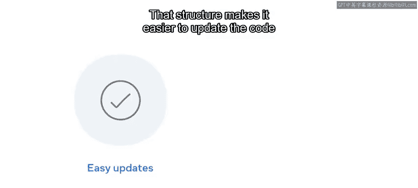

但是，并不存在一种完美的模型能解决所有代码结构问题。有时，结合多种方法效果最佳。

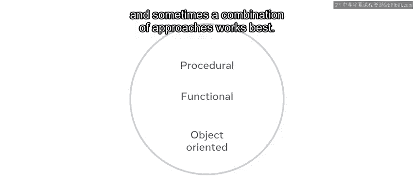


## 过程编程的核心

过程编程将代码组织成过程，有时也称为子程序或代码的功能部分。


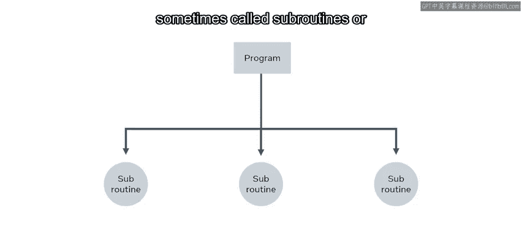

由于这种方法，代码由完成特定任务的逻辑步骤组成。例如，将两个数字相加并返回它们的和。


我可以使用一小段代码将数字 5 和 10 相加。

现在我想将数字 8 和 4 相加。然而，我写的代码是专门用于将 5 和 10 相加的。对于新的数字，我必须创建另一段类似的代码来进行计算。这不是一种高效的编码方式。

因此，我将代码改为一个函数，该函数将接受两个数字作为参数并返回它们的和。

```python
def sum(a, b):
    return a + b
```

在这个函数中，我没有将实际数字声明为变量，而是使用了参数 `a` 和 `b`，所需的代码更少。但更重要的是，我现在有了一个名为 `sum` 的函数，我可以随心所欲地使用许多不同的数字集来重复使用它。

在编程中，有一个称为 **DRY**（Don‘t Repeat Yourself，不要重复自己）的原则，其核心就是减少代码中的重复。

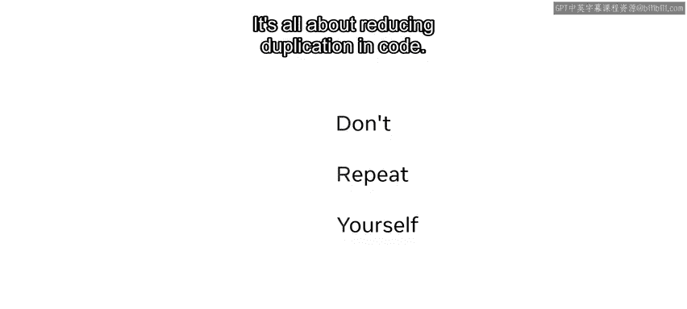

我最初编写的将两个数字相加并返回其和的代码就是一个不该做什么的好例子，因为我必须编写两次代码以适应第二组数字。

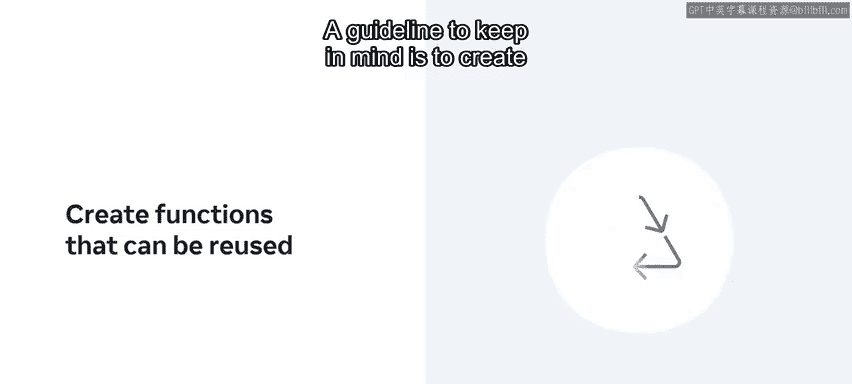

需要牢记的一个准则是：创建可以在整个应用程序中重复使用的函数。

## 过程编程示例


让我们检查另一个例子。这次是关于计算账单总额并为其添加税费。

代码将分为四个部分呈现，以帮助你关注每个过程的作用。

首先，`bill_total` 函数接受一个账单作为参数，并循环遍历它以计算总账单金额并返回总额。

```python
def bill_total(bill):
    total = 0.00
    for item in bill:
        total += item
    return total
```


`calculate_tax` 函数接受两个参数：百分比和账单总额，然后返回要添加到账单中的税费总额，并四舍五入到两位小数。

```python
def calculate_tax(percent, bill_total):
    return round((percent * bill_total) / 100.0, 2)
```

`food_bill` 包含其项目，代表一个客户的账单，它是静态的，但也可以更改为输入以接受用户数据来动态创建账单。

```python
food_bill = [10.50, 7.25, 15.75, 8.00]
```

最后几个部分将调用这两个函数来计算账单和税费，然后分别打印出来以及总金额。

```python
food_total = bill_total(food_bill)
tax_total = calculate_tax(15, food_total)

print("Food Total:", food_total)
print("Tax Total:", tax_total)
print("Overall Total:", food_total + tax_total)
```

你能识别出代码中的子程序或功能部分吗？你是否注意到这些部分是如何相互重用的？

现在，让我们把四个子程序放在一起，检查过程编程从四个方面减少了代码的“足迹”。

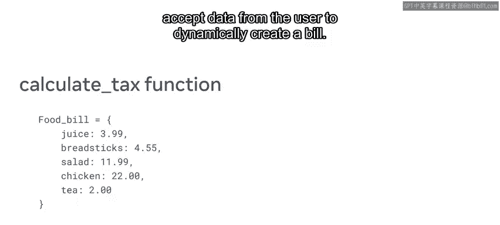

最好从末尾开始检查代码。`tax_total` 重用了 `food_total`。

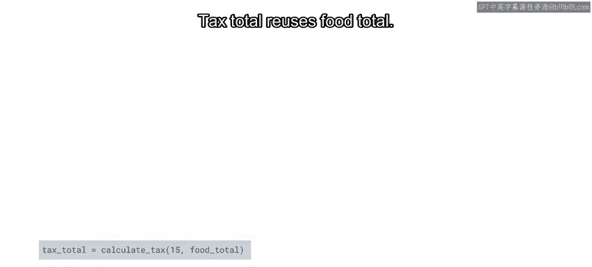

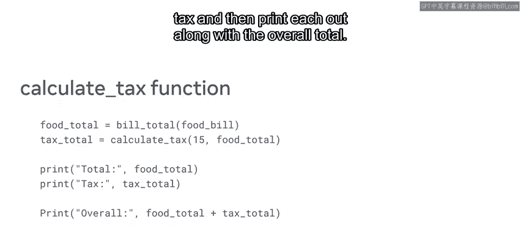

`food_total` 重用了 `bill_total` 和 `food_bill`。`calculate_tax` 重用了 `bill_total`。

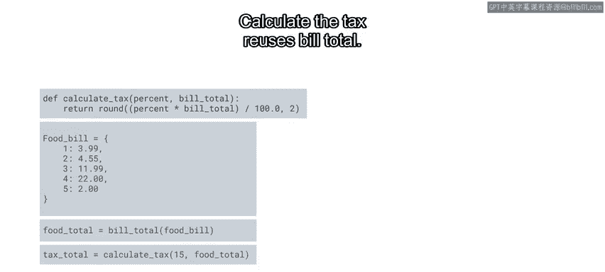

而 `bill_total` 重用了 `food_bill`。

## 过程编程的优缺点


总而言之，过程范式的优点是：对于初学者来说，它易于学习和入门。


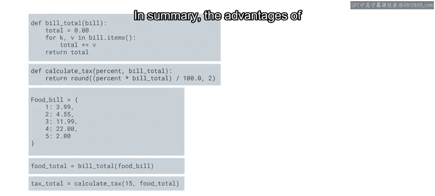

过程可以被代码的其他部分重复使用。

代码易于理解，因为每个过程都被分解为特定的任务。


然而，过程编程也有一些缺点，包括：可能更难维护和扩展。

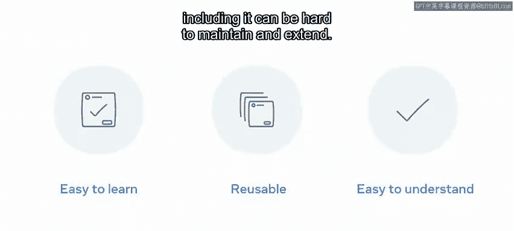

在某些情况下，它与现实世界的对象关联性不强。


数据在整个程序中都是暴露的。

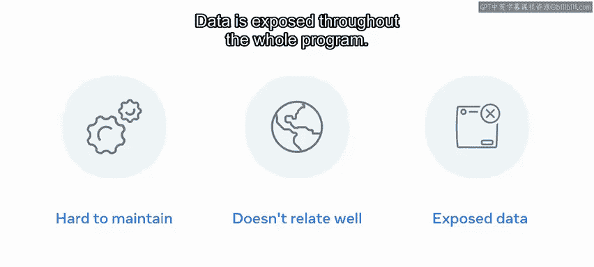


## 总结

过程编程既有优点也有缺点。作为一名新开发者，随着你学习的深入，你将能更好地判断它是否是解决特定编码问题的最佳方法。

本节课中，我们一起学习了过程编程的基本概念。我们了解到它是一种通过编写顺序执行的步骤来组织代码的范式，核心在于将任务分解为可重用的函数或过程。我们通过加法函数和账单计算示例，具体看到了如何应用DRY原则来避免代码重复，并分析了过程编程在易学性、可重用性方面的优势，以及在维护性、数据封装方面的局限性。理解这些是选择合适编程范式的重要基础。