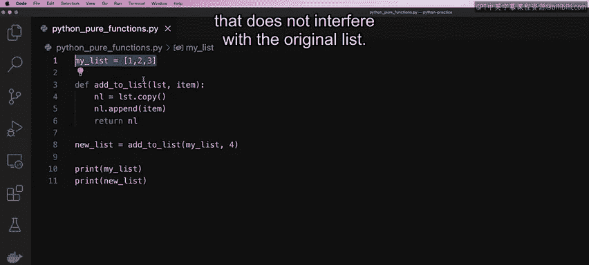

# Python 37：纯函数 🧠

在本节课中，我们将要学习**纯函数**的概念。纯函数是函数式编程中的一个核心思想，它能让代码更清晰、更易于调试和维护。我们将通过对比传统函数与纯函数，理解其定义、优势，并通过一个具体的代码示例，学习如何将一个非纯函数改造为纯函数。

## 什么是纯函数？🤔

上一节我们介绍了纯函数的重要性，本节中我们来看看它的精确定义。

一个纯函数是指**不会改变或影响其自身作用域之外的任何变量、数据、列表或集合**的函数。例如，如果存在一个全局作用域内的列表，纯函数不能向该列表添加任何内容，也不能以任何方式修改它。

## 纯函数 vs. 非纯函数 ⚖️

为了更清晰地理解，让我们分析一个例子，并判断它是否为纯函数。

以下代码包含一个全局列表和一个函数：
```python
my_list = [1, 2, 3]

def add_to_list(item):
    my_list.append(item)
    return my_list

print(add_to_list(4))  # 输出：[1, 2, 3, 4]
print(my_list)         # 输出：[1, 2, 3, 4]
```
你认为这是一个纯函数吗？**不是**。因为它通过附加传入的参数 `item` 修改了全局列表 `my_list`。

## 如何创建纯函数？🔧


要将上述函数改为纯函数，我们需要思考如何：
1.  扩展函数以接受一个列表作为参数。
2.  在不修改原始列表的情况下向列表添加项。
3.  返回一个包含新添加项的新列表。

解决方案是：**创建一个新列表，并复制或克隆原始列表的数据**。

让我们修改代码：
```python
my_list = [1, 2, 3]

def add_to_list(lst, item):
    new_list = lst.copy()  # 创建原始列表的副本
    new_list.append(item)  # 修改副本
    return new_list        # 返回新列表

new_list = add_to_list(my_list, 4)
print(my_list)   # 输出：[1, 2, 3]
print(new_list)  #输出：[1, 2, 3, 4]
```
现在，这个函数就是一个纯函数了。它返回了一个包含新元素的新列表，而原始列表 `my_list` 保持不变。

## 纯函数的优势 ✨

理解了纯函数的定义和创建方法后，我们来看看使用它的好处。以下是纯函数的主要优势：

*   **结果可预测**：纯函数是行为一致的代码片段，总是返回相同的输出。
*   **易于测试和调试**：由于没有副作用，测试时只需关注输入和输出。
*   **可缓存性**：因为给定相同的输入总是返回相同的输出，结果可以被缓存以提高性能。
*   **适合并发编程**：在多线程程序中，多个进程可能并发运行。纯函数有助于防止对全局作用域的修改，确保数据可靠性。

## 实战演示：一步步改造纯函数 💻

现在，我们通过一个更详细的步骤演示，在VS Code中如何将一个普通函数改造为纯函数。

首先，我创建一个非纯函数：
```python
my_list = [1, 2, 3]

def add_to_list(item):
    my_list.append(item)
    return my_list

new_list = add_to_list(4)
print(my_list)   # 输出：[1, 2, 3, 4]
print(new_list)  # 输出：[1, 2, 3, 4]
```
这个函数不是纯函数，因为它从函数内部操纵了全局作用域的数据。

**第一次尝试改造**：我们尝试传入列表作为参数并返回它。
```python
def add_to_list(lst, item):
    lst.append(item)
    return lst

new_list = add_to_list(my_list, 4)
print(my_list)   # 输出：[1, 2, 3, 4]
print(new_list)  # 输出：[1, 2, 3, 4]
```
这仍然不是纯函数。虽然传入了参数，但函数内部更新的 `lst` 和外部传入的 `my_list` 指向同一个对象。

**最终方案**：要创建纯函数，关键是如何**创建一个新列表**，并将传入列表的所有值复制到新列表中。
```python
def add_to_list(lst, item):
    nl = lst.copy()  # 创建传入列表的副本
    nl.append(item)  # 修改副本
    return nl        # 返回新列表

new_list = add_to_list(my_list, 4)
print(my_list)   # 输出：[1, 2, 3]
print(new_list)  # 输出：[1, 2, 3, 4]
```
现在，我们得到了两个不同的结果。`my_list` 保持不变，而 `new_list` 包含了新添加的值。这个函数现在是一个纯函数。



## 总结 📝

本节课中我们一起学习了**纯函数**。我们首先明确了纯函数的定义：一个不产生副作用、不修改外部状态的函数。然后，我们对比了非纯函数与纯函数的区别，并通过一个具体的列表操作示例，逐步演示了如何将非纯函数改造为纯函数。最后，我们总结了纯函数在可预测性、可测试性、可缓存性和并发安全方面的优势。在你的编程生涯中，很可能会经常使用纯函数，因为它们能让你的代码更干净、更易于调试和扩展。