# 38：递归

在本节课中，我们将要学习编程中的一个核心概念——递归。我们将了解递归的定义、工作原理，并通过一个具体的例子（计算阶乘）来对比循环与递归两种解决方案。最后，我们将总结递归的优缺点。

## 什么是递归？🤔

在编程中，递归用于解决那些可以被分解为更小的、重复性子问题的问题。

它特别适用于处理具有许多可能分支且过于复杂、难以用迭代方法解决的问题。

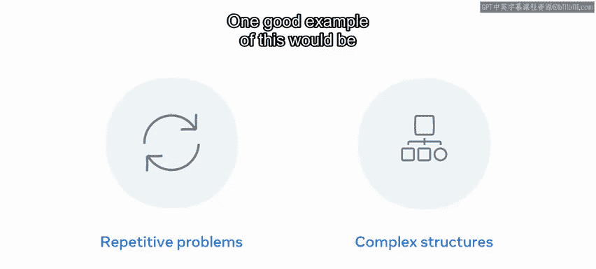

一个很好的例子是遍历文件系统。

那么，递归究竟是什么？

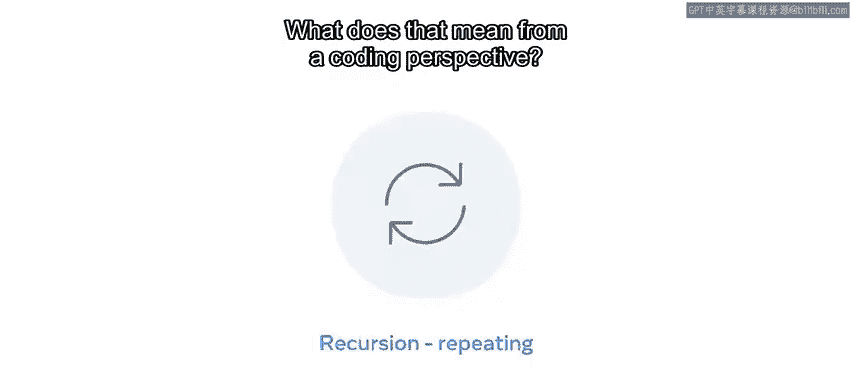

递归本质上是一个调用自身的函数。递归创建了一种模式，即函数自身一遍又一遍地重复执行。

从编码的角度来看，这意味着什么？

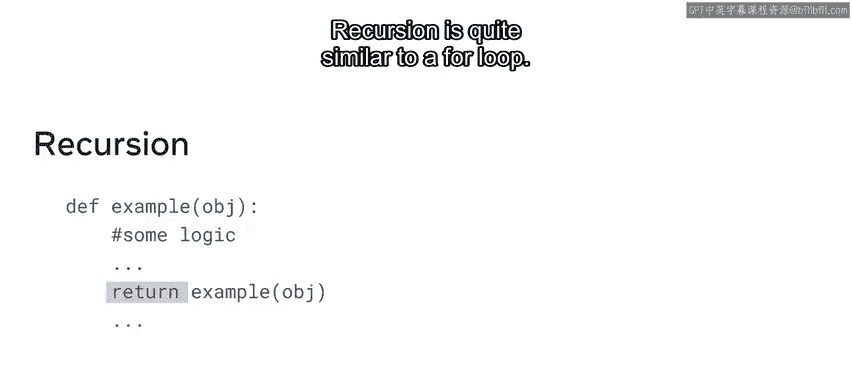

在这个例子中，一个函数接受一个参数，并且在函数内部，它包含一些逻辑来处理它试图解决的问题。

关键部分是返回语句。在代码中，返回语句返回的是同一个函数。

递归与 `for` 循环非常相似。

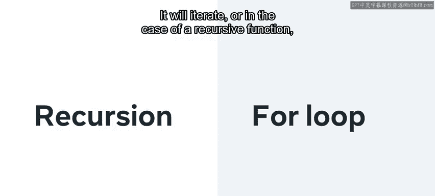

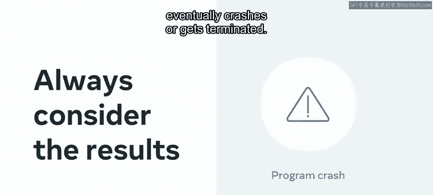

它会迭代，或者在递归函数的情况下，多次调用自身。

但请注意：当你创建一个递归函数时，必须始终考虑终止条件。如果不这样做，它将陷入无限循环，耗尽所有内存，直到程序最终崩溃或被终止。

## 循环与递归：计算阶乘 🧮

上一节我们介绍了递归的基本概念，本节中我们来看看如何用循环和递归两种方法来解决同一个问题——计算一个数的阶乘。

让我们从循环解决方案开始。

循环函数接受一个名为 `n` 的整数作为参数，首先检查该数是否小于零。如果是，则返回零，因为负数没有阶乘。

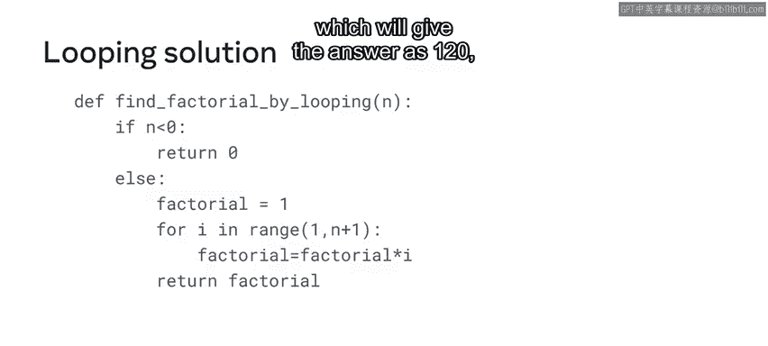

`else` 条件将 `factorial` 变量初始化为 1，然后循环遍历参数的范围（在本例中为 5）。循环将计算 `1 * 2 * 3 * 4 * 5`，得到答案 120，即 5 的阶乘。

现在，让我们探索同一问题的递归解决方案。

递归函数更简单、更紧凑。主要原因是您不再需要完整的循环来迭代参数 `n`。

函数的第一行验证数字是否为 1，如果是则返回 1。`else` 条件将参数 `n` 乘以调用 `find_factorial_recursive` 函数并传入 `n - 1` 的结果。

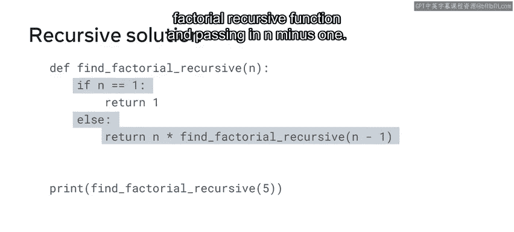

## 递归的执行过程 🔄

仅通过解释可能难以理解递归，让我们来演示函数调用自身时到底发生了什么。

函数被一遍又一遍地调用，每次变化的部分是传入函数的值。

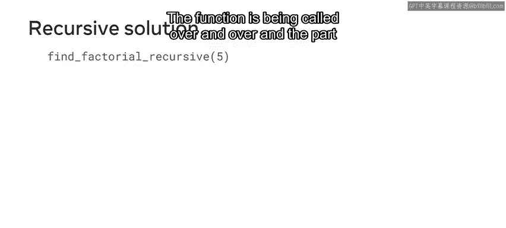

参数 `n`（本例中为 5）每次减少 1，直到最终变为 1。这阻止了函数再次被调用，并退出了递归过程。

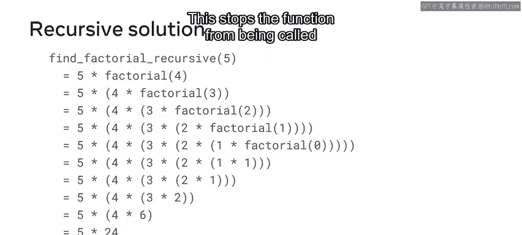

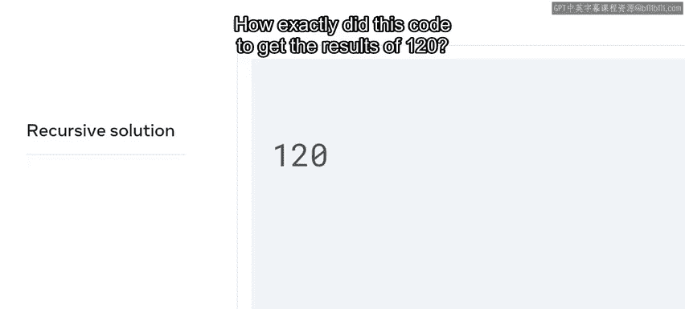

那么，这段代码究竟是如何得到结果 120 的呢？

这是由返回语句提供的。它保留了对递增值的引用，这是完成计算后的最终返回值。

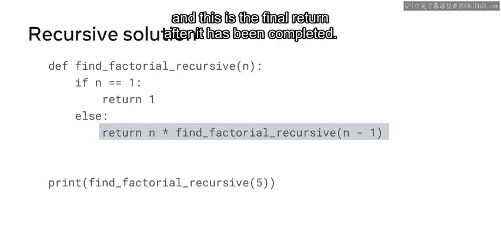

## 递归的优缺点 ⚖️

了解了递归的工作原理后，现在我们来回顾一下递归的优缺点。

以下是递归的主要优点：
*   递归代码可以使您的代码更整洁、更简洁。
*   复杂的任务可以分解为更易于阅读的子问题。
*   序列的生成可能比嵌套循环更容易理解。

但递归也存在缺点：
*   递归代码的逻辑可能更难跟踪。
*   在内存方面，递归开销大，有时效率低下。
*   递归代码也可能难以调试和逐步执行。

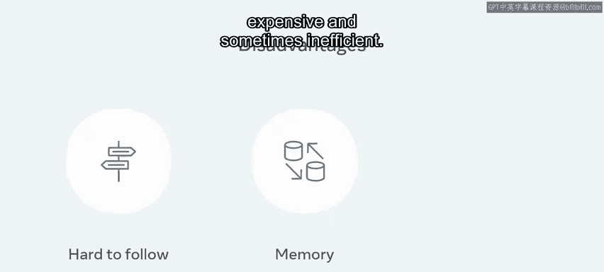

## 总结 📝

本节课中我们一起学习了递归。你现在应该能够解释什么是递归，以及如何用它来解决问题。

相信你将来会在代码中受益于递归的使用。