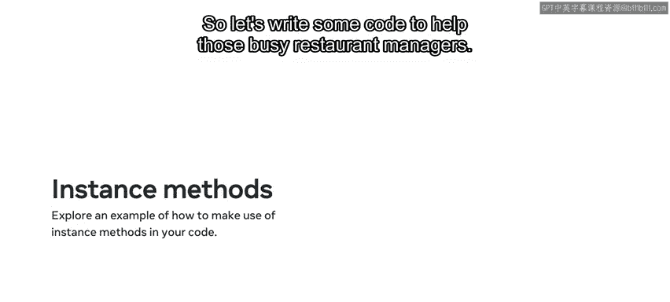
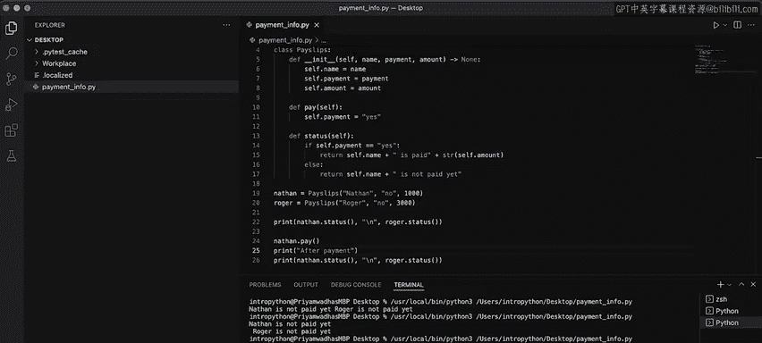
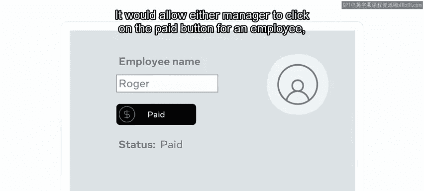

# 44：实例方法 🧑‍💻

在本节课中，我们将学习如何通过实例变量和实例方法，来管理对象的状态。我们将通过一个餐厅经理支付员工工资的实际问题，来演示这些概念的应用。

---

## 概述

在面向对象编程中，类定义了对象的蓝图。每个根据类创建的对象称为**实例**。实例拥有自己的数据（称为**实例变量**）和可以执行的操作（称为**实例方法**）。本节课我们将创建一个 `Paylips` 类，用于管理员工的支付状态，并学习如何使用实例方法来独立地更新每个员工对象的状态。

---

## 创建 Paylips 类



首先，我们创建一个名为 `paymentinfo.py` 的新文件。在这个文件中，我们将定义一个 `Paylips` 类。

```python
class Paylips:
    def __init__(self, name, payment, amount):
        self.name = name
        self.payment = payment
        self.amount = amount
```

在 `__init__` 方法中，我们初始化了三个实例变量：`name`（员工姓名）、`payment`（支付状态）和 `amount`（支付金额）。`self` 关键字代表实例本身，用于将参数值绑定到该实例的属性上。

---

## 定义实例方法

接下来，我们为 `Paylips` 类添加两个实例方法：一个用于支付，另一个用于检查状态。

```python
    def pay(self):
        self.payment = “yes”

    def status(self):
        if self.payment == “yes”:
            return self.name + “ is paid “ + str(self.amount)
        else:
            return self.name + “ is not paid yet”
```

*   `pay` 方法将实例的 `payment` 状态更新为 `“yes”`。
*   `status` 方法根据 `payment` 的状态，返回一个描述该员工支付状态的字符串。

---

## 创建实例并调用方法

现在，让我们创建两个员工实例，并检查他们的初始状态。

```python
nathan = Paylips(“Nathan”, “no”, 1000)
roger = Paylips(“Roger”, “no”, 3000)

print(nathan.status())
print(roger.status())
```

运行这段代码，输出会显示 Nathan 和 Roger 都尚未支付。为了让输出更清晰，我们可以在 `print` 语句中添加换行符 `\n`。

---

## 更新实例状态

假设经理决定支付 Nathan 的工资。我们可以调用 Nathan 实例的 `pay` 方法来更新他的状态。

```python
print(“After payment:”)
nathan.pay()
print(nathan.status())
print(roger.status())
```

再次运行代码，输出将显示 Nathan 的支付状态已更新为“已支付”，而 Roger 的状态保持不变。这证明了实例方法只影响调用它的那个特定实例。

---



## 核心概念详解

上一节我们通过代码演示了实例方法的作用，本节中我们来详细看看其背后的原理。

在编码示例中，Nathan 和 Roger 是两个独立的**实例对象**，各自拥有自己的**状态**（即实例变量的值）。当你调用 Nathan 的 `pay` 方法来改变他的状态时，Roger 完全不受影响。这是因为类中定义的方法并非直接影响所有实例，而是为每个实例提供了一套可以独立操作的蓝图。

在代码中，我们没有在调用 `pay` 函数后直接打印变量值，但如果这样做，你会看到 Nathan 的 `payment` 实例变量从 `“no”` 变成了 `“yes”`，而 Roger 的 `payment` 变量仍然是 `“no”`。

---

## 实际应用场景

现在，让我们想象这段代码是一个在线支付系统的基础。它将允许任何经理点击某个员工的“支付”按钮，然后仅更新该员工的支付状态。这样就消除了经理之间反复沟通确认的需要，实现了流程的自动化。

---



## 总结

本节课中，我们一起学习了**实例变量**和**实例方法**的核心概念。你学会了如何定义一个类，在其中初始化实例变量，并创建用于操作这些变量的实例方法。最重要的是，你理解了如何通过实例方法改变**单个实例对象的状态，而不会影响其他任何实例**。这为构建模块化、可独立管理对象的应用程序奠定了坚实基础。