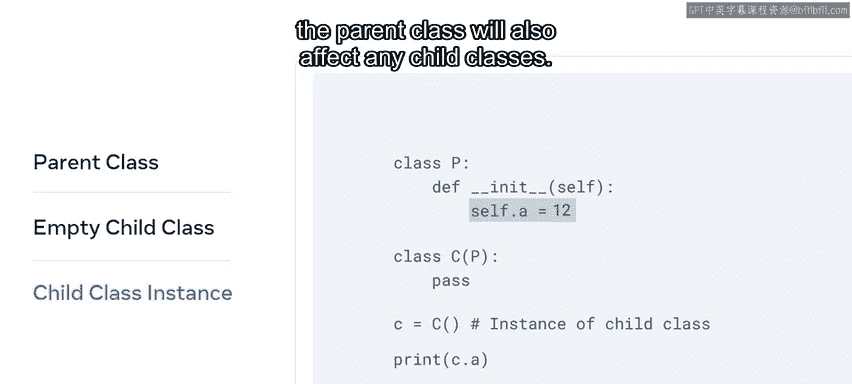
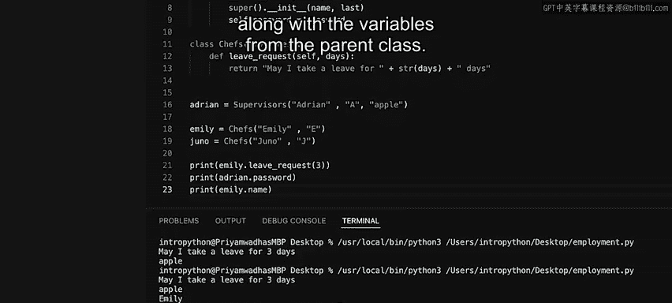

# Python 45：父类与子类 🧬

在本节课中，我们将要学习面向对象编程中的一个核心概念——继承。通过继承，我们可以创建一个新的类（子类），它能够复用现有类（父类）的属性和方法，并在此基础上进行扩展或修改，从而避免重复编写代码，使程序结构更加清晰和高效。

---

## 类的实例化与继承需求

当从一个类实例化对象时，你可能会发现这个类缺少一些你经常使用的属性。

在这种情况下，你可以决定创建一个新的类，它复制了第一个类的功能，但额外增加了一些属性。

如果从头开始重新编写所有内容会非常繁琐，但得益于继承机制，你无需这样做。

## 理解继承：父类与子类

上一节我们提到了创建新类的需求，本节中我们来看看继承是如何具体工作的。

继承是面向对象编程，特别是Python中的一个核心概念，它是代码可重用性的重要组成部分。你可能知道Python中的一切都是对象，现在让我们更深入地探讨这个观点。

这具体意味着Python中的每个类都继承自一个名为`object`的内置基类，它位于`builtins`模块中。换句话说，像`class SomeClass():`这样的类声明，实际上等同于`class SomeClass(object):`。

在讨论类派生时，起源的类被称为**父类**、**超类**或**基类**；继承自它的类被称为**子类**、**派生类**或**扩展类**。任何命名方式都是可以接受的，但重要的是要知道，子类**扩展**了其父类的属性和行为。这允许你做两件事：
1.  可以向子类添加新的属性。
2.  可以在子类中修改继承来的属性，而不会影响父类。

## Python中的继承示例

现在，让我们通过一个例子来探索在Python中如何实现继承。

这里有一个父类`P`，它包含一个值为`7`的变量`A`。

```python
class P:
    A = 7
```

然后是一个空的子类`C`，其中将父类`P`作为参数传入。

```python
class C(P):
    pass
```

最后，小写`c`代表子类`C`的一个实例。

```python
c = C()
```

如果你为`c.A`编写一个打印语句并运行代码，输出将是`7`。



```python
print(c.A)  # 输出：7
```

所以，即使`C`本身是空的，它仍然持有从`P`继承来的属性。

请记住，父类中的任何更改也会影响所有子类。

---

## 实践：员工管理系统示例

现在你已经了解了继承的基本工作原理，让我们通过一个更具体的例子来探索它提供的灵活性。

我将创建一个名为`employment.py`的新文件，第一步是创建一个名为`Employees`的父类，我将在其中为名和姓定义两个变量。

```python
class Employees:
    def __init__(self, name, last):
        self.name = name
        self.last = last
```

接下来，我将创建两个都扩展自`Employees`类的子类。

第一个子类是`Supervisors`。为了调用`Employees`类，我这样写：

```python
class Supervisors(Employees):
```

然后，我需要修改`Supervisors`类的`__init__`方法，以便添加另一个名为`password`的变量。通过调用`Employees`类，`super()`方法已自动应用，以访问父类的变量并在`Supervisors`类中初始化它们。

```python
class Supervisors(Employees):
    def __init__(self, name, last, password):
        super().__init__(name, last)
        self.password = password
```

现在，我将编写另一个名为`Chefs`的子类。

```python
class Chefs(Employees):
```

在这个类中，我想包含一个新的函数`leave_request`。

```python
class Chefs(Employees):
    def leave_request(self, days):
        return "May I take a leave for " + str(days) + " days?"
```

`leave_request`函数的目的是返回一个字符串，指明请求休假的天数。

## 创建实例并测试功能

现在所有类都已就位，我将从这些类中创建几个实例：一个用于主管，两个用于厨师。

首先，为主管创建一个实例：

```python
adrian = Supervisors("Adrian", "A", "apple")
```

然后，为厨师创建两个实例：

```python
emily = Chefs("Emily", "E")
juno = Chefs("Juno", "J")
```

接下来，让我们调用`emily`实例上的方法并传递一个值。她想请求三天的假期。

```python
print(emily.leave_request(3))
```

我还将添加另一个打印语句来检查主管`adrian`的实例变量`password`。

```python
print(adrian.password)
```

第三个打印语句输出`emily`的`name`变量值。

```python
print(emily.name)
```

现在运行代码，得到以下输出：
1.  第一个打印语句输出：`May I take a leave for 3 days?`
2.  第二个打印语句输出：`apple`
3.  第三个打印语句输出：`Emily`

请注意，各个继承类中的实例变量和方法，以及来自父类的变量，都同时存在并可用。

---



## 总结 🎯

本节课中我们一起学习了Python中的继承机制。你了解到继承如何通过创建子类来复用和扩展父类的功能，从而使代码更具可重用性、组织性，并减少冗余。我们通过定义父类`Employees`，以及继承它的子类`Supervisors`和`Chefs`，实践了属性的继承、方法的添加与重写，并最终实例化对象验证了继承的效果。掌握继承是构建复杂、模块化Python应用程序的关键一步。