# 47：方法解析顺序 🧬

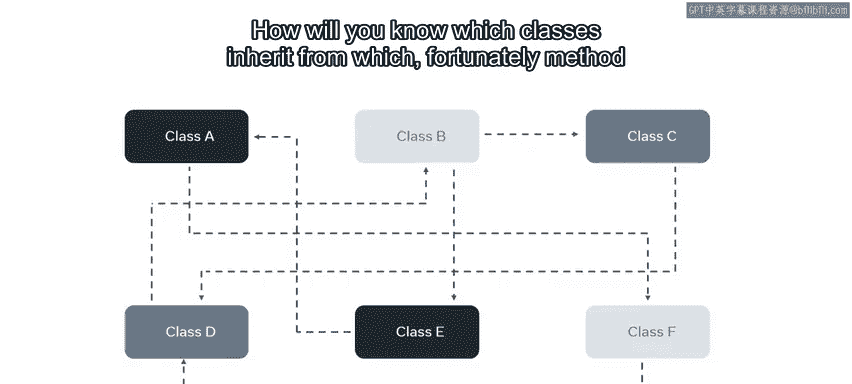

在本节课中，我们将要学习Python中一个重要的概念——方法解析顺序。当类之间的继承关系变得复杂时，MRO提供了一套规则来确定方法或属性的查找路径。我们将了解MRO的基本规则、代码线性化的概念，并学习如何在Python中使用相关函数。

## 继承的复杂性

到目前为止，你探索的类关系相对简单直接。但当情况变得复杂时，你将如何知道哪个类继承了哪个类？

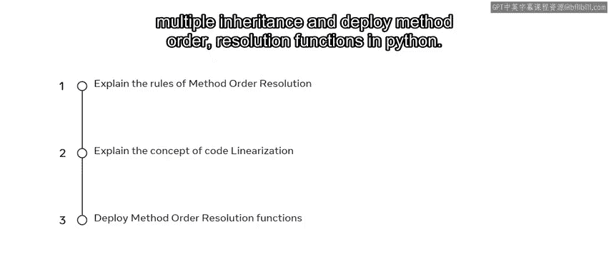

幸运的是，方法解析顺序提供了一些规则来帮助我们理清头绪。通过本视频的学习，你将能够解释方法解析顺序的基本规则及其如何应用于继承类，理解多重继承背景下的代码线性化概念，并在Python中运用方法解析顺序函数。

## Python中的继承类型

你可能已经遇到过一些单继承的例子，即一个子类只从一个父类继承。但了解Python有多种继承类型非常重要。

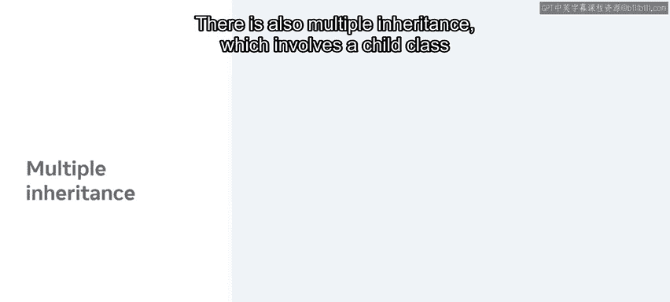

继承的分类类型基于父类和子类的数量以及层次结构。除了简单继承，广义上有四种继承类型。

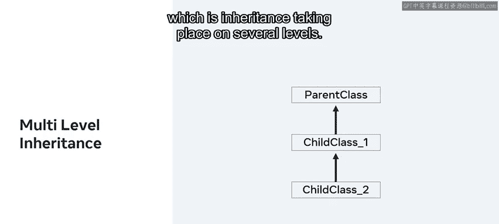

以下是主要的继承类型：

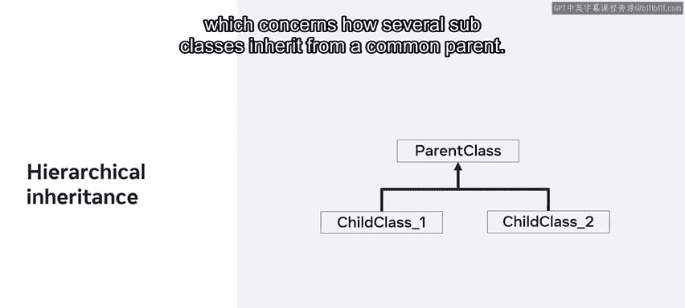

*   **简单继承**：这是你已经处理过的类型，一个子类继承自一个父类。
*   **多重继承**：涉及一个子类从多个父类继承。
*   **多级继承**：继承在多个层级上发生。
*   **层次继承**：涉及多个子类从一个共同的父类继承。

最后，可以说还有第五种类型，称为**混合继承**，它混合了其他类型的特性。

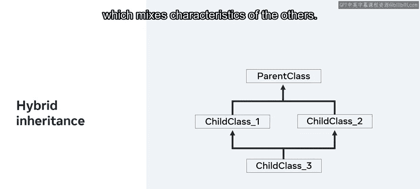

正如这些继承类型所示，随着项目中类的数量增长且相互依赖性增强，继承关系会变得越来越复杂。

## 什么是方法解析顺序

那么开发者如何解决这个问题呢？答案是使用方法解析顺序。

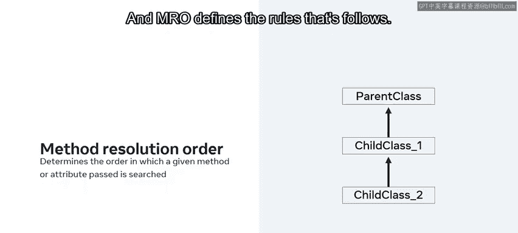

MRO决定了在类的层次结构中搜索给定方法或属性以进行解析（或者说，确定其归属）时所遵循的顺序。这个解析顺序被称为类的线性化，而MRO定义了它所遵循的规则。

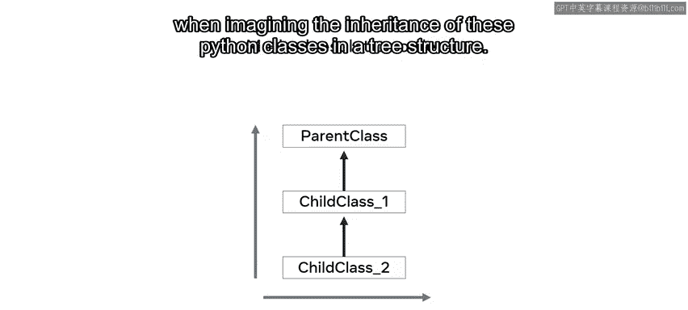

在想象这些Python类的继承树状结构时，Python中的默认顺序是**自底向上**和**从左到右**。

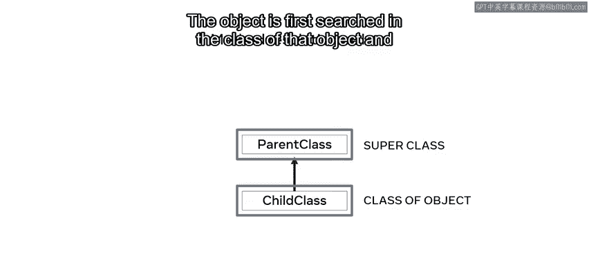

## MRO规则示例

让我们以最简单的单继承为例。对象首先在它自己的类中搜索，然后在它的超类中搜索。

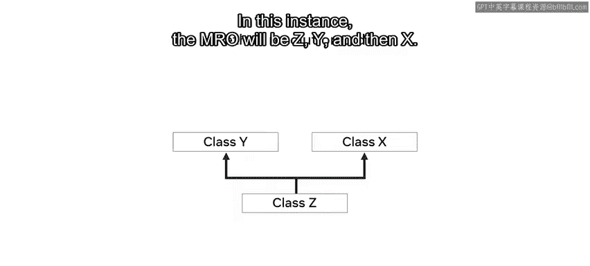

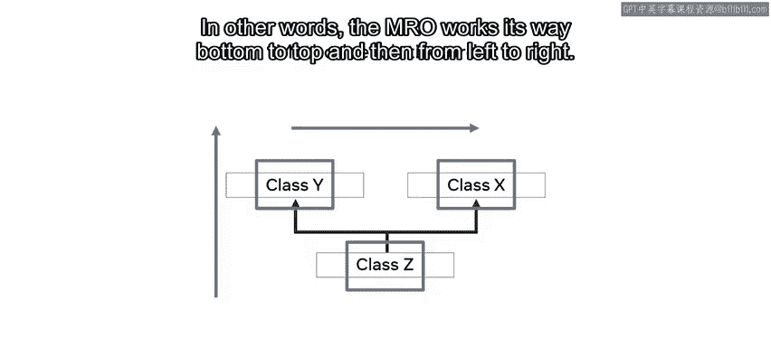

那么在一个类Z继承自两个类的例子中呢？假设Z继承自类X和Y。在这种情况下，MRO将是Z、Y，然后是X。换句话说，MRO的查找路径是自底向上，然后从左到右。

但是当层次结构中添加更多层级时，情况会变得复杂得多，因此开发者依赖算法来构建MRO。

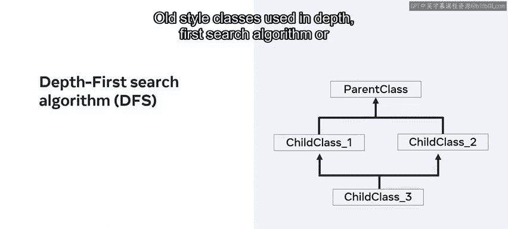

## MRO算法

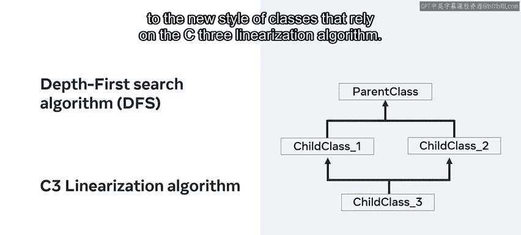

旧式类使用**深度优先搜索算法**。

从Python 3版本开始，Python转向了依赖**C3线性化算法**的新式类。

C3线性化算法的实现很复杂，超出了本课的范围，但现在可以概述它遵循的几个规则。

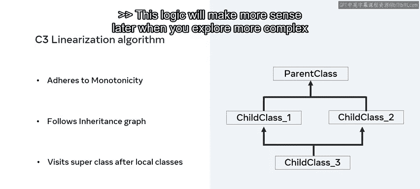

该算法遵循**单调性**，广义上意味着继承的属性不能跳过直接的父类。

它还遵循类的继承图，并且只有在访问了本地类的方法之后才会访问超类的方法。当你将来探索更复杂的类关系时，这个逻辑会更有意义。

## 在Python中查看MRO

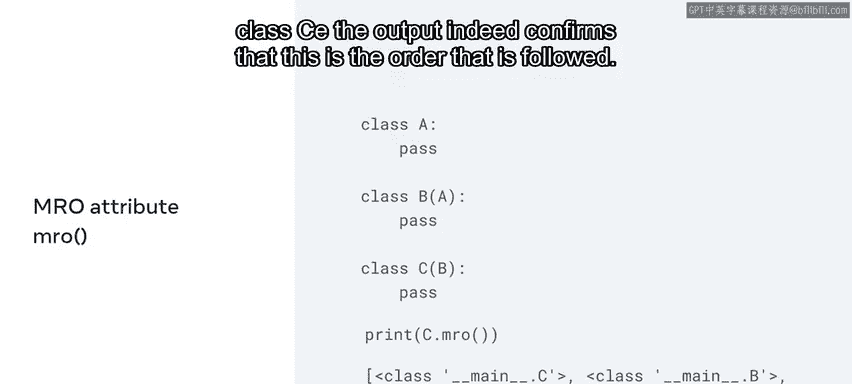

接下来，让我们花点时间探索一些查找类MRO的方法。首先，我将演示`mro`属性或函数。

让我们看一个由三个类组成的多级继承示例：类A、类B和类C。类A是父类，B和C是各自的子类。换句话说，B继承自A，C继承自B。当我打印对类C调用`mro`函数的返回结果时，输出确实证实了遵循的顺序。

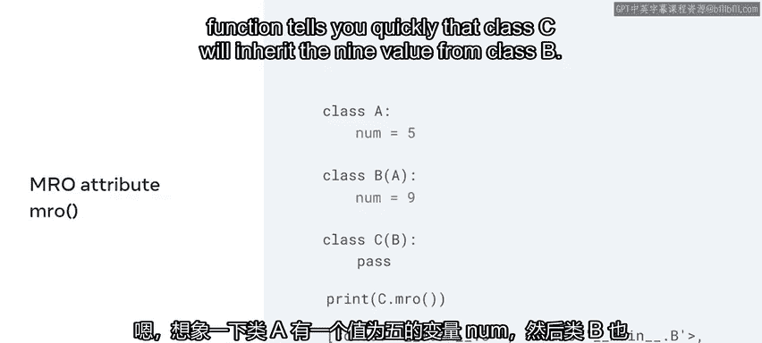

那么为什么这很重要呢？想象一下，类A有一个值为5的变量`num`。然后类B也有一个值为9的`num`变量。这里的`mro`函数可以快速告诉你，类C将从类B继承值9。

最后，让我们再检查一个函数，即`help`函数。如果我使用之前的代码，并将打印语句中的`mro`函数替换为`help`函数，它会提供一个更详细的输出，顶部包含MRO信息。

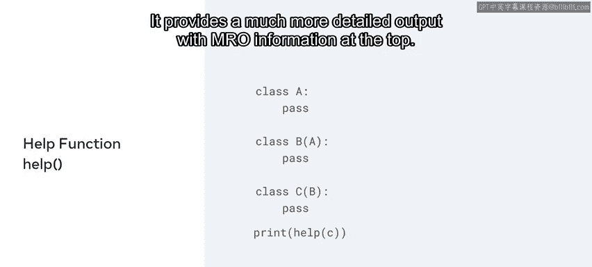

它还包含有关代码内部使用的数据描述符和类型的信息。

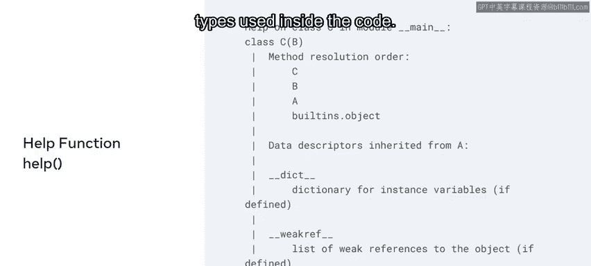

## 总结

本节课中，我们一起学习了方法解析顺序的简要介绍，以及它如何在不同场景下影响继承。这些都是非常广泛的主题，但希望它能帮助你理解Python中可能存在的代码复杂性。