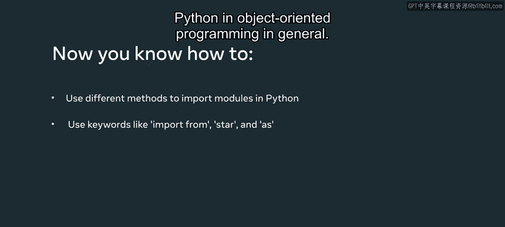

# Python 52：编写导入语句

## 概述

在本节课中，我们将学习如何在Python中使用`import`语句导入模块。我们将探讨多种导入方法，包括导入整个模块、导入特定函数、使用别名以及导入模块中的所有内容。掌握这些技巧能帮助你更高效地组织代码，并利用Python强大的模块化特性。

---

## 导入整个模块

首先，我们来看如何导入一个完整的模块。我已经创建了一个名为`import_pi.py`的文件。现在，我将通过输入`import math`来导入Python内置的`math`模块。

为了确保代码正常运行，我使用一个`print`语句。输入`print("正在导入math模块")`。运行代码后，`print`语句成功执行。

你遇到的大多数模块，尤其是内置模块，通常不会有任何`print`语句，它们只会被解释器静默加载。

现在我已经导入了`math`模块，接下来我想使用其中的一个函数。我们选择平方根函数`sqrt`。为此，我输入`math.sqrt`。

当我输入`math.`后，会出现一个下拉菜单，列出所有可用的函数，你可以从中选择`sqrt`。我将数字`9`作为参数传递给`math.sqrt`函数，将结果赋值给一个名为`root`的变量，然后打印它。

终端输出了数字`3`，即`9`的平方根，这是正确答案。

## 导入特定函数

与上面导入整个`math`模块不同，有一种更好的方法：直接将所需函数导入到项目的作用域中。这样可以避免因导入整个模块而使解释器过载。

为此，我输入`from math import sqrt`。运行后，它显示了一个错误。

现在，我从变量声明中移除`math.`前缀，再次运行代码。这次，它成功运行了。

## 使用别名

接下来，我们讨论一种称为“别名”的导入方式，这是导入不同模块的绝佳方法。这里，我为`math`模块分配一个别名`m`。我通过输入`import math as m`来实现。

然后，我输入`cosine = m.cos`。接着，我从函数列表中选择`cos`，并在括号内添加数字`0`。在下一行，我将打印`cosine`，然后运行代码。

结果是`0`的余弦值，即`1`。这之所以可行，是因为我使用了别名`m`。如果我尝试写`math.cos`，它将无法工作，因为现在`math`模块被识别为`m`。

让我从屏幕上移除这段代码，并在继续之前清空终端。

别名也可以用于导入的函数。例如，我可以输入`from math import factorial as f`来为`factorial`函数设置别名。

现在，我将`f(10)`赋值给一个名为`factorial_10`的变量。我将打印这个变量，看看它是否有效。运行代码后，我们看到它运行良好。

以这种方式使用别名可以减少每次输入`factorial`的工作量。

## 导入多个函数

移除别名后，我可以从一个给定的模块中导入任意多个函数。我将导入`log`和`sqrt`。

我使用`log`函数创建一个变量来求`log10(50)`的值。我通过输入`x = log(10, 50)`来实现。同样，我在下一行打印这个变量。点击运行后，我将查看它是否有效。

再次，它运行良好。

## 导入模块中的所有内容

那么，如果我想导入给定模块中的所有函数呢？我可以移除之前添加的函数，并用一个星号`*`替换它们。

这基本上等同于从`math`模块中导入所有内容。当我再次运行代码时，让我们看看它是否有效。它确实有效。

然而，在某些情况下，使用星号`*`并不是最佳做法。例如，这是一个小文件，我知道`log10`函数存在于`math`模块中。但是，当你处理大型代码库时，可能很难追踪`log10`函数来自哪里。此外，当你导入其他模块时，可能会造成混淆。

## 导入变量和类

导入包与在Python中导入模块非常相似。就像你可以导入函数一样，你也可以从给定模块中导入变量和类。

现在，我将星号`*`替换为一个名为`some_variable`的变量，它可能存在于给定的模块中。让我再次尝试运行代码。

由于`math`模块没有这样的变量，当我打印它时会抛出错误。解释器无法从`math`中导入`some_variable`。

---

## 总结

在本视频中，我们探索了在Python中使用`import`、`from`、`*`和`as`等关键字导入模块的不同方法。这使你能够在面向对象编程中充分利用Python的模块化结构。