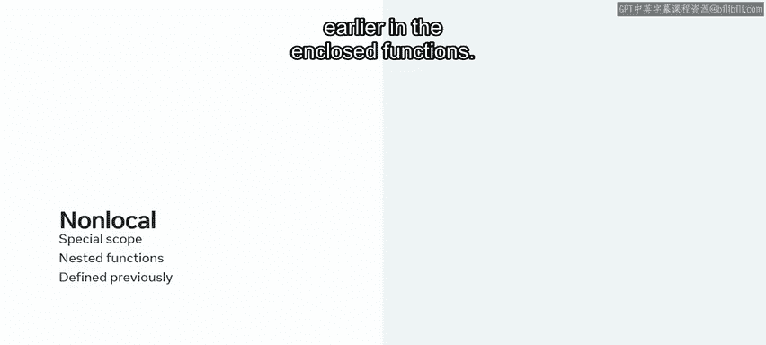
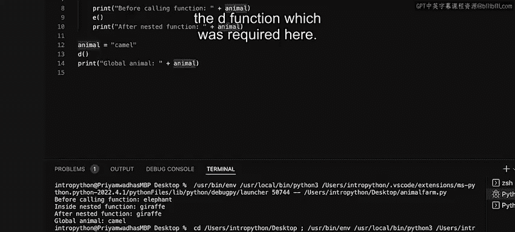

# Python 53：命名空间和作用域 🐍

在本节课中，我们将要学习Python中两个紧密相关的核心概念：**命名空间**和**作用域**。理解它们对于编写结构清晰、易于维护的代码至关重要。

---

## 命名空间与作用域概述

现在，你应该对模块的工作原理相当熟悉了。让我们来看看Python中另一个相关的概念：命名空间和作用域。

Python官方文档将**命名空间**定义为从名称到对象的映射。而**作用域**是Python程序中可以直接访问该命名空间的文本区域。此时，具有键值对的字典是映射名称和对象的理想数据结构。

你也已经学习了每个Python文件都可以是一个模块。你可以将同一个模块视为Python创建模块对象的地方。一个模块对象包含了在其中定义的不同属性的名称。通过这种方式，模块就是一种命名空间。

---

## 理解作用域类型

命名空间和作用域可能很快变得非常令人困惑，因此尽可能多地练习作用域以确保代码质量的标准非常重要。

Python中可以定义四种主要的作用域类型：
*   **局部作用域**
*   **闭包作用域**
*   **全局作用域**
*   **内置作用域**

尝试确定某个变量属于哪个作用域的做法被称为**作用域解析**。作用域解析遵循通常所说的**LEGB规则**。

让我们来逐一探索这些作用域：

*   **局部作用域**：这是首先搜索变量的地方，位于函数内部。
*   **闭包作用域**：定义在封闭或嵌套函数内部的作用域。
*   **全局作用域**：定义在最顶层，或者简单说就是在任何函数之外。
*   **内置作用域**：这是内置模块中存在的关键字。

简单来说，在函数内部声明的变量是**局部**的，而在任何函数作用域之外的变量通常是**全局**的。

---

## 作用域解析示例

上一节我们介绍了作用域的类型，本节中我们通过一个例子来看看它们的具体表现。

以下是一个示例，屏幕上的代码输出了相同变量名 `Greek` 在不同作用域中的情况。

```python
alpha = "global_alpha"

def function_B():
    beta = "local_beta"
    print(f"Inside B, id(beta): {id(beta)}")

    def function_C():
        gamma = "nested_gamma"
        print(f"Inside C, id(gamma): {id(gamma)}")

    function_C()
    print(f"After C, id(beta): {id(beta)}")

print(f"Global, id(alpha): {id(alpha)}")
function_B()
print(f"After all, id(alpha): {id(alpha)}")
```

变量有三种可能的声明位置：在全局级别、在函数B内部、或在从B内部调用的嵌套函数C内部。

`id()` 函数在打印语句中被使用，它返回对象的身份标识。你可以从输出中观察到以下几点：
1.  全局变量 `alpha` 的ID在代码完全执行后保持不变。
2.  函数B内部的局部变量 `beta` 的ID在嵌套函数C执行前后保持不变。
3.  `gamma` 的ID仅在嵌套函数的作用域内被分配。
4.  所有三个变量的ID都不同，即使它们拥有相同的变量名。

---

## 变量声明与作用域默认值

Python中的变量在你定义它们时被隐式声明。这意味着，与其他编程语言不同，Python中没有特殊的声明来指定变量的数据类型。

这也意味着，除非另有说明，否则给定的变量在声明时是**局部**的，而非全局的。😡

这与大多数其他编程语言形成对比，在那些语言中变量默认是全局的。因此，当变量在全局空间声明时，它对该空间来说也是局部的。

这可以通过一个简单的例子来理解：

```python
country = "GlobalCountry"

def my_function():
    country = "LocalCountry"
    print("Locals:", locals())
    print("Globals in function:", globals().get('country'))

print("Globals in main:", globals().get('country'))
my_function()
```

如果你查看这两个字典的内容，可以看到键 `country` 的值在两种情况下是不同的。你还使用了两个特殊的内置函数 `locals()` 和 `globals()` 来列出这两个作用域内字典的内容。

在这个例子中，你可以看到声明的全局变量保持不变。

---

## 全局变量的使用与注意事项

虽然全局变量是可以接受的，但由于多种原因，不鼓励使用它们。

当你处理生产代码时，项目结构可能变得复杂，使用全局变量可能难以诊断问题，从而导致所谓的“意大利面条式代码”。其他范式，如访问修饰符、并发和内存分配，使用局部变量能更好地处理。

当你刚开始使用Python时，将良好实践集成到你的代码中总是一个好主意。

有两个关键字可以用来改变变量的作用域：`global` 和 `nonlocal`。

*   `global` 关键字帮助我们从函数内部访问全局变量。
*   `nonlocal` 是Python中定义的一种特殊作用域类型，仅用于嵌套函数中，条件是它已在封闭函数中提前定义。



---

## 实践：理解作用域解析

现在，你可以编写一段代码，以更好地帮助你理解属性的作用域概念。

你已经创建了一个名为 `Animfarm.py` 的文件。你将在其中定义一个名为 `D` 的函数，并在其中创建另一个嵌套函数 `E`。

以下是完整的代码：

```python
animal = "camel" # 全局变量

def function_D():
    animal = "elephant" # 闭包作用域变量 (对E而言是非局部的)

    def function_E():
        nonlocal animal # 声明使用外层（非全局）的animal变量
        animal = "giraffe"
        print("Inside nested function E, animal is:", animal)

    print("Before calling E, animal is:", animal)
    function_E()
    print("After calling E, animal is:", animal)

print("Global animal is:", animal)
function_D()
print("Global animal after D is:", animal)
```

让我们来编写其余部分的代码。你可以从定义几个都叫 `animal` 的变量开始，第一个在函数D内部，第二个在函数E内部。请注意，你必须首先在E函数内部将变量声明为 `nonlocal`。

你现在将添加更多的打印语句以在查看输出时进行澄清。最后，你在这里调用了E函数，并且你可以在D函数之外再添加一个变量 `animal`。这将是一个全局变量。你可以添加对D函数的调用和一个针对全局变量的打印语句。

保存此文件并运行代码。

执行流程如下：
1.  首先，全局 `animal` 变量被赋值为 `"camel"`。
2.  然后调用 `function_D`，一旦进入其中，将 `"elephant"` 赋给局部（对E而言是非局部）的 `animal`。
3.  接着声明内部函数E，并通过打印“调用E函数前”的 `animal` 值来继续，此时 `animal` 的值是局部值 `"elephant"`。
4.  一旦进入内部函数E，你使用 `nonlocal` 关键字声明你将使用 `animal` 变量，并将其值改为 `"giraffe"`。在这里，你可以看到打印语句将输出“在嵌套函数E内部，animal是：giraffe”。
5.  这个值在你退出内部函数后仍然保持一致。所以当你打印“调用E函数后”时，值仍然是 `"giraffe"`。
6.  函数完全执行后，退出到全局空间，可以看到全局 `animal` 的值将是开始时赋值的 `"camel"`。

因此，你可以看到在内部所做的更改不会影响全局变量的值。

---

## 最后一点：`nonlocal` 的必要条件

让我们看最后一点：如果你将函数D中的局部 `animal` 变量声明注释掉，这将抛出一个错误。

```python
def function_D():
    # animal = "elephant" # 将此行注释掉
    def function_E():
        nonlocal animal # 错误！
        animal = "giraffe"
```

你可以看到错误信息指出，在D函数内部没有所需的非局部 `animal` 绑定存在。这说明了 `nonlocal` 关键字要求变量必须在**直接外层作用域**（即闭包作用域）中已定义。

---

## 总结



本节课中，我们一起学习了Python中**命名空间**（名称到对象的映射）和**作用域**（可访问命名空间的代码区域）的核心概念。我们深入探讨了四种作用域（LEGB：局部、闭包、全局、内置）及其解析规则，并通过实例观察了变量在不同作用域中的行为。我们了解了Python变量隐式声明、默认为局部作用域的特点，以及使用 `global` 和 `nonlocal` 关键字来修改作用域的方法。最后，我们强调了谨慎使用全局变量，并实践了如何通过代码来理解和验证作用域的工作原理，为编写结构清晰的代码打下了基础。