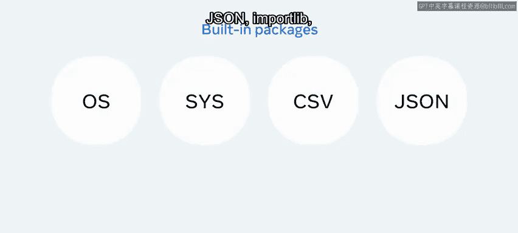
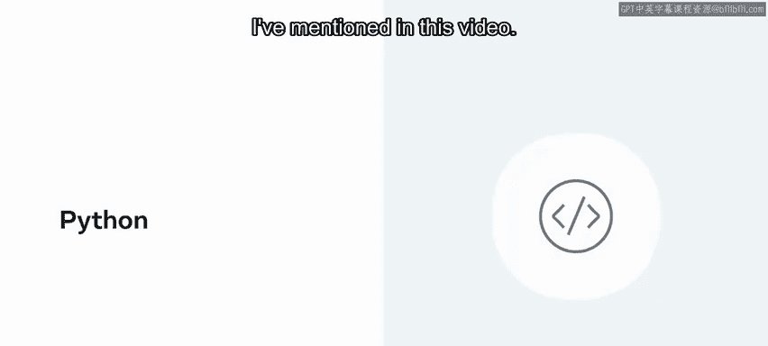

# ython流行包介绍 🐍

在本节课中，我们将学习Python中“包”的概念，并了解一些在数据科学、人工智能和Web开发等领域最流行和实用的包。理解这些工具是成为一名高效Python开发者的关键一步。

## 什么是Python包？ 📦

包是Python中服务于特定目的的模块集合。你可以将其想象成一个传统的图书馆，每个包就是一本特定的书或杂志，而这个“图书馆”每天都在变得更大。

在编程中，一个包就是一个目录或文件夹，而模块则是其中的文件或文档。你使用`import`语句导入包，方式与导入模块相同。但需要注意的是，除非正确定义，否则导入语句本身没有意义。

## 如何导入和使用包？

导入包的方式与模块类似，但有时需要更具体的格式。例如，假设你想导入一个名为`F`的包，仅使用`import F`可能无法达到目的。通常需要指定从包中导入哪个具体的模块，格式如下：
```python
from F import A
```
其中，`F`是包名，`A`是包含你所需函数的模块名。探索包的目录结构或参考在线代码示例可以节省大量时间。

## Python包管理器与仓库

要使用Python包，了解包管理工具至关重要。**Pip**是Python默认的包管理器。而**Python Package Index (PyPI)** 是官方的软件仓库，你可以在这里查找和发布开源包。

## Python的主要应用领域与包分类

Python拥有庞大的包生态系统。对于初学者开发者来说，这可能令人望而生畏。因此，了解Python当今最主要的应用领域很有帮助。这些领域包括：
*   数据科学
*   人工智能与机器学习
*   Web框架
*   应用程序开发
*   自动化与硬件接口

基于这些领域，我们可以将包大致分为几类：内置包、数据科学包、机器学习与AI包，以及Web和GUI开发包。接下来，让我们逐一简要探索。

## 内置包 🧰

内置包是那些无需单独安装，在安装Python后即可立即使用的包。几乎每个项目都会用到它们中的一个或多个，因此值得深入了解。

以下是最受欢迎的一些内置包：
*   **OS**：用于与操作系统交互。
*   **CSV**：用于读写CSV格式文件。
*   **JSON**：用于处理JSON数据。
*   **Importlib**：用于动态导入模块。
*   **Re**：用于正则表达式操作。
*   **Math**：提供数学函数。
*   **Itertools**：用于创建高效迭代器的函数。

## 数据科学包 📊

在数据科学领域，Python拥有极其强大的工具集。

以下是该领域最核心和流行的包：
*   **NumPy**：提供高性能的多维数组对象及计算工具。
*   **SciPy**：建立在NumPy之上，用于科学计算和技术计算。
*   **NLTK**：自然语言工具包，用于文本处理和分析。
*   **Pandas**：提供高性能、易用的数据结构和数据分析工具。



这些包主要用于数据探索和操作。此外，还有其他一些重要的包：
*   **OpenCV**：用于图像处理和计算机视觉。
*   **Matplotlib**：一个广泛使用的数据可视化库，用于创建静态、交互式和动画图表。


## 机器学习与人工智能包 🤖

在机器学习（ML）和人工智能（AI）领域，Python同样占据主导地位。

以下是当前最流行的包：
*   **TensorFlow**：由Google开发的开源机器学习框架。
*   **PyTorch**：由Facebook开发，以其动态计算图和易用性在研究中非常流行。
*   **Keras**：一个高级神经网络API，能够运行在TensorFlow、Theano等后端之上。PyTorch和Keras是目前实现深度学习和神经网络最流行的选择。

此外，还有其他一些优秀的包，例如**SciPy**、**Scikit-learn**（一个简单高效的数据挖掘和数据分析工具）和**Theano**。选择使用哪个包取决于项目的规模和范围，以及你对特定包的熟悉程度。

## Web开发包 🌐

如今，Python主要用于机器学习、人工智能和Web开发。

在Web开发领域，最流行的包是：
*   **Flask**：一个轻量级的微框架，灵活且易于上手。
*   **Django**：一个功能全面的全栈框架，内置了许多开箱即用的功能。

其他流行的Web开发包还包括**CherryPy**、**Pyramid**、**Beautiful Soup**（用于网页抓取）和**Selenium**（用于Web自动化测试）。

## 其他领域的包

除了上述领域，Python在机器人、游戏开发等专业领域也有相应的包。无论你想从事哪个领域，几乎都能找到相关的Python包。虽然可能没有一个包能完美契合你当前的项目，但Python的开源开发者社区正在不懈努力填补这些空白。

对于Python初学者来说，你所需的大部分功能通常都能通过某一个包得到满足。

## 总结与下一步

本节课中，我们一起学习了Python包的核心概念。我们介绍了什么是包、如何导入包，并分类探讨了内置包以及当今在数据科学、机器学习、人工智能和Web开发中最流行的一些包。



为了继续扩展你对Python包的了解，建议你想一个希望创建的项目，并尝试使用本视频中提到的这些包进行实践。动手实践是掌握它们的最佳途径。