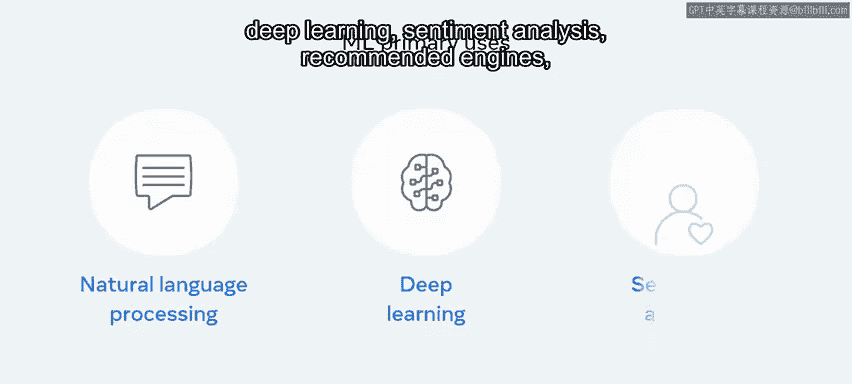
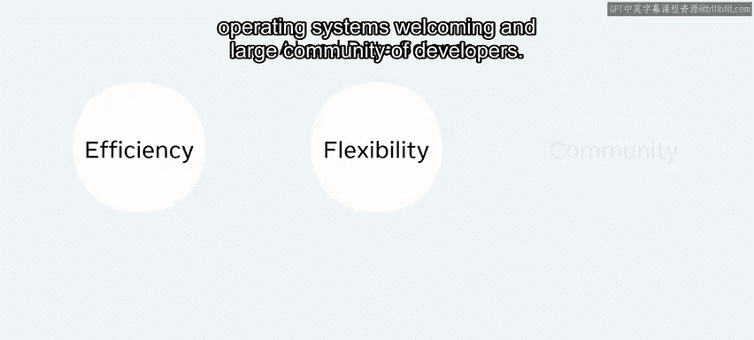
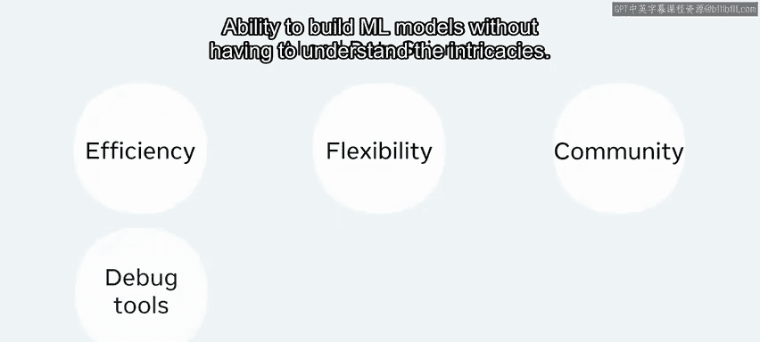
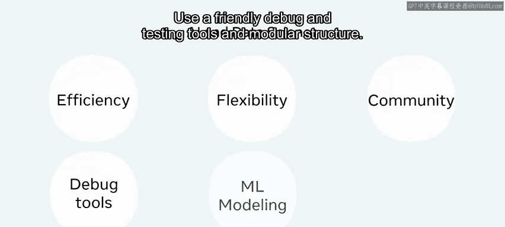
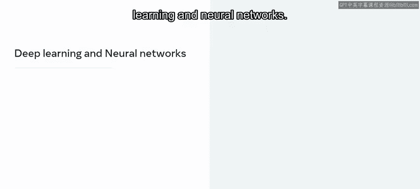
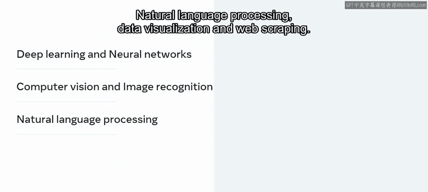
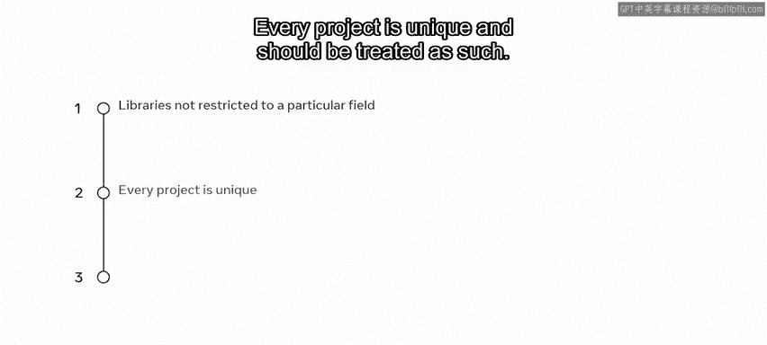
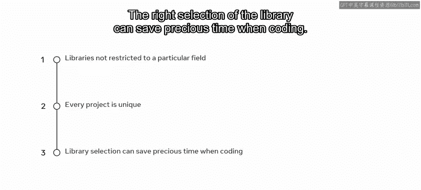

# Python 57：机器学习、深度学习与AI核心概念及Python库 🧠

在本节课中，我们将学习人工智能、数据科学和机器学习的基本概念，并了解Python在这些领域中的核心地位及其流行的开源库。

人工智能（AI）的广义目标是让机器像人类一样思考。数据科学主要关注数据的管理与探索，其数据可能包含文本、音频、图像和视频等多种媒体形式。机器学习（ML）是人工智能的一个分支，专注于通过算法从数据中训练模型并获取洞见。

上一节我们介绍了AI、数据科学和ML的基本定义，本节中我们来看看机器学习在哪些具体领域得到了广泛应用。

以下是机器学习被广泛应用的几个主要领域：
*   自然语言处理
*   深度学习
*   情感分析
*   推荐引擎
*   计算机视觉
*   语音识别

如今，随着文本、图像和视频数据量的激增，数据科学，尤其是人工智能，正面临着前所未有的巨大需求。

为了应对这些需求，开发者需要高效的工具。Python是这些领域中最受欢迎的语言之一。

以下是Python在这些领域如此流行的几个关键原因：
*   **语法高效且可读性强**：代码简洁易懂。
*   **跨语言、框架和操作系统的灵活性**：易于与其他技术栈集成。
*   **庞大且友好的开发者社区**：有丰富的学习资源和问题解答支持。
*   **无需深入理解底层原理即可构建ML模型**：得益于高级库的封装。
*   **用户友好的调试与测试工具，以及模块化结构**：便于开发和维护。

这些优势共同促进了大量（主要是开源的）库和框架的蓬勃发展。理解“包”、“库”和“框架”这几个术语的区别很重要。一个**包**是模块的集合。**库**和**框架**这两个词常与“包”互换使用。库也可以是为特定目的而设计的包的集合，而**框架**一词通常用于涉及特定流程或架构的场景。

所有这些都是通过Python的`import`语句来使用的代码片段。

目前，一些最流行的机器学习库集中在以下几个领域：深度学习与神经网络、计算机视觉与图像识别、自然语言处理、数据可视化以及网络爬虫。需要理解的是，这些是宽泛的分类，大多数相关库的功能并不局限于某个特定领域。

每个项目都是独特的，应具体问题具体分析。在编码时，选择合适的库可以节省宝贵的时间。

本节课中我们一起学习了机器学习库的相关知识。许多领域都使用机器学习，而像深度学习和神经网络这样的领域，依赖于使开发者工作更轻松的开源机器学习库。这些库是包的集合，选择合适的库可以在编码时为你节省时间。因此，在未来项目中，请仔细思考应选择哪个库，以确保它符合你的需求。