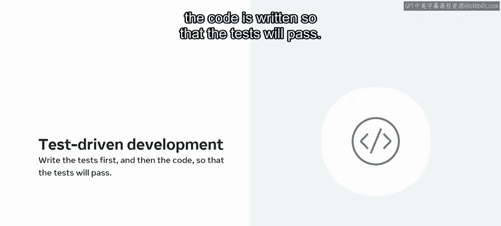
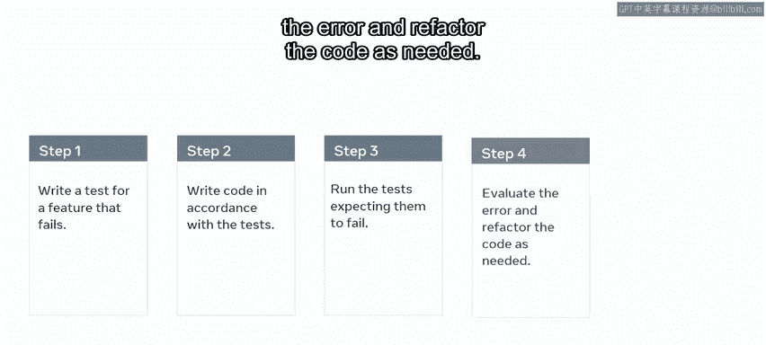
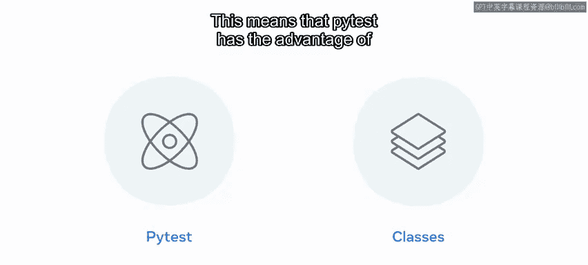
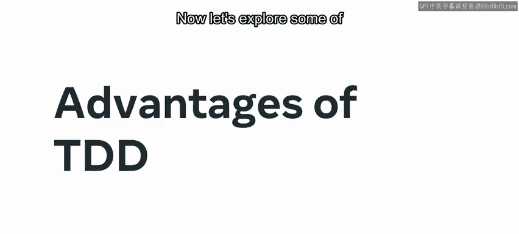
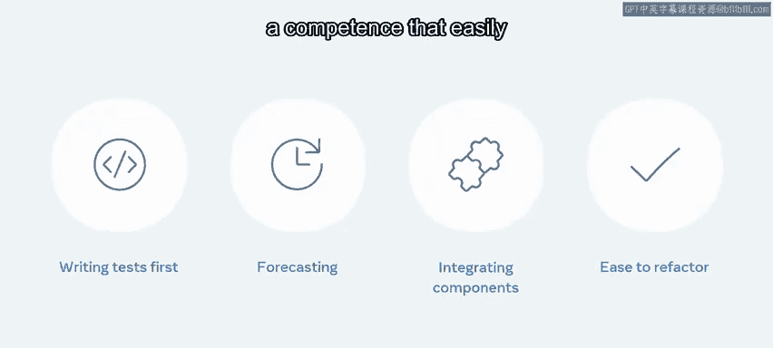
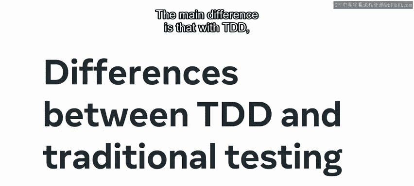
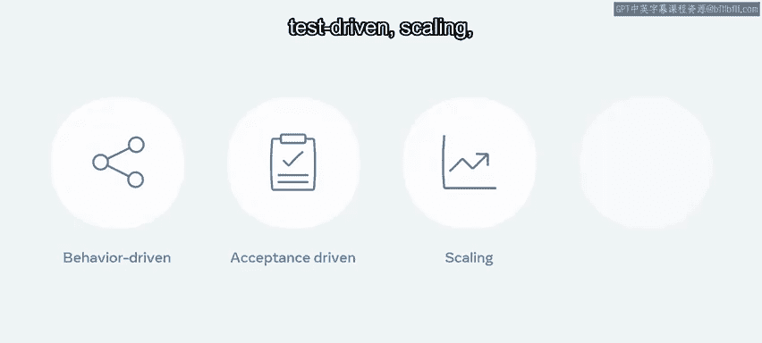

# 63：测试驱动开发TDD 🧪

在本节课中，我们将要学习测试驱动开发（TDD）的基本概念、标准流程、优势以及它与传统测试的区别。TDD是一种先编写测试用例，再编写功能代码的开发实践，旨在提高代码质量和开发效率。

## 概述

测试在软件开发生命周期中是一个相对较晚出现的环节，但其重要性正与日俱增。软件开发通常时间紧迫，开发者常常在代码编写完成后才将测试挤入剩余时间。这导致没有足够的时间进行充分测试，可能使软件包含需要长期处理的缺陷。测试驱动开发（TDD）是一种替代性的编程实践，它要求先编写测试，再编写能使测试通过的代码。这与先编写代码再逐步测试应用程序的传统做法不同。



## TDD的标准流程 🔄

上一节我们介绍了TDD的基本理念，本节中我们来看看它的具体实施流程。TDD遵循一种迭代方法，从编写测试用例开始。初始工作需要团队进行功能和测试规划，具体步骤略有变化。以下是TDD的标准步骤：

1.  **编写一个会失败的测试**：为一个新功能编写测试，此时由于功能尚未实现，测试预期会失败。
2.  **编写最少量的代码**：编写恰好能使上一步测试通过的代码，不追求完美或完整。
3.  **运行测试并观察失败**：运行测试，确认它如预期般失败（这验证了测试的有效性）。
4.  **评估错误并重构代码**：分析测试失败的原因，并根据需要重构或完善代码。
5.  **重新运行整个过程**：运行测试，确保其通过，然后为下一个功能或改进重复此循环。



这个过程也被称为 **“红-绿-重构”循环**。“红”代表失败的测试，“绿”代表重构后通过的测试。遵循此循环的核心目的是让测试失败，然后重写代码直到测试通过。当一个功能的所有测试都显示为“绿色”且无需再次运行时，该功能即告完成。

## 自动化测试工具 🛠️

当自动化成为优先事项时，你可以使用如 `pytest` 这样的包或库。`pytest` 只需要编写函数，而 `unittest` 则需要编写类。这意味着 `pytest` 具有更简单的优势，因为它需要的工作量更少。



```python
# 使用 pytest 编写一个简单测试示例
def test_addition():
    assert 1 + 1 == 2
```



## TDD的优势 ✨

了解了流程和工具后，我们来看看采用TDD能带来哪些好处。

*   **全面的测试覆盖**：先编写测试并根据测试重构代码，能确保测试充分覆盖代码。
*   **明确的设计导向**：你可以带着特定的功能和预期结果来编写测试。这种前瞻性需求从一开始就提供了清晰度。
*   **更好的组件集成**：这种前瞻性在集成不同组件时也发挥作用，你可以根据已有组件来添加新功能和接口。
*   **增强的重构信心**：在代码上进行循环工作使开发者有信心轻松地进行额外的更改和重构。



总的来说，**代码更精简、早期修复缺陷、代码可扩展性以及最终调试的便利性**，是TDD越来越被接受的主要原因。

## TDD与传统测试的区别 ⚖️



最后，让我们简要探讨一下TDD与传统测试的一些区别。主要区别在于，TDD从一开始就突出了需求和标准，使其目的性更强。

现代开发通常根据软件开发生命周期的不同部分和阶段，结合使用这两种测试形式。测试驱动开发有几种子类型和变体，包括行为驱动开发（BDD）、验收测试驱动开发（ATDD）、规模化测试驱动开发以及开发者测试驱动开发。这些都是软件开发过程中可以使用的选项。

## 总结



本节课中，我们一起学习了测试驱动开发（TDD）的过程。我们了解了TDD“红-绿-重构”的迭代循环、其相对于传统测试先写测试后写代码的核心差异、以及它所带来的代码质量更高、设计更清晰等优势。掌握TDD有助于构建更健壮、可维护的软件系统。