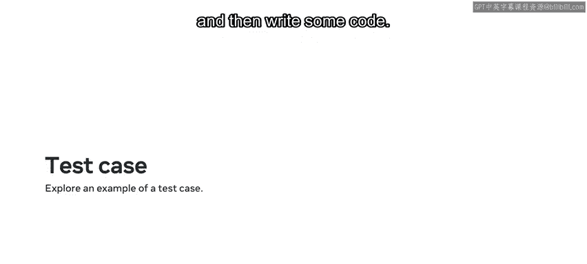
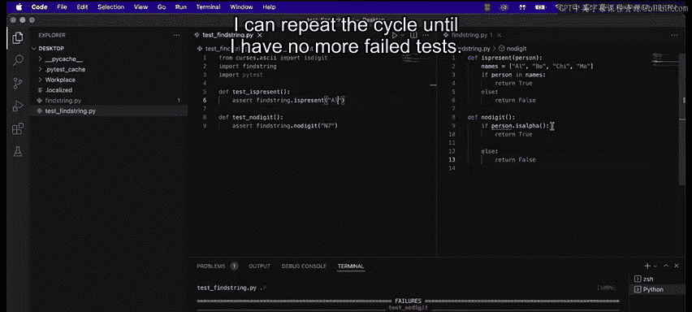

# 64：应用测试驱动开发（TDD）🧪

在本节课中，我们将要学习如何应用测试驱动开发（TDD）的方法论。我们将通过一个具体的例子，了解TDD与传统测试的区别，并掌握其核心步骤。

## 概述

测试驱动开发是一种软件开发方法，其核心思想是在编写实际功能代码之前，先编写测试用例。这与传统的先写代码后写测试的方式相反。TDD遵循“红-绿-重构”的循环，旨在通过测试来驱动设计，并确保代码质量。

## 传统测试与TDD的区别

上一节我们概述了TDD，本节我们来具体看看它与传统测试的区别。

在传统测试中，流程是**先编写代码，然后编写测试用例**来确保该代码的完整性。

在测试驱动开发中，方法正好相反。**测试用例是你必须开始思考的地方**。

## TDD的核心步骤🧩

以下是TDD方法所涉及的步骤：

1.  **编写测试用例**：心中带着某个功能目标来编写测试。
2.  **编写代码**：根据测试用例编写代码，确保测试通过。
3.  **重构代码**：如果测试失败，则重构代码。



## 实践示例：学生注册验证

现在，我们通过一个示例来演示如何设计一个检查学生注册的测试用例，数据存储在数据库中。测试需要检查输入姓名的完整性。

首先，我将演示如何设计测试用例，然后编写一些代码。

为了保持简单明了，我将使用一个包含姓名的Python列表来代替数据库。我需要确保我输入的姓名在列表中。同时，我还想确保数据完整性，这意味着我必须确保姓名以正确的格式输入。

### 项目文件结构

我创建了两个文件：
*   第一个是 `test_find_string.py`，这是我的测试文件。
*   第二个是 `fine_string.py`，这是我的主程序文件。

我已经安装了 `pytest` 包。因为这是测试驱动开发，所以我将首先编写我的测试函数。

### 步骤一：编写第一个测试

以下是 `test_find_string.py` 文件的内容：

```python
import string
import pytest
import fine_string

def test_is_present():
    assert fine_string.is_present('Al') == True
```

我首先导入 `string` 模块，它将帮助我检查ASCII字符。然后导入 `pytest` 模块以及 `fine_string` 模块（我的主文件）。我定义了一个名为 `test_is_present` 的函数，并添加了一个 `assert` 语句来检查 `is_present` 函数是否正常工作，因为我将用它来验证我的数据输入。

与传统编写代码的方法不同，我先编写了 `test_find_string.py`，然后添加了名为 `test_is_present` 的测试函数。

### 步骤二：根据测试编写功能代码

根据测试，我创建了另一个名为 `fine_string.py` 的文件，我将在其中编写 `is_present` 函数。

以下是 `fine_string.py` 文件的内容：

```python
def is_present(person):
    list_of_names = ['Al', 'Alice', 'Bob', 'Charlie']
    if person in list_of_names:
        return True
    else:
        return False
```

我定义了一个名为 `is_present` 的函数，并传递一个名为 `person` 的参数。然后，我创建了一个写有姓名的列表作为值。之后，我创建了一个简单的 `if-else` 条件来检查传入的参数是否存在于列表中。

因此，名为 `is_present` 的函数将检查传入的姓名是否在列表中。

让我测试我的代码。注意，测试通过了，因为姓名“Al”在列表中。

### 步骤三：扩展测试以增强完整性

但这并不能确保我可能添加的条目的完整性。例如，我可能不希望姓名中包含数字字符。

为了解决这个问题，我编写了另一个名为 `test_no_digit` 的函数。我将根据新添加的测试来更新主程序 `fine_string.py` 中的部分代码。

以下是更新后的 `test_find_string.py` 文件：

```python
import string
import pytest
import fine_string

def test_is_present():
    assert fine_string.is_present('Al') == True

def test_no_digit():
    assert fine_string.no_digit('N7') == False
```

### 步骤四：根据新测试更新功能代码

为此，我创建了一个名为 `no_digit` 的函数来匹配我的测试。

以下是更新后的 `fine_string.py` 文件：

```python
def is_present(person):
    list_of_names = ['Al', 'Alice', 'Bob', 'Charlie']
    if person in list_of_names:
        return True
    else:
        return False

def no_digit(person):
    for char in person:
        if char in string.digits:
            return False
    return True
```

我再次创建了一个简单的 `if-else` 条件。我运行代码，你会注意到其中一个测试通过了，另一个测试失败了。

所以，姓名“Al”通过了，因为它在姓名列表中。但值“N7”没有通过，因为它包含一个数字字符。

## 总结



本节课中，我们一起探索了测试驱动开发的方法论。我们了解到，TDD要求我们先从测试用例开始思考，然后编写代码使测试通过，并在测试失败时重构代码。通过学生注册验证的示例，我们实践了TDD的完整循环：编写测试（检查姓名存在性）、编写代码、扩展测试（检查数据格式）、再次更新代码。你可以继续添加更多测试用例并修改代码，使其适合这些测试用例，并重复这个循环，直到没有更多失败的测试。恭喜你掌握了TDD的基本应用！🚀