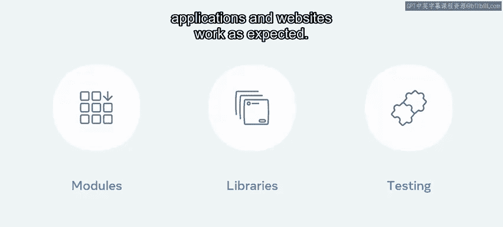
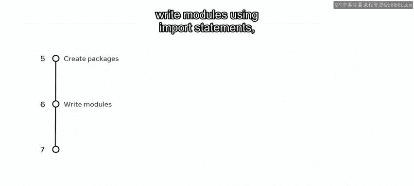
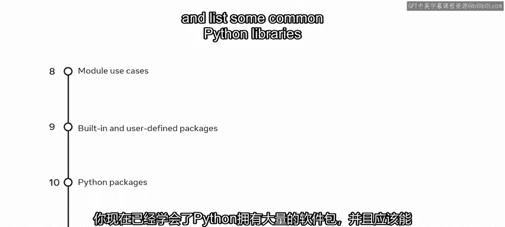
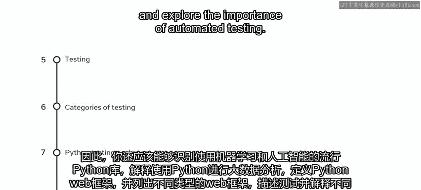
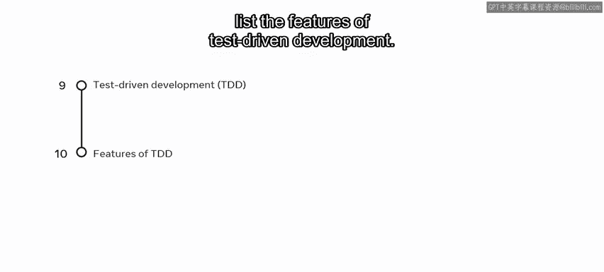

# Python 65：模块小结 🎯

在本节课中，我们将回顾并总结关于Python模块、包、库和工具的核心知识。你将清晰地理解这些概念如何扩展Python的功能，并掌握在实际项目中应用它们的关键技能。

## 模块回顾 📦

上一节我们介绍了模块的基础，本节中我们来总结模块的核心要点。

模块是Python中用于扩展代码功能的基础构建块。使用模块可以避免重复编写代码。

以下是关于模块你应掌握的关键能力：
*   能够解释Python中模块是什么以及为何使用它们。
*   识别不同类型的模块并说明它们的位置。
*   举例说明如何从不同位置访问内置模块和用户自定义模块。
*   使用`import`语句从不同目录访问模块。
*   能够使用`pip`从Python包索引（PyPI）创建包。
*   使用`import`语句编写模块。
*   解释并使用Python中的`reload()`函数。

## 包与库 📚

现在，我们来看看Python中丰富的包与库集合。

Python拥有一个庞大的包和库生态系统，用于支持各种应用场景。

以下是关于包与库你应掌握的关键能力：
*   能够描述典型的模块使用场景。
*   区分内置Python包和用户自定义Python包。
*   列举一些流行的Python包。
*   列举一些在数据分析和数据科学中常用的Python库。

## 框架、库与测试 🧪

在模块中，你还学习了关于库、框架和测试的知识。

因此，你还应掌握以下能力：
*   识别在机器学习和人工智能中流行的Python库。
*   解释如何使用Python进行大数据分析。
*   定义Python Web框架。
*   列举不同类型的Web框架。
*   描述测试并解释不同类型的测试。
*   列举测试的四个主要级别或类别。
*   描述Python中的测试包，例如`pytest`、`Selenium`、`Robot`。
*   探索自动化测试的重要性。
*   能够解释测试驱动开发（TDD）方法。
*   列举测试驱动开发的特点。

## 总结 ✨

本节课中我们一起学习了Python模块、包、库和工具的入门知识。这些知识使你能够极大地扩展编程代码的能力。通过掌握模块化编程、利用丰富的第三方库以及实施有效的测试策略，你可以更高效、更可靠地构建复杂的软件应用。