# Python 68：课程介绍 📚

在本课程中，我们将学习如何使用Python作为客户端来连接和操作MySQL数据库。我们将从建立基础连接开始，逐步深入到执行CRUD操作、使用高级查询、调用数据库函数与存储过程，最后学习连接池技术以优化数据库访问性能。

## 模块一：建立Python与MySQL的连接 🔌

欢迎来到数据库工程学的下一门课程。本课程的重点是数据库客户端。

让我们花点时间回顾一下你将在这些模块中掌握的一些新技能。

### 第一课：Python连接MySQL与包管理

你将开始学习关于MySQL Python连接的知识。

你将学习使用**Pip**来安装包或软件。

```bash
pip install mysql-connector-python
```

接着，你将学习如何安装一个前端的Python客户端，并将其连接到后端的MySQL数据库。

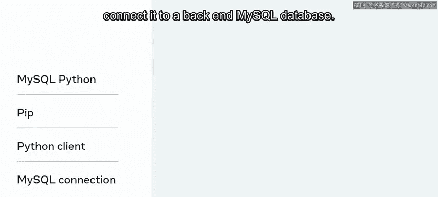

然后，你将探索如何建立Python和MySQL之间的通信以执行CRUD操作。

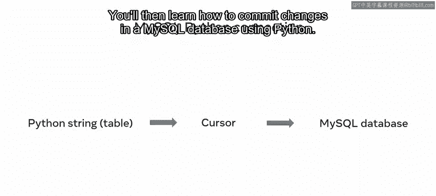

### 第二课：游标对象与数据库操作

一旦建立了连接，你将访问一个**游标**对象。

```python
cursor = connection.cursor()
```

访问游标对象后，你将使用Python创建一个MySQL数据库和表。

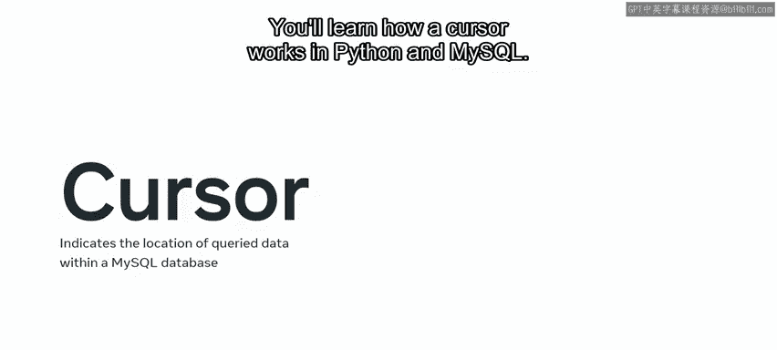

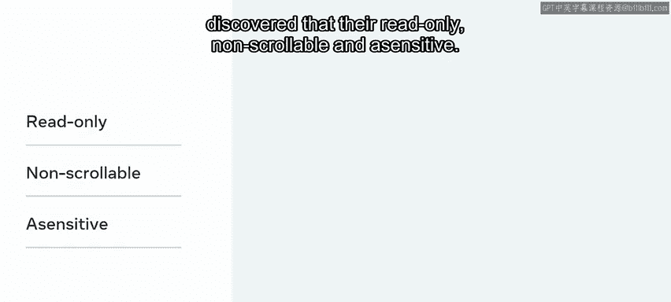

然后，你将学习如何使用Python提交对MySQL数据库的更改。

```python
connection.commit()
```

### 第三课：深入理解游标

在模块一的第三课也是最后一课中，你将探索MySQL数据库中游标的概念。

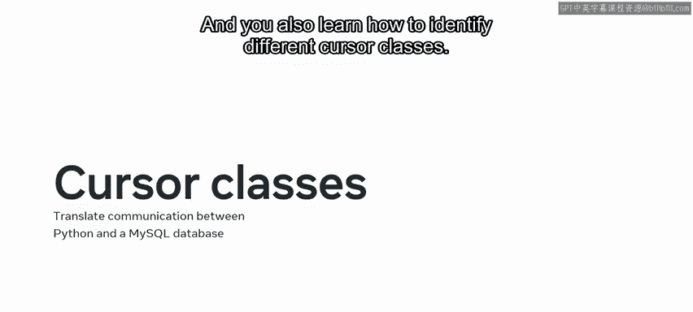

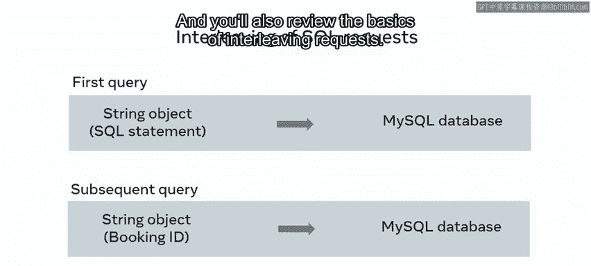

你将学习游标在Python和MySQL中如何工作。

你还会回顾游标的关键特性，并发现它们是**只读的、不可滚动的、不敏感的**。

接着，你将学习**游标类**用于在Python和MySQL数据库之间转换通信。

你还会学习如何识别不同的游标类。

并且回顾**交错请求**的基础知识。

## 模块二：使用Python执行CRUD操作与高级查询 🛠️

上一节我们介绍了如何建立连接和使用游标，本节中我们来看看如何执行具体的数据库操作。

第二个模块的重点是使用Python在MySQL数据库中执行创建、读取、更新和删除操作，即**CRUD**操作。

### 第一课：创建与读取记录

你将开始学习如何在数据库中创建和读取记录。

你将回顾此过程的步骤，并发现Python如何与数据库通信以执行这些操作。

然后，你将探索如何使用Python执行MySQL更新和删除操作。

并学习如何将更改提交到数据库。

最后，你将通过完成一系列实验练习来结束第一课，在练习中展示你使用Python在MySQL数据库中执行CRUD操作的能力。

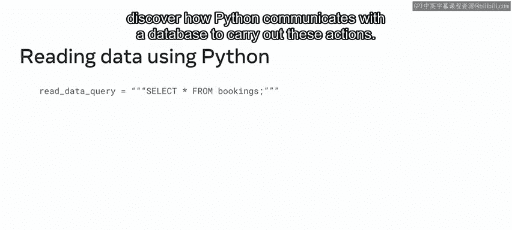

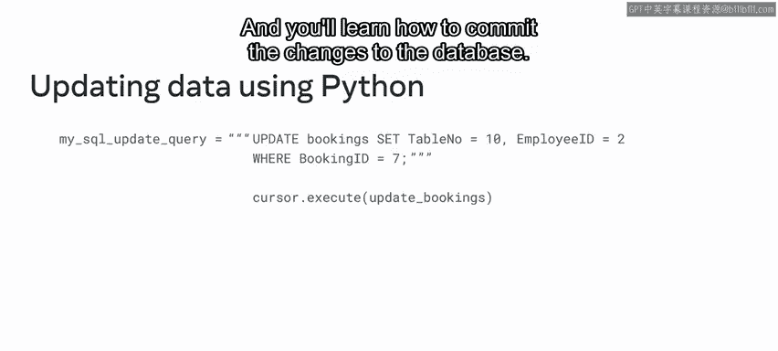

### 第二课：高级查询

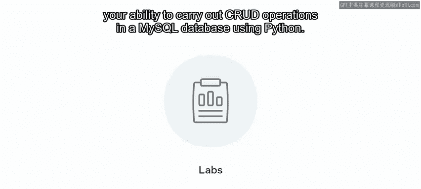

在模块二的第二课中，你将回顾使用Python在MySQL数据库中进行高级查询。

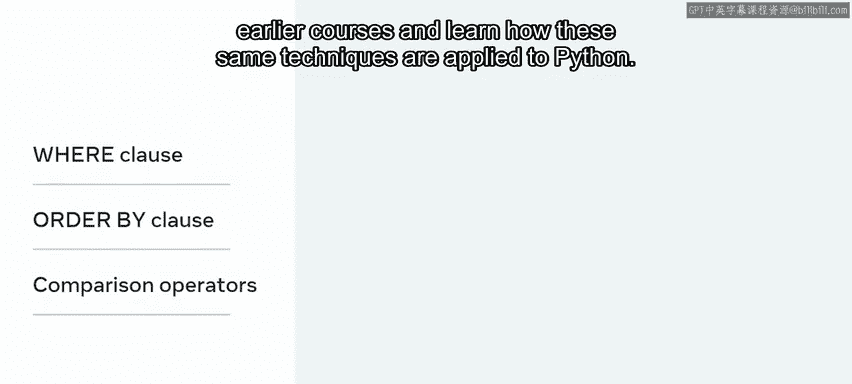

以下是这些查询的概述：

首先，涉及使用Python在MySQL数据库中对数据进行**过滤和排序**。

你将回顾早期课程中MySQL过滤和排序技术的基础知识，并学习如何将这些相同的技术应用于Python。

接下来，你将学习如何执行一系列不同的**连接**操作，以使用Python从MySQL数据库的不同表中查找数据。

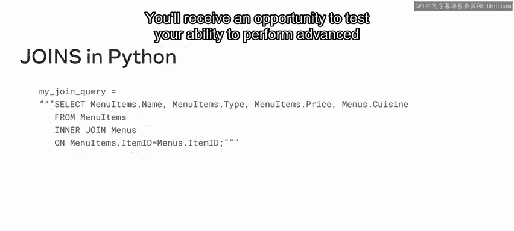

你将有机会通过一系列实验来测试自己使用Python在MySQL数据库中进行高级查询的能力。

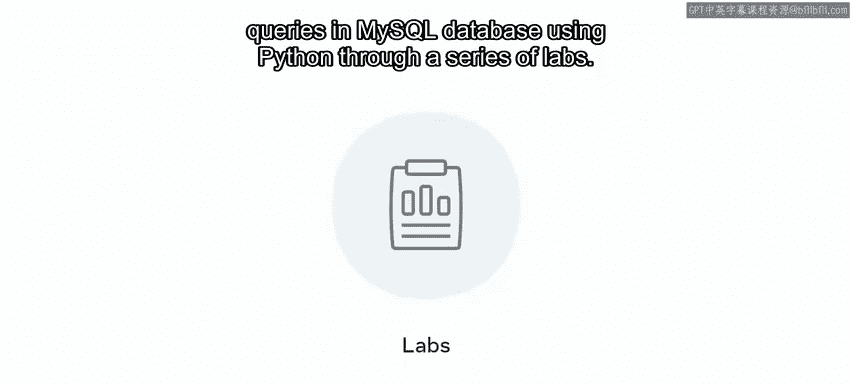

## 模块三：高级数据库客户端技术 ⚙️

模块三侧重于高级数据库客户端。本模块的第一课首先概述如何将MySQL函数与Python结合使用。

### 第一课：使用MySQL函数

你将首先学习识别MySQL函数的重要性，并回顾MySQL中可用的不同类型函数。

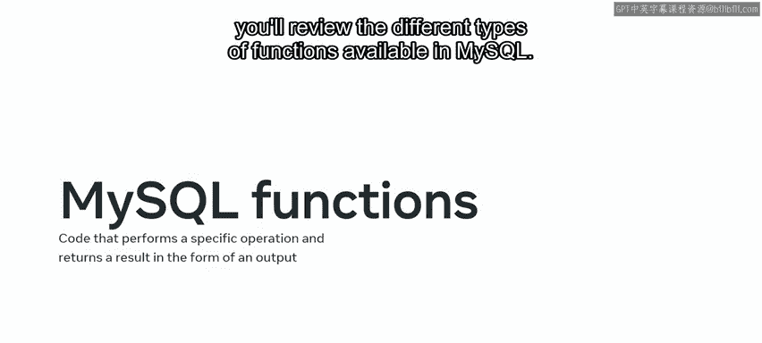

一旦你回顾完MySQL函数的基础知识。

接着，你将学习如何使用Python实现或访问MySQL函数。

你还会探索Python中的**datetime函数**，并学习如何利用这些函数通过Python更新MySQL数据库。

然后，你将在实验练习中展示使用这些函数的能力。

### 第二课：使用存储过程

在第三模块的第二课中，你将探索将MySQL存储过程与Python结合使用。

你将回顾存储过程的基础知识，了解它们与函数的区别，以及如何使用Python在MySQL数据库中创建它们。

接着，你将学习如何通过Python使用 **`callproc`方法**来访问存储过程。

并且回顾**分隔符**的使用。

## 模块四：数据库连接池 🌊

第三个也是最后一个模块侧重于连接池。

### 理解与实现连接池

你将首先理解数据库连接池的概念。


你将学习数据库连接池如何工作。

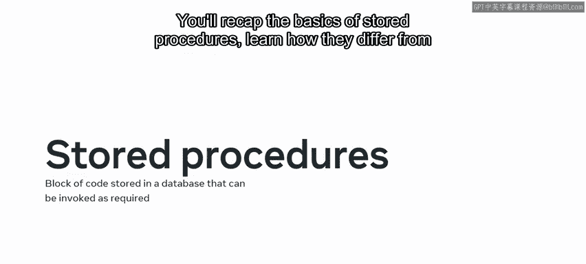

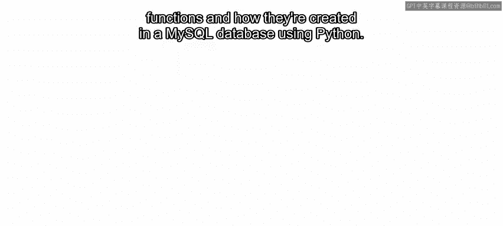

并了解如何识别数据库连接池的优势。

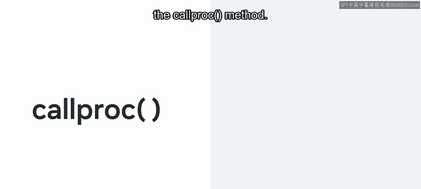

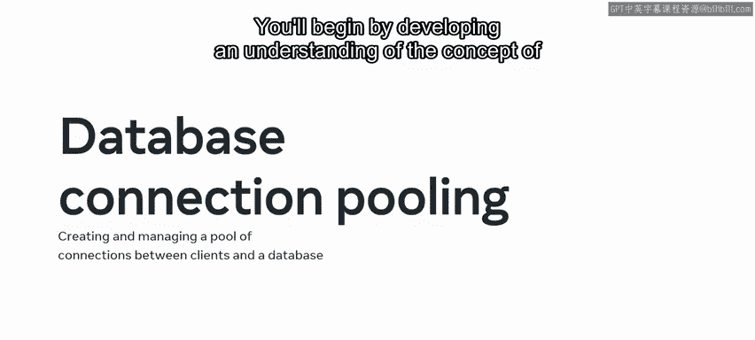

然后，你将回顾为数据库创建连接池的步骤，包括实现MySQL连接池模块的过程。

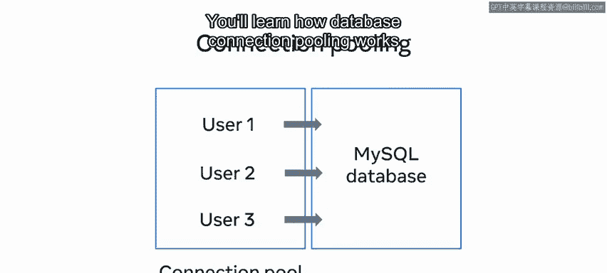

---

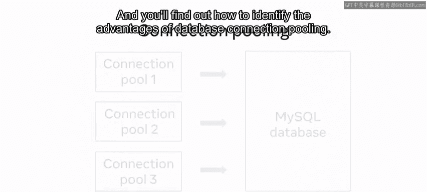

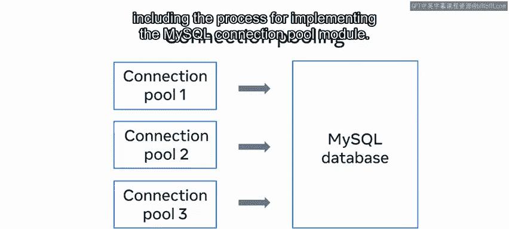

**课程总结**

在本节课中，我们一起学习了使用Python作为MySQL数据库客户端的完整路径。从建立基础连接、执行CRUD操作、进行高级查询，到使用数据库函数、存储过程，最后掌握了连接池技术以提升应用性能。

你已经到达本课程介绍的结尾。现在，是时候开始你数据库工程之旅的下一章了。祝你好运。