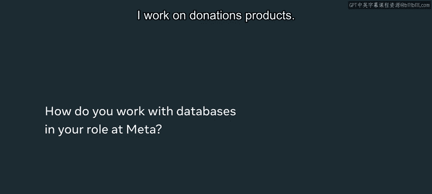
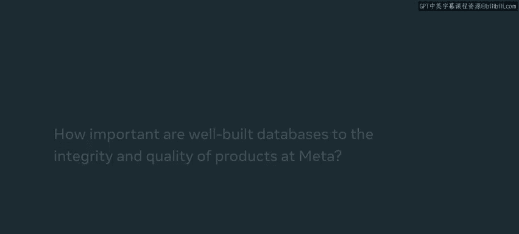
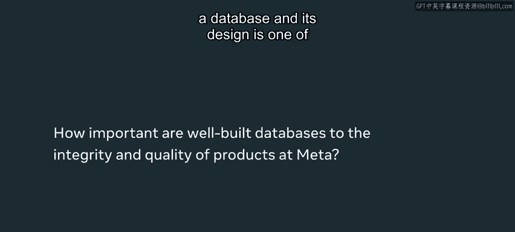
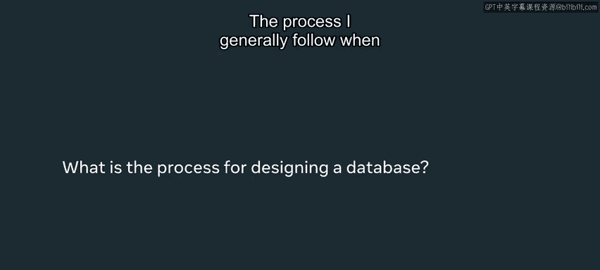
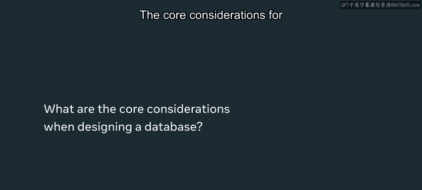
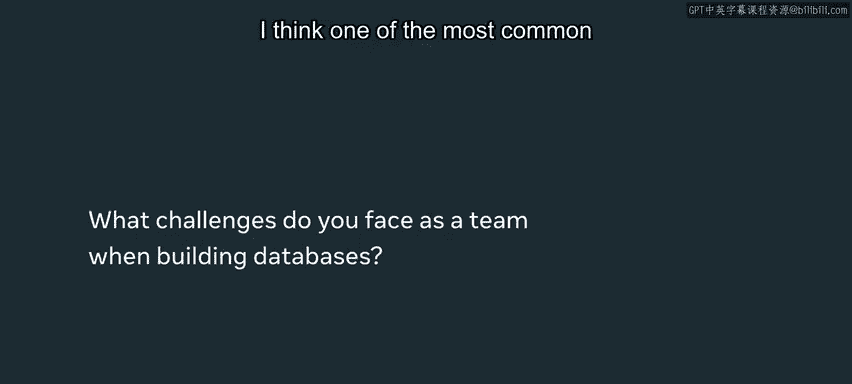
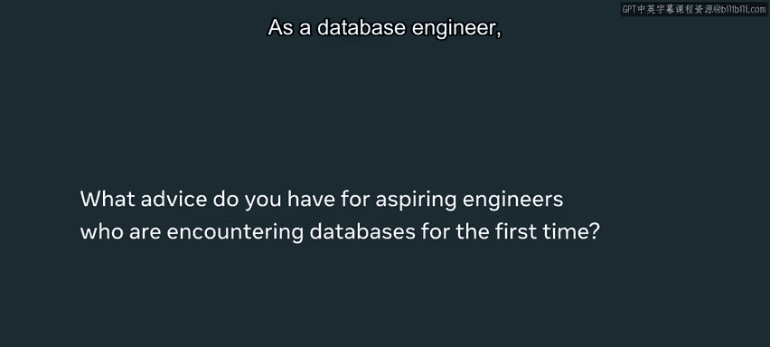

# 69：1_Meta的数据库工程 🗄️

在本节课中，我们将跟随Meta软件工程师Maxxie Herrera，学习数据库设计中的核心考量、常见挑战以及工程师的职责。课程将重点阐述如何构建可靠、安全且可扩展的数据库系统。

---

在我的职业生涯中，曾遇到过这样的情况：两个系统相互依赖，我必须同时发布它们。唯一的解决方案是在夜间流量最低时发布代码，并希望在我们一个系统更新而另一个系统宕机的五分钟内，只有少数用户会遇到问题。有时，这是唯一能做的事情。

大家好，我是Maxxie Herrera，我使用They/Them代词，是Meta门洛帕克办公室的一名软件工程师。我从事捐赠产品相关的工作，确保我们能够追踪谁向哪个筹款活动、哪个慈善机构进行了捐赠。这一点至关重要，我们不能出错。

我们希望确保存储正确的数据，并将正确的数据显示给正确的用户。这意味着我们需要保证**数据有效性**，确保只获取特定用户应该看到的数据，并保存正确的数据。这些是设计可靠数据库时非常重要的概念。你需要确保数据关系合理，并且不会访问任何特定用户不应看到的数据。

数据库及其设计的**完整性与质量**，是确保数据受到保护、数据以安全方式存储、用户能够信任其数据未被滥用的首要和关键步骤。这要求我们拥有一个精心设计的数据库，需要周全地考虑数据之间可能存在的各种关系，并为未来的变化制定计划。

我设计数据库时通常遵循的流程是：首先构思产品运行所需的**核心数据模型**。我以此为起点，因为从产品角度出发，最容易概念化我们将如何访问所需的数据。在初步数据模型建立之后，我开始深入研究所需的特定隐私和验证细节。例如，某些数据是否需要加密？某些数据是否应仅允许特定服务器访问？这些都是我们必须提出的不同问题。然后，根据存储的数据类型（可能是信用卡信息或用户信息），你还需要在数据库和数据库设计中集成更多的检查机制来适应这些需求。

在Meta，设计良好数据库的核心考量首先是**尊重用户隐私和用户安全**。用户应该知道他们的数据在哪里、有权访问它们，并且应该知道这些数据不会被用于他们不认可的产品中。

我们需要确保的另一件事是**可扩展性**。如果你的数据模型构思得再好，却无法与Meta产品每天面对的数十亿用户规模一同扩展，那也是无济于事的。

我认为，处理数据库时最常见的挑战之一，并非最初构建数据库的时候，因为那时你已经在模型中构思好了关系。真正的挑战在于，当有新需求出现并改变原有关系时。首先要做的是认真思考未来如何更改你的数据库，它如何不仅在用户数量上扩展，还要适应不同类型的产品。

另一个非常重要的考量是**如何修改现有数据库**。这将是一项极具挑战性的任务，并且数据库相关的大部分工作都围绕于此。我们有一个旧的数据模型，它已不满足当前需求。我们需要克服这个问题，这需要你进行大量的思考和规划，例如如何迁移数据。这些都是需要时间来解决的重大任务。但正是通过这些实践，你才能更好地管理数据库，并从一开始就构建出更好的数据模型。

作为一名数据库工程师，你将接触到大量数据，必须时刻牢记这对于用户信任或任何将数据托付给你的人的信任是多么重要。即使你认为数据微不足道，人们也对你寄予了厚望，确保你负责任地处理数据。我希望你能认识到，数据库设计和数据库工程对于整体产品体验至关重要，并且是构建用户对你产品信任的基石。

---

本节课中，我们一起学习了数据库设计的核心原则：确保**数据有效性**和**完整性**是基础。设计流程应从**核心数据模型**出发，再深入考虑隐私与安全细节。成功的数据库必须优先保障**用户隐私与安全**，并具备强大的**可扩展性**以应对增长。此外，我们探讨了修改现有数据库和进行数据迁移的挑战，这是数据库工程师工作的关键部分。最终，我们认识到，负责任的数据库工程是赢得用户信任、构建可靠产品的核心。