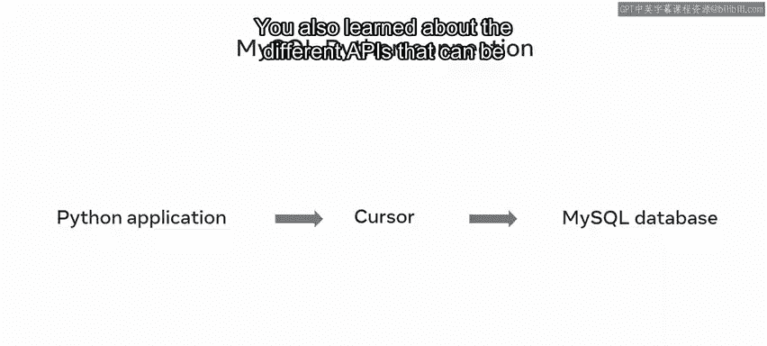
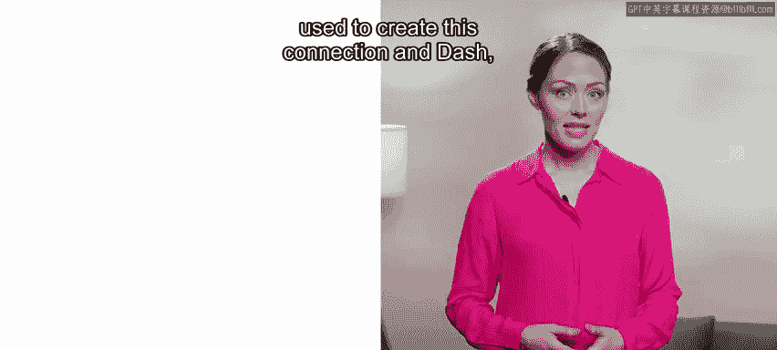
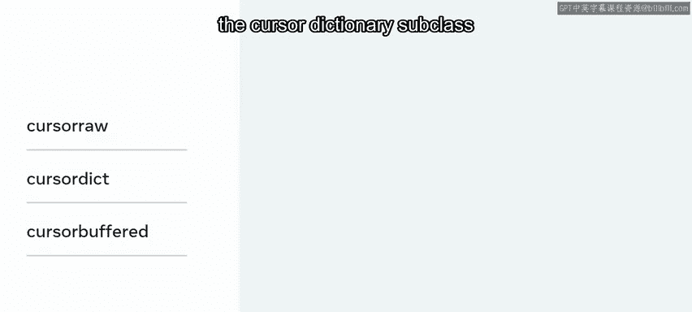
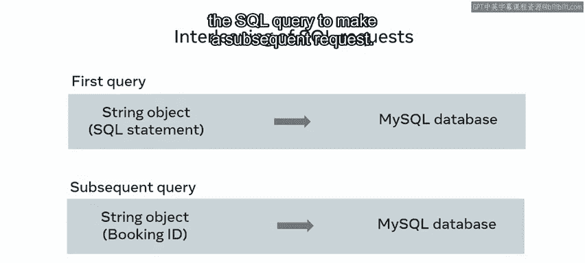
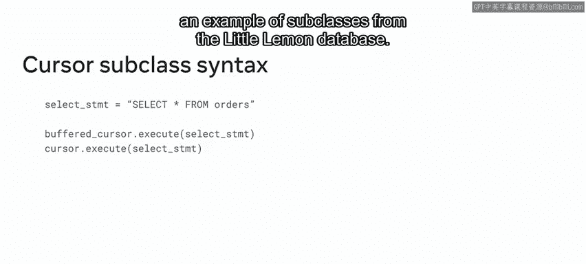

# 76：模块小结 - 使用Python与MySQL交互 🎉

在本节课中，我们将回顾并总结本模块的核心内容。您已经学习了如何使用Python与MySQL数据库进行交互的基础知识，包括建立连接、使用API以及操作游标。接下来，我们将系统地梳理这些关键技能。

## 模块概述

恭喜您完成了本课程第一个模块的学习。现在，您应该已经熟悉了使用Python与MySQL数据库交互的基础知识。

让我们花点时间回顾一下您在本模块课程中获得的关键技能。

## 第一课：Python与MySQL的连接基础

在第一课中，您学习了课程介绍，并理解了如何使用应用程序编程接口（API，也称为驱动程序）在Python和MySQL数据库之间建立连接。

您现在知道，前端Python应用程序会向连接器API发送连接请求。API将此连接转发给后端的MySQL数据库，随后可以建立游标连接。一旦连接建立，数据就可以在Python和MySQL之间传输。

您还了解了可用于创建此连接的不同API，并且作为数据库工程师，您将主要依赖 **`mysql.connector`** Python API。

在第一课中，您还学习了如何在系统上安装和配置Python软件，以便在Python和MySQL之间建立连接。

以下是您学到的具体步骤：
*   您学习了如何下载Python。
*   您学习了如何使用Pip。
*   您学习了如何导入所需的不同包。
*   您还学习了如何使用别名创建自定义名称，以便更轻松地与数据库通信。

接着，您探索了一个使用Python客户端连接到MySQL数据库的实际示例。

您看到了如何将API导入Python程序并使用别名，并且您现在知道如何使用访问（点）运算符来利用其模块和功能。

您还知道了如何向连接器模块传递参数，例如用户名和密码。

最后，您以使用Python在数据库中创建表的流程概述结束了本课。您了解到需要创建一个游标对象，用于与MySQL数据库通信。

游标对象访问一个执行模块，该模块将查询作为Python字符串传递给MySQL数据库。

一旦您的连接设置完成，您就可以使用Python在MySQL数据库中创建数据，例如数据库和表。

## 第二课：深入理解游标

在上一节我们介绍了连接的基础，本节中我们来看看数据库交互的核心工具——游标。

在模块的最后一课中，您学习了游标。您了解到游标用于指示数据在MySQL数据库中的位置，以便Python客户端可以访问它。

游标允许您读取、检索并在查询结果中的各个记录之间移动。

接着，您探索了对数据库工程师特别有用的游标关键特性或功能。

以下是游标的三个主要特性：
*   **只读性**：游标是只读的，无法被修改，并且会保留结果。
*   **不可滚动性**：游标按顺序获取记录，这有助于在处理单个记录时跟踪当前位置。
*   **敏感性**：这意味着它们指向MySQL数据库中的原始数据，而不是副本。

然后，您探索了在MySQL数据库中使用游标所需的代码。

您现在可以使用以下命令：
*   **`DECLARE`** 命令来声明一个游标。
*   **`OPEN`** 命令来调用游标的名称。
*   **`FETCH`** 命令来获取结果。
*   **`CLOSE`** 命令来关闭游标。

您随后通过Little Lemon数据库的示例探索了这个过程。

在本课的下一个部分，您探索了不同的游标子类，并学习了如何使用它们来改变或调整游标的行为。

您发现游标类是一种在Python和MySQL数据库之间转换通信的方法。类接收Python字符串对象，并将其解析为MySQL友好的命令和数据类型，以便数据库理解。

您还探索了一些常见的游标子类示例。子类继承其父游标类的属性，例如：
*   **`cursor.Raw`** 子类
*   **`cursor.Dict`** 子类
*   **`buffered cursor`** 类

您还了解了**交错SQL请求**，这涉及使用部分SQL查询来发起后续请求。

接着，您探索了创建和使用子类的语法，并且也通过Little Lemon数据库的示例探索了子类的应用。

## 课程总结

本节课中我们一起学习了使用Python与MySQL数据库交互的基础知识，包括建立MySQL-Python连接和使用游标。做得很好。

我期待在下一个模块中继续指导您，您将学习如何使用Python在MySQL中执行查询。