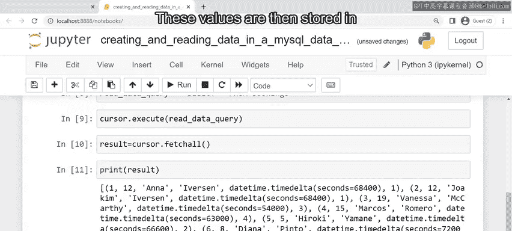

# 77：使用Python在MySQL数据库中创建和读取数据 📊

在本节课中，我们将学习如何使用Python编程语言，在MySQL数据库后端执行创建（Create）和读取（Read）操作。我们将通过一个餐厅预订系统的实例，一步步了解如何将SQL语句转换为Python字符串，并通过连接器与数据库进行交互。

---

## 概述：Python与数据库的CRUD操作

正如你所知，在MySQL中操作数据库涉及CRUD（创建、读取、更新、删除）操作。通过Python操作数据库同样涉及这些CRUD操作。

关键区别在于，用于执行操作的SQL语句必须在Python中作为字符串进行处理。在本视频中，你将发现如何使用Python在MySQL数据库中执行创建和读取操作。

---

## 创建数据：从SQL到Python字符串

上一节我们介绍了CRUD操作的基本概念，本节中我们来看看如何使用Python执行创建（插入）操作。

到目前为止，你已经学会了如何使用类似`INSERT INTO`的语句在数据库中创建数据。例如，Little Lemon餐厅必须使用`INSERT INTO`语句，将顾客姓名和他们预订的时间段添加到数据库`bookings`表的`customer_name`和`time`列中。

然而，在使用Python时，这种方法需要更多的步骤。

以下是使用Python执行插入操作的基本流程：

1.  **编写SQL语句**：像平常一样创建你的SQL语句。
2.  **转换为字符串**：然后使用引号将其转换为Python字符串参数。
3.  **存储为变量**：创建一个变量来存储这个查询字符串。
4.  **通过游标发送**：Python通过游标（cursor）将这个字符串发送到数据库。
5.  **执行语句**：该语句随后在数据库上执行。

Little Lemon可以使用Python，通过`mysql_insert_query`变量将客人的预订数据添加到他们的MySQL数据库中。SQL数据只需要以字符串格式传递。

**核心代码示例**：
```python
# 步骤1-3：创建SQL插入语句并存储为字符串变量
mysql_insert_query = “INSERT INTO bookings (customer_name, time) VALUES (‘John Doe’, ‘19:00’);”
```

---

## 读取数据：执行SELECT查询

现在我们已经了解了如何创建数据，接下来让我们看看如何从数据库中读取数据。

正如你现在应该知道的，你也可以使用`SELECT`语句从数据库中检索或查询数据。在使用Python读取数据时，编写SQL `SELECT`查询同样是第一步。

Python可以使用`SELECT`语句从MySQL数据库读取数据。就像处理插入查询一样，你需要创建一个变量来将查询存储为Python字符串，并编写你的`SELECT`查询。确保它写在引号内以转换为Python字符串。

Little Lemon可以使用一个`read_data_query`字符串对象来检索他们`bookings`表中的所有数据。他们只需要将`SELECT`查询写成Python字符串，然后使用游标对象的`execute`模块。

**核心代码示例**：
```python
# 创建SELECT查询字符串
read_data_query = “SELECT * FROM bookings;”
```

---

## 实践演练：帮助Little Lemon餐厅

既然你知道了如何使用Python创建和读取数据，让我们看看你是否能帮助Little Lemon。

为了演示，Python、API和MySQL数据库之间已经通过MySQL Connector Python API建立了连接。

### 任务一：插入数据

你的第一个任务是使用`cursor()`方法从连接实例化游标对象。

下一步是通过将MySQL插入查询作为参数传递给`execute()`方法来执行它。

一旦查询执行完毕，使用连接对象的`commit()`方法将更改提交到数据库。

现在，每个新的客户数据实例都通过`mysql_insert_query`添加到了数据库的`bookings`表中。

**操作步骤代码**：
```python
# 假设 `connection` 是已建立的数据库连接对象
cursor = connection.cursor()
mysql_insert_query = “INSERT INTO bookings (customer_name, time) VALUES (‘Alice’, ‘20:00’);”
cursor.execute(mysql_insert_query)
connection.commit()
```

### 任务二：读取数据

在开发的下一阶段，Little Lemon需要读取或检索其数据库中的数据。一些示例客户数据已被添加到数据库中以测试读取功能。你需要开发功能来检索这些数据。

正如前面所学，第一步是创建一个作为Python字符串的SQL语句，你可以将其传递给一个变量。

在这种情况下，你需要创建一个SQL `SELECT`语句，从数据库的`bookings`表中检索所有数据，并将此语句作为字符串传递给名为`read_data_query`的Python变量。

现在你需要将查询传递给游标上的`execute`模块，就像创建数据时一样。查询执行后，你需要使用游标上的`fetchall()`方法来检索结果。

创建一个名为`results`的新变量，然后通过游标对象将查询结果传递给这个变量。

`results`变量是列表数据类型，它以元组的形式显示每条记录。因此，`results`变量本质上是一个元组列表，每个元组都是从`bookings`表中提取的单行。

在这种情况下，`results`变量中每个元组中的项目顺序与`bookings`表中的列顺序相同。它们这样排序是因为你正在读取表中的所有记录。

你可以通过创建一个名为`columns`的新变量并从游标对象调用列名来检索列名。这些值随后存储在`columns`变量中以供后续使用。

**操作步骤代码**：
```python
read_data_query = “SELECT * FROM bookings;”
cursor.execute(read_data_query)
results = cursor.fetchall()
columns = cursor.column_names
```

---

## 重要注意事项与收尾工作

别忘了，当你不再需要它们时，关闭游标对象和连接也是一个好习惯。

**收尾代码**：
```python
if cursor:
    cursor.close()
if connection and connection.is_connected():
    connection.close()
```

---



## 总结

本节课中我们一起学习了如何使用前端Python应用程序在后端MySQL数据库中执行创建和读取操作。

你现在知道了如何：
1.  将SQL语句（如`INSERT INTO`和`SELECT`）转换为Python字符串。
2.  使用游标对象的`execute()`方法在数据库上运行这些查询。
3.  使用`commit()`提交插入操作的变化。
4.  使用`fetchall()`检索查询结果，并以列表形式获取列名。
5.  在操作完成后正确关闭游标和数据库连接。


这是一个很好的开始。我期待引导你学习更多Python中的CRUD操作。