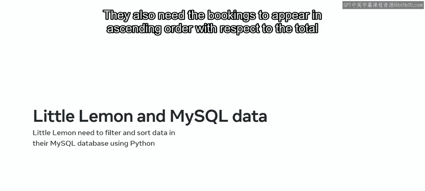
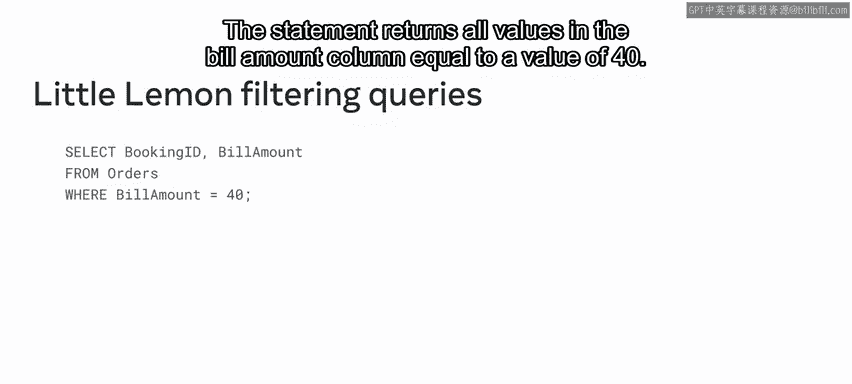
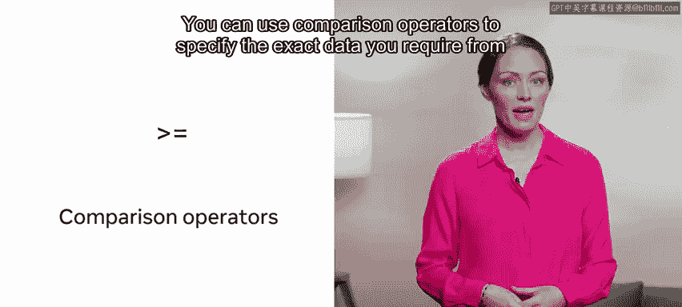
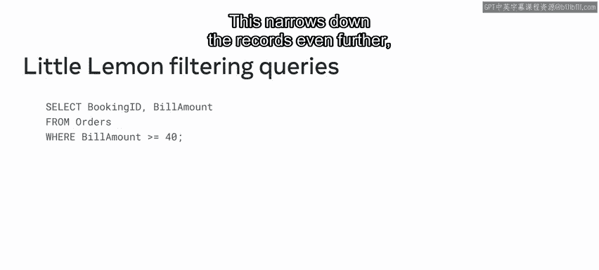
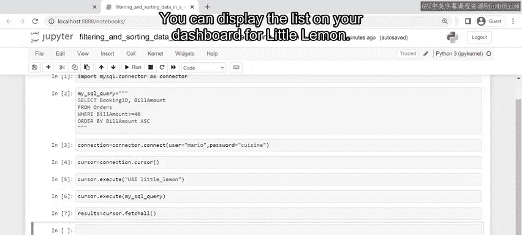

# Python 79：使用Python对MySQL数据库中的数据进行过滤和排序 🔍

在本节课中，我们将学习如何使用Python对MySQL数据库中的数据进行过滤和排序。当查询数据库记录时，查询结果可能包含数百、数千甚至数百万条数据。然而，我们通常只需要其中的一小部分。通过应用过滤和排序技术，我们可以精确地定位所需的数据。

上一节我们介绍了数据库查询的基本概念，本节中我们来看看如何在Python中实现这些技术。我们将以Little Lemon餐厅为例，他们需要查询所有账单金额大于或等于40美元的预订记录，并按账单金额升序排列。

## 过滤技术：WHERE子句 📊

过滤技术中，WHERE子句是一个基础且重要的工具。它用于筛选满足特定条件的记录。



以下是WHERE子句的基本用法：
```sql
SELECT booking_id, bill_amount FROM orders WHERE bill_amount = 40;
```
此语句从`orders`表中选取`bill_amount`等于40的所有记录的`booking_id`和`bill_amount`列。

然而，Little Lemon需要的是账单金额**大于或等于**40美元的记录。这需要引入比较运算符。


## 使用比较运算符 🔧

比较运算符允许我们指定更精确的过滤条件。



例如，我们可以将等于运算符（`=`）替换为大于或等于运算符（`>=`）：
```sql
SELECT booking_id, bill_amount FROM orders WHERE bill_amount >= 40;
```
此修改将结果集缩小，仅返回账单金额大于或等于40的记录。

## 排序技术：ORDER BY子句 📈



为了进一步组织数据，我们可以使用ORDER BY子句对结果进行排序。这是一个可选的子句，可以附加在SELECT语句末尾。

Little Lemon需要按账单金额升序排列结果。实现方式如下：
```sql
SELECT booking_id, bill_amount FROM orders WHERE bill_amount >= 40 ORDER BY bill_amount ASC;
```
这里，`ASC`关键字表示升序排列。执行后，查询将返回所有符合条件的记录，并按`bill_amount`从小到大排序。

## 在Python中实现查询 🐍

现在，我们已经回顾了SQL中的过滤和排序技术。接下来，我们将探讨如何在Python程序中执行这些查询。

首先，我们需要将SQL查询语句编写为Python字符串：
```python
mysql_query = """
SELECT booking_id, bill_amount 
FROM orders 
WHERE bill_amount >= 40 
ORDER BY bill_amount ASC;
"""
```




以下是使用Python连接MySQL并执行查询的完整步骤：

1.  建立与MySQL数据库的连接。
2.  创建游标对象。
3.  执行SQL查询。
4.  获取并处理结果。

```python
import mysql.connector

# Python 1. 建立连接
connection = mysql.connector.connect(
    host='localhost',
    user='your_username',
    password='your_password',
    database='little_lemon_db'
)

# Python 2. 获取游标
cursor = connection.cursor()

# Python 3. 执行查询
cursor.execute(mysql_query)

# Python 4. 获取所有结果
results = cursor.fetchall()

# 打印结果
for row in results:
    print(row)

# 关闭游标和连接
cursor.close()
connection.close()
```
执行上述代码后，`results`变量将包含一个Python元组列表，每个元组代表一条符合条件的记录，并且已按账单金额升序排列。Little Lemon餐厅便可以获得他们所需的数据。



## 总结 🎯

本节课中我们一起学习了如何使用Python对MySQL数据库进行数据过滤和排序。我们回顾了SQL中`WHERE`子句和比较运算符用于过滤数据，以及`ORDER BY`子句用于排序数据的方法。接着，我们通过一个完整的Python示例，演示了如何连接数据库、执行包含过滤和排序条件的SQL查询，并获取处理结果。掌握这些技术能帮助你更精确、高效地从数据库中提取所需信息。